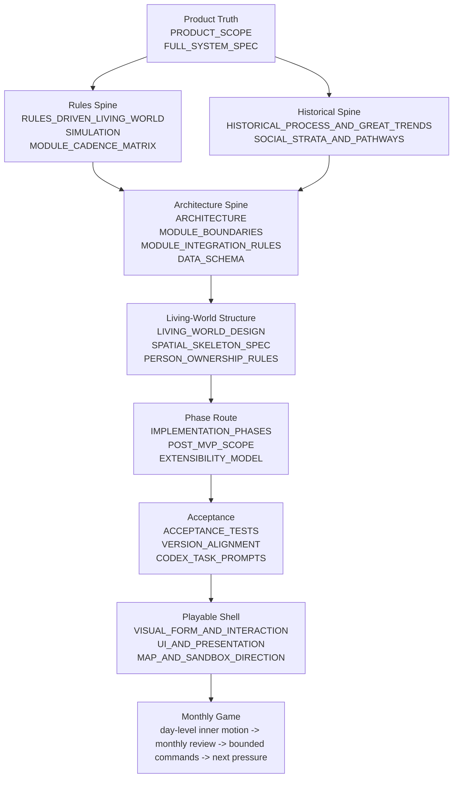

# GAME_DEVELOPMENT_ROADMAP

This document is the implementation index for Zongzu.
It connects the product truth, living-world structure, module boundaries, phase plan, tests, and future dynasty-scale play into one development route.

Use it when deciding:
- what to build next
- which docs to read first
- which module owns a change
- whether a slice is MVP, MVP-plus, post-MVP, or future dynasty-cycle depth
- whether a feature is a real rule chain or just a narrative idea

This file does not replace the detailed specs.
It is the map that points to them.

## Master Index Map

## One-Line Development Spine

`M0 foundations -> M1 living society -> M2 influence and player agency -> M3 MVP shell -> P1 deep society -> P2 county/court -> P3 conflict/war -> P4 historical trends -> P5 dynasty-cycle agency`

Every phase follows the same implementation ladder:

1. create or update an ExecPlan
2. identify owning module and feature pack
3. define state shape and typed IDs
4. update schema and migration rules if saved state changes
5. define Query / Command / DomainEvent contracts
6. place cadence in `day`, month, seasonal, annual, setup, or command resolution
7. prove one thin live rule chain
8. emit structured diffs and read-only projections
9. add tests and acceptance notes
10. update docs and keep lower-scope bootstraps isolated

If a feature cannot pass those ten steps, it is not ready for implementation.

## Phase Route Table

| Phase | Main Question | Primary Modules / Packs | Must Prove | Primary Docs |
| --- | --- | --- | --- | --- |
| M0 | Can the modular spine run and save? | Kernel, Contracts, Scheduler, Persistence, feature manifest | 12-month deterministic empty/minimal world, save/load, module registration | `ARCHITECTURE.md`, `ENGINEERING_RULES.md`, `STATIC_BACKEND_FIRST.md`, `DATA_SCHEMA.md` |
| M1 | Can local life and lineage pressure breathe? | `WorldSettlements`, `PersonRegistry`, `FamilyCore`, `PopulationAndHouseholds`, `SocialMemoryAndRelations` | births, deaths, household pressure, commoner pressure, grudge/memory basics | `LIVING_WORLD_DESIGN.md`, `PERSON_OWNERSHIP_RULES.md`, `RELATIONSHIPS_AND_GRUDGES.md` |
| M2 | Can the MVP feel playable from the hall? | `EducationAndExams.Lite`, `TradeAndIndustry.Lite`, `NarrativeProjection`, shell read models | exam/trade pressure, family lifecycle preview, read-only living-society footprint, bounded commands | `MVP_SCOPE.md`, `UI_AND_PRESENTATION.md`, `RULES_DRIVEN_LIVING_WORLD.md` |
| M3 | Can disorder and local force join without breaking M2? | `OrderAndBanditry.Lite`, `ConflictAndForce.Lite` | route pressure, black-route pressure, local conflict, violent death pressure bridge | `CONFLICT_AND_FORCE.md`, `MODULE_INTEGRATION_RULES.md`, `ACCEPTANCE_TESTS.md` |
| P1 | Can governance and disorder become institutional? | `OfficeAndCareer`, `OrderAndBanditry.Full`, public-life integration | yamen pressure, petition/backlog, clerk dependence, paper compliance, suppression / backlash | `POST_MVP_SCOPE.md`, `INFLUENCE_POWER_AND_FACTIONS.md`, `SOCIAL_STRATA_AND_PATHWAYS.md` |
| P2 | Can force become a durable social resource? | `ConflictAndForce.Full` | retainers, militia, escorts, command capacity, fatigue, force legitimacy | `CONFLICT_AND_FORCE.md`, `LIVING_WORLD_DESIGN.md` |
| P3 | Can campaign war stay integrated with society? | `WarfareCampaign`, campaign board, aftermath dockets | mobilization, supply, morale, command-fit, aftermath feeding modules by events | `CONFLICT_AND_FORCE.md`, `MAP_AND_SANDBOX_DIRECTION.md`, `VISUAL_FORM_AND_INTERACTION.md` |
| P4 | Can the world widen without flattening? | regional breadth, routes, multi-settlement summaries, presentation polish | regions differ, route pressure travels, shell still reads as hall / desk, not dashboard | `SIMULATION_FIDELITY_MODEL.md`, `SPATIAL_SKELETON_SPEC.md` |
| P5 | Can history bend at regime scale? | future `CourtAndThrone` / `WorldEvents`, deeper office, force, public legitimacy, dynasty-cycle pack | imperial rhythm, rebellion-to-polity, succession struggle, usurpation, restoration, dynasty repair | `HISTORICAL_PROCESS_AND_GREAT_TRENDS.md`, `POST_MVP_SCOPE.md`, `ACCEPTANCE_TESTS.md` |

## Ultra-Fine Implementation Route

### Route 0: Before Any Slice

Do this before writing code:
- create or update an ExecPlan under `docs/exec-plans/active/`
- state whether the work is MVP, MVP-plus, post-MVP, or future pack depth
- list touched modules and docs
- state save/schema impact
- state determinism risk
- state which lower-scope bootstraps must stay unchanged

Do not start from UI or story text.
Start from the rule chain:

`owned state + cadence + pressure + deterministic resolution -> event/diff -> projection -> bounded command -> next pressure`

Time UX rule:
- day-level cadence gives nearby life lived texture
- xun labels may group almanac/projection wording, but are not the bottom authority grid
- monthly review remains the normal player-facing turn
- red-band interrupts are rare crisis windows, not a second routine turn loop

### Route 1: M0 Kernel And Modular Spine

Build order:
1. typed IDs and shared contract primitives
2. module runner contract and feature manifest
3. deterministic scheduler ordering
4. save root with module envelopes
5. replay hash checkpoint
6. empty/minimal world seed
7. save/load roundtrip tests
8. module registration tests

Thin proof:
- advance 12 months with the same seed twice
- compare replay hashes and save output

Do not:
- add gameplay depth before scheduler, manifest, and save envelopes are stable
- let modules write into each other

### Route 2: M1 Local Life Substrate

Build order:
1. `WorldSettlements` minimal settlement state
2. `PersonRegistry` identity-only person anchor
3. `FamilyCore` lineage, marriage, birth, death, heir pressure
4. `PopulationAndHouseholds` household pressure and commoner base
5. `SocialMemoryAndRelations` favor, shame, debt, fear, grudge, and dormant memory
6. family / household / memory read models
7. birth/death/household pressure diffs
8. 10-year interactive preview and 20-year headless stability

Thin proof:
- a clan member ages, marries, has or loses children, dies, and leaves readable succession or mourning pressure
- a commoner household can rise, hold, slide, migrate, seek protection, or fall toward disorder as pressure

Do not:
- make FamilyCore own all person truth
- make ordinary households decorative
- make death end at a notice

### Route 3: M2 MVP Shell And Lite Pathways

Build order:
1. `EducationAndExams.Lite` study / attempt / result
2. `TradeAndIndustry.Lite` estate/shop/route/cash/grain pressure
3. `NarrativeProjection` diffs-to-notices
4. `PresentationReadModelBundle`
5. living-society read-only footprint
6. player influence footprint
7. family lifecycle command affordances and receipts
8. great hall / ancestral hall / desk / notice projection
9. M2 save/load and long-run diagnostics

Thin proof:
- the world runs first
- the hall explains what happened
- the player can issue one bounded command
- next month carries visible cost or residue

Do not:
- turn household pressure into career labels
- let UI infer commands that modules did not project
- enable office, order, conflict, or warfare in default MVP paths

### Route 4: M3 Disorder And Local Conflict

Build order:
1. `OrderAndBanditry.Lite` pressure, black-route fields, paper compliance, implementation drag
2. `TradeAndIndustry` gray-route / illicit ledger mirrors
3. bounded public-life order affordances with `OrderAndBanditry`-owned receipts/refusals
4. `ConflictAndForce.Lite` force posture, activation, readiness, violent outcomes
5. death-by-violence bridge into person/family lifecycle
6. local conflict vignette projection
7. migration and stress tests for order/trade/conflict envelopes

Thin proof:
- route disorder squeezes trade
- trade pressure hurts households
- a local response can shield routes or create retaliation
- a public-life order command can be issued from hall/desk pressure, resolve inside `OrderAndBanditry`, and read back next month through governance/order projections
- violent death enters FamilyCore as aftermath pressure without duplicate cause ownership

Do not:
- make force posture automatically suppress order unless activated
- merge black-route state into TradeAndIndustry or create a detached black-market module
- introduce tactical micro

### Route 5: P1 Governance And Institutional Disorder

Build order:
1. `OfficeAndCareer` posts, waiting list, appointment pressure
2. petition backlog, clerk dependence, task-load, evaluation pressure
3. yamen/document-contact read models
4. official actor projection: credential, post, patron ties, family pull, clerk dependence, memorial attack risk
5. public-life official notices and county-gate pressure
6. office queries feeding order/trade/public-life without direct writes
7. governance docket projection
8. governance-lite command receipts
9. court-facing watch-only hooks for appointment rumor, reform talk, censor pressure, and dispatch language

Thin proof:
- an office actor can change paperwork timing or enforcement quality
- order pressure can become office backlog
- office leverage can help or worsen public legitimacy
- a living official can be blocked by clerks, patrons, family obligation, or faction risk even when the formal post exists

Do not:
- make exam success a direct office button
- make yamen a quest NPC
- let office write order/trade state directly
- make court attention a direct control surface before the court pack exists

### Route 6: P2 Force Depth

Build order:
1. `ForceGroupState` with family, owner, location, strength, readiness, morale, discipline, fatigue
2. private retainers, escorts, militia, yamen force, official detachments, rebel bands, garrison force
3. command capacity and mobilization windows
4. recovery, fatigue, injury, desertion, and reputation effects
5. public legitimacy and fear consequences

Thin proof:
- a lineage can protect a route, intimidate a rival, or overextend
- coercion gives short-term result and long-term damage

Do not:
- treat all force as generic soldiers
- let force become a separate tactics game

### Route 7: P3 Campaign Sandbox

Build order:
1. campaign proposal and mobilization state
2. committed force summaries from upstream force / office / world queries
3. contested routes and supply stretch
4. command-fit, morale, scouting, front, withdrawal, aftermath
5. campaign board projection
6. aftermath dockets: merits, blame, relief, route repair
7. downstream event handlers into trade, order, office, memory, population, world, family, conflict fatigue

Thin proof:
- a campaign creates supply strain
- supply strain affects route, households, and public talk
- aftermath creates honors, blame, relief needs, and local scars

Do not:
- implement RTS or unit micro
- let battle outcome ignore households, markets, office, memory, and routes

### Route 8: P4 Regional Breadth And Presentation Polish

Build order:
1. regional profiles and route corridors
2. additional settlement seeds
3. summary simulation for regional ring
4. migration and long-distance kin links
5. desk map / macro sandbox overlays
6. richer hall room states, visitors, letters, and ambient changes
7. analytics and debug overlays for scale, pressure, hotspots, payloads

Thin proof:
- a distant route or region can create local price, rumor, migration, or military pressure
- different regions feel different through routes, ecology, public life, and institution reach

Do not:
- simulate every distant person at full fidelity
- flatten regions into color skins

### Route 9: P5 Imperial And Dynasty Cycle

Build order:
1. decide owner: future `CourtAndThrone`, `WorldEvents`, or equivalent pack
2. `ImperialBand`: mourning, amnesty, succession uncertainty, mandate confidence, court-time disruption
3. `CourtProcessState`: memorial queue, audience/council attention, agenda pressure, censor pressure, appointment slate, policy window, dispatch targets
4. `OfficialActorState`: credential, post, faction heat, patron ties, clerk dependence, family pull, evaluation pressure, memorial attack risk
5. `RegimeAuthorityState`: recognition, appointment reach, tax reach, grain-route reach, force backing, ritual claim, public belief, office defection
6. imperial rhythm events into office, world, public life, warfare, order, trade, households, and memory
7. rebellion ladder: protection failure -> armed autonomy -> rebel governance -> legitimacy claim -> polity formation
8. succession ladder: uncertainty -> faction coalition -> force / office backing -> ritual claim -> usurpation / restoration / repair
9. save-compatible state and acceptance tests for high-scale counterfactuals

Thin proof:
- an accession, mourning, amnesty, or succession crisis changes local timing, compliance, rumor, military confidence, and side-taking pressure
- a rebel band can either remain predatory, become provisional governance, or collapse
- a court agenda can become appointment, relief, tax, military, or reform pressure only after passing through documents, officials, clerks, routes, and local buffering
- a regime claim becomes real only when offices, grain, force, ritual, public belief, and local compliance begin to line up

Do not:
- give the player an emperor button at start
- make dynasty change a single event
- detach court play from households, markets, office, public life, and force
- make court assembly a scripted cutscene that bypasses module ownership
- treat the Renzong opening as a fixed event rail that prevents earned counterfactual outcomes

## Pressure-Chain Build Order

Build these chains in this order after the skeleton exists:

1. livelihood chain: season -> harvest -> grain price -> household strain -> clan support -> memory -> projection
2. marriage chain: household / FamilyCore -> social memory -> lineage pressure -> hall command
3. death chain: cause module -> PersonRegistry -> FamilyCore -> succession / mourning -> memory -> notice
4. exam chain: education pressure -> result -> office waiting / fallback paths -> household cost
5. trade chain: route / market -> price / margin -> debt / opportunity -> household drift
6. public-life chain: notice / rumor / venue -> legitimacy / shame / fear -> memory and command windows
7. disorder chain: distress -> protection failure -> black route -> suppression / backlash
8. conflict chain: force activation -> incident -> injury/death/loss -> aftermath
9. campaign chain: mobilization -> supply -> front -> outcome -> dockets -> downstream scars
10. official execution chain: credential / post -> clerk dependence -> docket movement -> local execution -> evaluation / faction / family consequence
11. court agenda chain: memorials / audience attention -> appointment or policy window -> dispatch -> local implementation -> backlash or residue
12. historical trend chain: pressure -> carrier -> window -> policy bundle -> local implementation -> backlash -> residue
13. imperial rhythm chain: accession / mourning / amnesty / succession -> local compliance / rumor / office / military effects
14. regime recognition chain: legitimacy claim -> office backing -> tax / grain / force / ritual reach -> local compliance / defection
15. dynasty-cycle chain: fatigue -> fracture -> rebellion / succession crisis -> polity / usurpation / restoration -> new order

## Documentation Index By Job

| Job | Start Here | Then Read |
| --- | --- | --- |
| Documentation navigation | `DOCUMENTATION_MAP.md` | `README.md`, `CODEX_MASTER_SPEC.md`, `FULL_SYSTEM_SPEC.md` |
| Product direction | `PRODUCT_SCOPE.md` | `FULL_SYSTEM_SPEC.md`, `RULES_DRIVEN_LIVING_WORLD.md` |
| Historical / regime-scale design | `HISTORICAL_PROCESS_AND_GREAT_TRENDS.md` | `SOCIAL_STRATA_AND_PATHWAYS.md`, `INFLUENCE_POWER_AND_FACTIONS.md`, `RENZONG_PRESSURE_CHAIN_SPEC.md` |
| MVP cut decisions | `MVP_SCOPE.md` | `MVP.md`, `ACCEPTANCE_TESTS.md` |
| Phase planning | `GAME_DEVELOPMENT_ROADMAP.md` | `IMPLEMENTATION_PHASES.md`, `POST_MVP_SCOPE.md` |
| Module ownership | `MODULE_BOUNDARIES.md` | `MODULE_INTEGRATION_RULES.md`, `DATA_SCHEMA.md`, `RENZONG_PRESSURE_CHAIN_SPEC.md` |
| Save/schema work | `SCHEMA_NAMESPACE_RULES.md` | `DATA_SCHEMA.md`, `VERSION_ALIGNMENT.md` |
| Scheduler/cadence | `SIMULATION.md` | `MODULE_CADENCE_MATRIX.md`, `SIMULATION_FIDELITY_MODEL.md` |
| Living-world structure | `LIVING_WORLD_DESIGN.md` | `SPATIAL_SKELETON_SPEC.md`, `PERSON_OWNERSHIP_RULES.md`, `RENZONG_PRESSURE_CHAIN_SPEC.md` |
| Conflict/war | `CONFLICT_AND_FORCE.md` | `MAP_AND_SANDBOX_DIRECTION.md`, `VISUAL_FORM_AND_INTERACTION.md` |
| UI/shell | `UI_AND_PRESENTATION.md` | `VISUAL_FORM_AND_INTERACTION.md`, `MAP_AND_SANDBOX_DIRECTION.md` |
| Codex execution | `CODEX_MASTER_SPEC.md` | `CODEX_TASK_PROMPTS.md`, active ExecPlans |

## Cut Discipline

When scope pressure rises:
1. preserve M0-M2 deterministic spine
2. preserve monthly loop and read-only projection integrity
3. preserve family / household / memory / trade / exam pressure
4. cut command breadth before cutting cause traces
5. cut presentation polish before cutting rule ownership
6. keep P5 history-change hooks as future-proof boundaries, not MVP runtime features

The roadmap succeeds when a future developer can answer:
- what phase am I in?
- which module owns the next state?
- which query / command / event seam carries it?
- what thin live chain proves it?
- what test says it is done?
- what later phase must remain unblocked?
