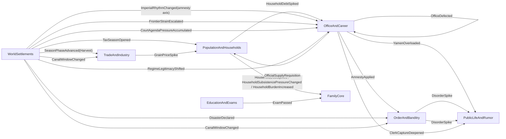

# RENZONG_THIN_CHAIN_TOPOLOGY_INDEX

This document freezes the current Renzong pressure-chain thin-slice topology.

It does not replace `RENZONG_PRESSURE_CHAIN_SPEC.md`. The spec remains the fuller design target. This index records what is actually wired as a thin live chain today, which scope each chain is allowed to touch, what keeps it from repeating, and which tests prove the current slice.

Use this file before adding rule density. If a future change deepens a chain, update this index in the same PR.

## Thin-Chain Closeout Status - v101-v108

As of the v101-v108 closeout audit, the current Renzong thin-chain skeleton is treated as closed through v100. "Closed" here means the live thin topology has source pressure, owning modules, scheduler drain or delayed-month behavior, repetition guard, off-scope boundary where applicable, downstream receipt/projection, owner-lane readback, UI/Unity copy-only display, no-summary-parsing guards, and no-save/no-schema documentation.

This is not a full-chain completion claim. The full-chain debt below remains intentionally open for later rule-density work: richer household registration and tax/corvee formulas, famine and relief economy, exam-office-public memory, mourning and non-amnesty imperial axes, frontier logistics, disaster recovery, clerk/faction depth, court process state, regime recognition, canal politics, and long-run residue/recovery tuning.

V101-V108 adds no runtime authority, no scheduler phase, no command, no event pool, no persisted state, no schema/migration, no new ledger, no manager/controller layer, no `PersonRegistry` expansion, and no UI/Unity rule path. It is an audit lock over the v3-v100 thin-chain evidence.

## Chain 8 First Rule-Density Layer - v109-v116

V109-V116 is the first rule-density layer for Chain 8. It keeps the existing path `WorldSettlements.CourtAgendaPressureAccumulated -> OfficeAndCareer.PolicyWindowOpened -> OfficeAndCareer.PolicyImplemented -> PublicLifeAndRumor`, but makes the player-facing process read as policy tone, document direction, county-gate posture, and public interpretation rather than a flat court-pressure receipt.

The new readback language is `政策语气读回`, `文移指向读回`, `县门承接姿态`, `公议承压读法`, `朝廷后手仍不直写地方`, and `不是本户硬扛朝廷后账`. It remains a rule-driven command / aftermath / social-memory / readback loop. `DomainEvent` is only one fact propagation tool; it is not the design body.

Ownership remains unchanged: `WorldSettlements` owns court agenda / mandate pressure source, `OfficeAndCareer` owns policy window and county/yamen implementation posture, `PublicLifeAndRumor` owns public interpretation and notice visibility, `SocialMemoryAndRelations` owns only later durable residue from structured aftermath, Application assembles projections, and Unity copies projected fields. V109-V116 adds no Court module, court engine, event pool, dispatch/policy/court-process/owner-lane/cooldown ledger, schema, migration, `PersonRegistry` expansion, or UI/Unity authority.

## Chain 8 Local Response Affordance - v117-v124

V117-V124 adds the next bounded local-response affordance layer to Chain 8. The existing path remains `WorldSettlements.CourtAgendaPressureAccumulated -> OfficeAndCareer.PolicyWindowOpened -> OfficeAndCareer.PolicyImplemented -> PublicLifeAndRumor`, but player-facing command surfaces may now show narrow continuations such as `政策回应入口`, `文移续接选择`, `县门轻催`, `递报改道`, and `公议降温只读回`.

This is still not a full court engine. `PressCountyYamenDocument`, `RedirectRoadReport`, `PostCountyNotice`, and `DispatchRoadReport` are reused as existing Office/PublicLife owner-lane commands and guidance surfaces. `OfficeAndCareer` resolves county document/report pressure from existing office scalar state; `PublicLifeAndRumor` reads public interpretation; Application routes/assembles/projects; Unity copies projected fields. The readback must keep saying `不是本户硬扛朝廷后账` and must not calculate policy success.

V117-V124 adds no Court module, event pool, dispatch ledger, policy ledger, court-process ledger, owner-lane ledger, cooldown ledger, schema, migration, `PersonRegistry` expansion, manager/god-controller path, Application rule layer, or UI/Unity authority. Readers must not parse `DomainEvent.Summary`, receipt prose, public-life notice/dispatch prose, `LastAdministrativeTrace`, `LastPetitionOutcome`, `LastLocalResponseSummary`, or `LastRefusalResponseSummary`.

## Chain 8 Memory-Pressure Readback - v133-v140

V133-V140 adds a projection-only memory-pressure readback after the v125-v132 delayed echo. When a later policy window is visible, Application may project existing `office.policy_local_response...` SocialMemory cause/type/weight together with current `JurisdictionAuthoritySnapshot` and `SettlementPublicLifeSnapshot` values as `政策旧账回压读回`, `旧文移余味`, `下一次政策窗口读法`, and `公议旧读法续压`.

This readback must remain downstream of `OfficeAndCareer`, `PublicLifeAndRumor`, and `SocialMemoryAndRelations`. It does not create a Court module, court engine, event pool, policy ledger, memory-pressure ledger, cooldown ledger, new schema field, migration, Application success calculation, UI rule path, Unity rule path, `PersonRegistry` expansion, or manager/god-controller path. It must not parse memory summaries, receipt prose, public-life prose, `DomainEvent.Summary`, `OfficialNoticeLine`, `PrefectureDispatchLine`, `LastAdministrativeTrace`, `LastPetitionOutcome`, `LastLocalResponseSummary`, or `LastRefusalResponseSummary`.

## Chain 8 Public Follow-Up Cue - v149-v156

V149-V156 adds a projection-only public follow-up cue on top of v141-v148. When old `office.policy_local_response...` residue is already visible in public-life command/readback surfaces, Application may read the structured outcome code and current public-life scalars to show `政策公议后手提示`, `公议冷却提示`, `公议轻续提示`, `公议换招提示`, and `下一步仍看榜示/递报承口`.

This cue is not a cooldown ledger and not a new policy result. `OfficeAndCareer` still owns county document/report execution, `PublicLifeAndRumor` still owns street interpretation, and `SocialMemoryAndRelations` still owns durable residue. It adds no Court module, court engine, event pool, public-follow-up ledger, cooldown ledger, schema field, migration, Application success calculation, UI/Unity authority, `PersonRegistry` expansion, or manager/god-controller path. It must not parse memory summaries, receipt prose, public-life prose, `DomainEvent.Summary`, `OfficialNoticeLine`, `PrefectureDispatchLine`, `LastAdministrativeTrace`, `LastPetitionOutcome`, `LastLocalResponseSummary`, or `LastRefusalResponseSummary`.

## Chain 8 Follow-Up Docket Guard - v157-v164

V157-V164 adds a projection-only docket/no-loop guard on top of v149-v156. When old `office.policy_local_response...` residue is already visible as a public follow-up cue, Application may read the same structured outcome code and public-life scalars to show `政策后手案牍防误读`, `公议后手只作案牍提示`, `不是Order后账`, `不是Office成败`, and `仍等Office/PublicLife/SocialMemory分读` in governance/docket guard text.

This guard belongs to existing `CourtPolicyNoLoopGuardSummary` and docket guidance only. It is not a new ledger, not a cooldown account, not a policy outcome, not Order debt, and not a home-household bill. It adds no Court module, court engine, event pool, docket ledger, public-follow-up ledger, cooldown ledger, schema field, migration, Application success calculation, UI/Unity authority, `PersonRegistry` expansion, or manager/god-controller path. It must not parse memory summaries, receipt prose, public-life prose, `DomainEvent.Summary`, `OfficialNoticeLine`, `PrefectureDispatchLine`, `LastAdministrativeTrace`, `LastPetitionOutcome`, `LastLocalResponseSummary`, or `LastRefusalResponseSummary`.

## Chain 8 Suggested Action Guard - v165-v172

V165-V172 adds a projection-only suggested-action guard on top of v157-v164. When the governance docket already selects an existing affordance for a settlement that has the court-policy public follow-up guard, Application may append `建议动作防误读` and `只承接已投影的政策公议后手` to the existing `SuggestedCommandPrompt` / docket `GuidanceSummary`.

This does not change `SelectPrimaryGovernanceAffordance` priority, command availability, or policy outcome calculation. The suggested action remains an already-projected Office/PublicLife affordance, not a Court command, not a new ranking rule, not a cooldown account, not Order debt, not Office success/failure, and not a home-household bill. V165-V172 adds no Court module, court engine, event pool, suggested-action ledger, docket ledger, public-follow-up ledger, cooldown ledger, schema field, migration, Application success calculation, UI/Unity authority, `PersonRegistry` expansion, or manager/god-controller path. It must not parse memory summaries, receipt prose, public-life prose, `DomainEvent.Summary`, `OfficialNoticeLine`, `PrefectureDispatchLine`, `LastAdministrativeTrace`, `LastPetitionOutcome`, `LastLocalResponseSummary`, or `LastRefusalResponseSummary`.

## Chain 8 Suggested Receipt Guard - v173-v180

V173-V180 adds a projection-only suggested receipt guard on top of v165-v172. When a later command receipt is already carrying existing court-policy local-response/public-follow-up context, Application may append `建议回执防误读`, `只回收已投影的政策公议后手`, and `回执不是新政策结果` to the projected receipt readback.

This does not create a receipt ledger or suggested receipt ledger. The receipt remains a readback over existing Office/PublicLife/SocialMemory facts: `OfficeAndCareer` still owns county document/report aftermath, `PublicLifeAndRumor` still owns public interpretation, and `SocialMemoryAndRelations` still owns durable residue. V173-V180 adds no Court module, court engine, event pool, dispatch/policy/court-process/owner-lane/cooldown/docket/suggested-action/suggested-receipt ledger, schema field, migration, Application success calculation, UI/Unity authority, `PersonRegistry` expansion, or manager/god-controller path. It must not parse memory summaries, receipt prose, public-life prose, `DomainEvent.Summary`, `OfficialNoticeLine`, `PrefectureDispatchLine`, `LastAdministrativeTrace`, `LastPetitionOutcome`, `LastLocalResponseSummary`, or `LastRefusalResponseSummary`.

## Chain 8 Receipt-Docket Consistency Guard - v181-v188

V181-V188 adds a projection-only receipt-to-docket consistency guard on top of v173-v180. When the governance docket already sees the same structured court-policy local-response/public-follow-up residue used by the suggested receipt guard, Application may append `回执案牍一致防误读`, `回执只回收已投影的政策公议后手`, and `案牍不把回执读成新政策结果` to the existing governance no-loop / docket guidance surfaces.

This guard belongs to `CourtPolicyNoLoopGuardSummary` and docket `GuidanceSummary` only. It does not create a receipt-docket ledger, policy result, cooldown account, Order after-account, Office success/failure, or home-household bill. `OfficeAndCareer` still owns county document/report aftermath, `PublicLifeAndRumor` owns public interpretation, and `SocialMemoryAndRelations` owns durable residue. V181-V188 adds no Court module, court engine, event pool, dispatch/policy/court-process/owner-lane/cooldown/docket/receipt/receipt-docket ledger, schema field, migration, Application success calculation, UI/Unity authority, `PersonRegistry` expansion, or manager/god-controller path. It must not parse memory summaries, receipt prose, public-life prose, `DomainEvent.Summary`, `OfficialNoticeLine`, `PrefectureDispatchLine`, `LastAdministrativeTrace`, `LastPetitionOutcome`, `LastLocalResponseSummary`, or `LastRefusalResponseSummary`.

## Chain 8 Public-Life Receipt Echo - v189-v196

V189-V196 adds a projection-only public-life receipt echo guard on top of v181-v188. When a public-life notice/report command already reads the same structured `office.policy_local_response...` residue as policy public-reading echo, Application may append `公议回执回声防误读`, `街面只读已投影的政策公议后手`, and `公议不把回执读成新政令` to the existing public-life command `LeverageSummary` / `ReadbackSummary`.

This belongs only to player-facing public-life command readback. It does not create a public-life receipt echo ledger, new policy result, Order after-account, Office success/failure, cooldown account, or home-household bill. `OfficeAndCareer` still owns county document/report aftermath, `PublicLifeAndRumor` owns street/public interpretation, and `SocialMemoryAndRelations` owns durable residue. V189-V196 adds no Court module, court engine, event pool, dispatch/policy/court-process/owner-lane/cooldown/docket/receipt/public-life-receipt-echo ledger, schema field, migration, Application success calculation, UI/Unity authority, `PersonRegistry` expansion, or manager/god-controller path. It must not parse memory summaries, receipt prose, public-life prose, command affordance prose, `DomainEvent.Summary`, `OfficialNoticeLine`, `PrefectureDispatchLine`, `LastAdministrativeTrace`, `LastPetitionOutcome`, `LastLocalResponseSummary`, or `LastRefusalResponseSummary`.

## Chain 8 First Rule-Density Closeout Audit - v197-v204

V197-V204 closes v109-v196 as a Chain 8 first rule-density audit. It treats the branch as complete only at the first-layer readback level: policy process texture, bounded Office/PublicLife local response, delayed SocialMemory residue, memory-pressure next-window readback, public-reading echo, public follow-up cue, docket guard, suggested-action guard, suggested-receipt guard, receipt-docket consistency, and public-life receipt echo.

The v109-v196 first rule-density closeout audit v197-v204 is not the full court engine and not a court-agenda / policy-dispatch completion claim. Court process state, appointment slate, dispatch arrival, and downstream household/market/public consequences remain explicit full-chain debt. V197-V204 adds no production rule, Court module, event pool, dispatch/policy/court-process/owner-lane/cooldown/docket/receipt/public-life-receipt-echo ledger, schema field, migration, Application success calculation, UI/Unity authority, `PersonRegistry` expansion, or manager/god-controller path.

## Chain 8 Public-Reading Echo - v141-v148

V141-V148 adds a projection-only public-reading echo on top of v133-v140. When a later public-life notice/report choice is visible, Application may project existing `office.policy_local_response...` SocialMemory cause/type/weight together with current `JurisdictionAuthoritySnapshot` and `SettlementPublicLifeSnapshot` values as `政策公议旧读回`, `公议旧账回声`, and `下一次榜示/递报旧读法`.

The echo belongs on governance and public-life command readbacks only. `PublicLifeAndRumor` reads street interpretation, `OfficeAndCareer` still owns county-gate execution, and `SocialMemoryAndRelations` still owns durable residue. It adds no Court module, court engine, event pool, public-reading ledger, policy ledger, schema field, migration, Application success calculation, UI/Unity authority, `PersonRegistry` expansion, or manager/god-controller path. It must not parse memory summaries, receipt prose, public-life prose, `DomainEvent.Summary`, `OfficialNoticeLine`, `PrefectureDispatchLine`, `LastAdministrativeTrace`, `LastPetitionOutcome`, `LastLocalResponseSummary`, or `LastRefusalResponseSummary`.

## Chain 8 Social-Memory Echo - v125-v132

V125-V132 adds the first delayed social-memory echo after the v117-v124 local response affordance. The same court-policy path remains `WorldSettlements.CourtAgendaPressureAccumulated -> OfficeAndCareer.PolicyWindowOpened -> OfficeAndCareer.PolicyImplemented -> PublicLifeAndRumor`, but a later `SocialMemoryAndRelations` month pass may now read structured Office local-response aftermath and write `office.policy_local_response...` residue.

This is still not a Court module, court engine, event pool, faction AI, full policy economy, or new ledger. The echo uses existing `JurisdictionAuthoritySnapshot` fields such as `LastRefusalResponseCommandCode`, `LastRefusalResponseOutcomeCode`, `LastRefusalResponseTraceCode`, and `ResponseCarryoverMonths`; it must not parse command receipts, public-life prose, `DomainEvent.Summary`, `LastAdministrativeTrace`, `LastPetitionOutcome`, `LastLocalResponseSummary`, or `LastRefusalResponseSummary`.

The social-memory readback should say the residue came from `OfficeAndCareer/PublicLifeAndRumor` court-policy local response, not from `OrderAndBanditry`, not from a home-household repair path, and not from this household hard-carrying court after-accounts. Application projects structured memory cause/type/weight; Unity copies projected fields only. V125-V132 adds no persisted fields, schema bump, migration, `PersonRegistry` expansion, manager/god-controller path, or UI/Unity authority.

## Reading Rule

Each thin chain must answer:
- source pressure and owning module
- event path across modules
- pressure locus: global, court, regime, settlement, route, household, clan, person, office, or campaign
- same-month drain or explicit delayed-month behavior
- watermark, edge rule, or cadence that prevents accidental repetition
- off-scope boundary, when the pressure has a concrete locus
- downstream receipt or projection surface
- full-chain debt that remains intentionally unimplemented

The index protects the rule that Zongzu is rules-driven, not event-pool driven. `DomainEvent` records and transfers resolved facts; it is not the source of gameplay by itself.

## Topology Map

## Thin-Chain Ledger

| Chain | Current thin path | Locus | Same-month? | Repetition guard | Receipt / projection | Current proof |
|---|---|---|---|---|---|---|
| 1. Tax/corvee household-yamen-public + sponsor-family pressure | `WorldSettlements.TaxSeasonOpened -> HouseholdDebtSpiked -> OfficeAndCareer.YamenOverloaded -> PublicLife heat`; v36 also drains `HouseholdDebtSpiked -> FamilyCore` sponsor-clan pressure | symbolic tax-season source today; household handler accepts settlement scope; office emits settlement-scoped yamen receipt; public-life mutates only the matching settlement; FamilyCore touches only the household sponsor clan | yes, bounded scheduler drain | scheduler fresh-event watermark; full precise tax locus still deferred; FamilyCore uses household id + `SponsorClanId` and does not fan out | `HouseholdDebtSpiked` with tax-profile metadata, settlement-scoped `YamenOverloaded`, public-life street-talk heat, and sponsor-clan `CharityObligation` / `SupportReserve` / `BranchTension` pressure readback | `RenzongPressureChainTests.Chain1_RealMonthlyScheduler_DrainsTaxSeasonIntoYamenAndPublicLife`; `HouseholdBurdenHandlerTests`; `TaxSeasonBurdenHandlerTests`; `OfficeAndCareerModuleTests.HandleEvents_HouseholdDebtSpiked_UsesSettlementMetadataForYamenScope`; `YamenOverloadHandlerTests` |
| 2. Harvest/grain household pressure | `SeasonPhaseAdvanced(Harvest) -> TradeAndIndustry.GrainPriceSpike -> HouseholdSubsistencePressureChanged`; v36 allows `HouseholdSubsistencePressureChanged -> FamilyCore` sponsor-clan pressure | settlement market / household / sponsor clan | yes, bounded scheduler drain | harvest phase edge plus local market event; off-scope household and off-scope clan assertions | `GrainPriceSpike` carries grain-market metadata; `HouseholdSubsistencePressureChanged` carries household subsistence-profile metadata; FamilyCore reads structured household snapshot and sponsor clan only | `RenzongPressureChainTests.Chain2_RealMonthlyScheduler_DrainsHarvestPriceIntoLocalHouseholdPressure`; `GrainPriceSubsistenceHandlerTests`; `HouseholdBurdenHandlerTests` |
| 3. Exam prestige | `EducationAndExams.ExamPassed -> FamilyCore.ClanPrestigeAdjusted` | person to clan | yes, bounded scheduler drain | exam cadence and one exam result | `ExamPassed` carries credential metadata; `ClanPrestigeAdjusted` carries exam-prestige profile metadata | `ExamPrestigeChainTests.ExamPass_ThinChain_RealScheduler_DrainsIntoClanPrestige`; `ExamResultHandlerTests` |
| 4. Imperial amnesty disorder | `ImperialRhythmChanged(amnesty axis) -> OfficeAndCareer.AmnestyApplied -> OrderAndBanditry.DisorderSpike` | imperial signal allocated to settlement jurisdiction | yes, bounded scheduler drain | office-owned `LastAppliedAmnestyWave`; handler must respect amnesty axis rather than any imperial change | `AmnestyApplied` carries office execution metadata; `DisorderSpike` carries amnesty-disorder profile metadata | `ImperialAmnestyDisorderChainTests.ImperialAmnesty_ThinChain_RealScheduler_DrainsIntoDisorderSpike`; `AmnestyDispatchHandlerTests`; `AmnestyDisorderHandlerTests` |
| 5. Frontier supply household burden | `WorldSettlements.FrontierStrainEscalated -> OfficeAndCareer.OfficialSupplyRequisition -> PopulationAndHouseholds.HouseholdBurdenIncreased`; v36 allows `HouseholdBurdenIncreased -> FamilyCore` sponsor-clan pressure | settlement / household / sponsor clan | yes, bounded scheduler drain | world-owned `LastDeclaredFrontierStrainBand`; current scalar is thin-slice only; FamilyCore uses household id + `SponsorClanId` and does not fan out | `OfficialSupplyRequisition` carries office execution profile metadata; `HouseholdBurdenIncreased` carries household burden-profile metadata; sponsor clan can gain charity obligation, support drawdown, branch tension, and relief-sanction pressure | `FrontierSupplyHouseholdChainTests` plus office/population handler tests; `HouseholdBurdenHandlerTests` |
| 6. Disaster disorder public life | `WorldSettlements.DisasterDeclared -> OrderAndBanditry.DisorderSpike -> PublicLife heat` | settlement disaster | yes, bounded scheduler drain | world-owned `LastDeclaredFloodDisasterBand`; metadata-only rule handling | `DisorderSpike` carries disaster-disorder profile metadata; PublicLife projects cause-aware heat | `DisasterDisorderPublicLifeChainTests` plus disaster handler tests |
| 7. Clerk capture public life | `OfficeAndCareer.ClerkCaptureDeepened -> PublicLife heat` | settlement jurisdiction | yes, bounded scheduler drain | office-owned `ActiveClerkCaptureSettlementIds`; clears only when condition falls | `ClerkCaptureDeepened` carries office profile metadata; PublicLife heat scales from that profile | `OfficeCourtRegimePressureChainTests.Chain7_RealScheduler_ClerkCaptureDrainsIntoScopedPublicLifeAndDoesNotRepeat` plus office/public-life handler tests |
| 8. Court agenda policy window and yamen implementation | `WorldSettlements.CourtAgendaPressureAccumulated -> OfficeAndCareer.PolicyWindowOpened -> OfficeAndCareer.PolicyImplemented` | court/global source allocated to one jurisdiction, then resolved inside the same office/yamen lane | yes, bounded scheduler handling | allocation rule opens exactly one selected court-facing jurisdiction in the thin slice; local drag can absorb the signal; v37 implementation mutates only existing Office state and emits one matching-settlement outcome | `PolicyWindowOpened` carries office-owned policy-window profile metadata; `PolicyImplemented` carries implementation outcome, score, docket drag, clerk capture, local buffer, and paper-compliance metadata | `OfficeCourtRegimePressureChainTests.Chain8_RealScheduler_CourtAgendaDrainsIntoOnePolicyImplementation`; `Chain789OfficePressureHandlerTests`; `PolicyImplementationHandlerTests` |
| 9. Regime legitimacy office defection | `WorldSettlements.RegimeLegitimacyShifted -> OfficeAndCareer.OfficeDefected -> PublicLifeAndRumor` | regime/global source allocated to one highest-risk official, then read by the matching public-life settlement | yes, bounded scheduler handling | risk allocation chooses one official; default `MandateConfidence = 70` prevents unseeded crisis; authority/reputation can buffer low mandate pressure | `OfficeDefected` carries office-owned defection profile metadata after appointment mutation; v253-v260 projects `天命摇动读回`, `去就风险读回`, `官身承压姿态`, and `公议向背读法` through Office/PublicLife readback only | `OfficeCourtRegimePressureChainTests.Chain9_RealScheduler_RegimePressureDefectsOnlyOneHighRiskOfficial`; `OfficeCourtRegimePressureChainTests.Chain9_RegimeLegitimacyDefectionProjectsPublicAndGovernanceReadback`; `Chain789OfficePressureHandlerTests` |
| 10. Canal window trade/order pressure | `WorldSettlements.CanalWindowChanged -> TradeAndIndustry route/market pressure` and `WorldSettlements.CanalWindowChanged -> OrderAndBanditry route pressure` | water/canal-exposed settlement | yes, bounded scheduler handling | transition edge on `CanalWindow`; handlers select exposed settlements from structured `IWorldSettlementsQueries` and keep off-scope settlements untouched | Trade emits route-blocked receipt if existing route risk crosses threshold; Order emits black-route pressure receipt if existing black-route pressure crosses threshold | `CanalWindowTradeHandlerTests`; `CanalWindowOrderHandlerTests`; `EventContractHealth_CanalWindowChangedHasTradeAndOrderAuthorityConsumers` |

## Freeze Rules

1. Thin slice does not mean full chain. Every row above is a proof of topology and boundary, not the full social formula.
2. A broad pressure must choose a first local locus before mutating local state. Frontier, court, regime, disaster, and imperial rhythm may start wide, but they may not touch every household or jurisdiction by accident.
3. Persistent pressure requires an edge, watermark, processed band, or explicit recurring-demand cadence. A high current value alone is not a new escalation event.
4. Same-month follow-on effects must pass through the bounded scheduler drain and process only fresh events. If a future link cannot finish inside the cap, carry traceable state into the next month.
5. Every emitted event must be listed in `PublishedEvents`; every handled event must be listed in `ConsumedEvents`; every cross-module event name must come from `Zongzu.Contracts`.
6. Concrete-locus handlers must filter before mutation and tests must include a comparable off-scope negative case.
7. Rule density must consume existing owner-state dimensions before inventing a second rule layer. For household pressure, prefer `Livelihood`, land, grain, labor, dependents, debt, distress, and migration fields owned by `PopulationAndHouseholds`.
8. Generic downstream events must either carry cause metadata or keep projection wording cause-neutral.
9. Projection may explain why-now and what-next, but it may not become a second authority layer.
10. Application services may route commands and compose read models, but they may not absorb chain rules while the owning modules are still being shaped.
11. Ten-year diagnostic event-contract debt must be classified before it is used as design evidence. V32 classifications are diagnostic-only: `ProjectionOnlyReceipt`, `FutureContract`, `DormantSeededPath`, `AcceptanceTestGap`, `AlignmentBug`, or `Unclassified`. V33 hardens this into a no-unclassified gate for the current ten-year health run. V34 adds diagnostic `owner=<module>` and `evidence=<doc/test backlink>` readback over the classified debt. The classification table, gate, and evidence backlinks do not create an event pool, do not make `DomainEvent` the design body, and do not change persisted module state.

## Full-Chain Debt

The thin topology leaves these fuller branches intentionally unimplemented:

Chain 8 v165-v204 note: the suggested-action guard, suggested receipt guard, receipt-docket consistency guard, public-life receipt echo guard, and first rule-density closeout audit only copy or document existing court-policy anti-misread guidance in the docket prompt, command receipt readback, docket no-loop surface, public-life command readback, and audit surfaces. They do not close court process state, add an appointment slate, add dispatch arrival, create a receipt ledger, create a receipt-docket ledger, create a public-life receipt echo ledger, or create downstream household/market/public consequence rules.

- Chain 1: precise zhuhu / kehu household grade, tax kind, tenant/client rent cascade, cash squeeze into markets, long memory, precise settlement tax events, and richer jurisdiction capacity formulas. The current handler already uses a multi-dimensional proxy profile from existing household state (`Livelihood`, `LandHolding`, `GrainStore`, `LaborCapacity`, `DependentCount`, `DebtPressure`, `Distress`) and carries settlement scope into the yamen/public-life receipt; v36 also lets sponsor clans absorb household debt pressure through existing `FamilyCore` support/charity/tension fields, but it is not yet a full tax/corvee society or relief economy formula.
- Chain 2: formal yield ratio, granary security, route risk, disaster relief, migration, death pressure, famine narrative residue. The current handler already uses a first household-owned subsistence profile from grain price/current supply-demand metadata plus existing household dimensions (`Livelihood`, `GrainStore`, `LaborCapacity`, `DependentCount`, `DebtPressure`, `Distress`, `MigrationRisk`); v36 can press sponsor-clan charity/support/tension from that structured household snapshot, but it is not yet a full grain/famine society formula.
- Chain 3: office waiting list, recommendation, favor/shame memory, public-life exam projection, failure and study-abandon branches. The current handler already uses a first credential-prestige profile from exam metadata (`ExamTier`, score, academy prestige, stress) plus existing clan/person state (`Prestige`, `MarriageAlliancePressure`, heir/branch role, adult unmarried status), but it is not yet the full education-office-public-life chain.
- Chain 4: mourning, succession, appointment rhythm, dispatch wording, public legitimacy, and non-amnesty imperial axes. The current handler already uses a first amnesty-disorder profile from office execution metadata (`AmnestyWave`, authority tier, jurisdiction leverage, clerk dependence, petition backlog, administrative task load) plus order-owned local state (`DisorderPressure`, `BanditThreat`, `BlackRoutePressure`, `CoercionRisk`, `RoutePressure`, suppression buffers), but it is not yet the full imperial-local political chain.
- Chain 5: frontier sectors, WarfareCampaign mobilization, ConflictAndForce readiness, market diversion, formal quota formulas, public-life military burden, and long memory residue. The current handler already uses a first office-to-household profile from frontier metadata plus jurisdiction pressure (`AuthorityTier`, leverage, clerk dependence, backlog, administrative task load) and household-owned dimensions (`Livelihood`, `LandHolding`, `GrainStore`, `ToolCondition`, `ShelterQuality`, `LaborCapacity`, `DependentCount`, `LaborerCount`, `DebtPressure`, `Distress`, `MigrationRisk`); v36 can press sponsor-clan charity/support/tension from `HouseholdBurdenIncreased`, but it is not yet the full frontier/war economy chain.
- Chain 6: relief decisions, household subsistence/migration, market panic, route insecurity, SocialMemory disaster residue, public legitimacy. The current handler already uses a first order-owned disaster-disorder profile from disaster metadata (`severity`, `floodRisk`, `embankmentStrain`) plus local order soil (`DisorderPressure`, `BanditThreat`, `RoutePressure`, `BlackRoutePressure`, `CoercionRisk`, `RetaliationRisk`, `ImplementationDrag`) and suppression buffers, but it is not yet the full disaster-relief society chain.
- Chain 7: official evaluation, memorial attacks, petition delay, trade dispute delay, clerk factions, recommended clerk / shiye intervention. The current handler already uses a first office-to-public profile from `ClerkDependence`, `PetitionBacklog`, `AdministrativeTaskLoad`, `PetitionPressure`, authority tier, and jurisdiction leverage, but it is not yet the full official-clerk-execution chain.
- Chain 8: court process state, appointment slate, dispatch arrival, downstream household/market/public consequences. The current handler already uses a first office-owned policy-window profile plus v37 implementation outcome from mandate deficit, authority tier, jurisdiction leverage, petition signal, administrative task load, clerk dependence, petition backlog, docket drag, clerk capture, local buffer, and paper compliance; v109-v116 adds first-layer process readback for policy tone, document direction, county-gate posture, and public interpretation; v117-v124 adds bounded local response affordances through existing Office/PublicLife commands; v125-v132 lets `SocialMemoryAndRelations` write later `office.policy_local_response...` residue from structured Office aftermath only; v133-v140 projects that old residue into the next visible policy-window readback as memory-pressure context; v141-v148 also lets public-life notice/report choices show the old residue as public-reading echo; v149-v156 adds projection-only public follow-up cues such as `公议轻续提示` without adding a cooldown ledger; v157-v164 adds a docket/no-loop anti-misread guard over that cue; v165-v180 copies the same anti-misread guidance into suggested prompts and receipts; v181-v188 aligns the docket with the receipt so neither surface reads the receipt as a new policy result; v189-v196 makes public-life command readback say the street/public side also does not read the receipt as a new policy command; v197-v204 audits that v109-v196 is a closed first rule-density branch only. It is not yet the full court-agenda/policy-dispatch chain.
- Chain 9: regime recognition, grain-route control, household compliance, public legitimacy, ritual claim, force backing, rebellion-to-polity and dynasty-cycle consequences. The current handler already uses a first office-owned defection profile from mandate deficit, demotion pressure, clerk pressure, petition pressure, reputation strain, and authority/reputation buffer. V253-V260 adds only first-layer public/governance readback for `天命摇动读回`, `去就风险读回`, `官身承压姿态`, and `公议向背读法`; it is not yet the full regime-recognition/compliance chain.
- Chain 10: canal dredging politics, formal shipment allocation, canal-office paperwork, boatmen, route factions, market substitution, and durable public/social residue. The current handler only returns canal-window facts to existing `TradeAndIndustry` and `OrderAndBanditry` owner lanes through existing fields; it is not a full canal economy, patrol AI, or yamen implementation formula.

## V213-V244 Social Mobility Fidelity Ring Note

This pass is not a new Renzong pressure chain. It thickens the shared "near detail, far summary" substrate that existing and future chains can read.

- `PopulationAndHouseholds` now turns high household pressure into first-layer livelihood drift, member activity, and labor/marriage/migration pool readback.
- `PersonRegistry` can move a hot person into a nearer `FidelityRing` through a narrow command, but remains identity-only.
- Chains that later touch households, migration, relief, disorder, office, or warfare may read these structured population/fidelity projections; they must not treat them as a ledger or parse readback prose.
- Save/schema impact is none.

## V245-V252 Social Mobility Fidelity Ring Closeout Audit

V245-V252 closes the v213-v244 social mobility fidelity-ring branch as first-layer substrate only. It is documentation and architecture-test governance, not a new runtime rule layer.

Closed means the current code now has a bounded loop for household pressure -> livelihood/member activity/pool synchronization -> structured mobility/fidelity readback -> Unity copy-only presentation. It does not mean Zongzu has a full society engine, complete migration economy, full class mobility model, per-person world simulation, dormant-stub demotion loop, or SocialMemory durable movement residue.

The closeout preserves the owner split: `PopulationAndHouseholds` owns livelihood/activity/pools, `PersonRegistry` owns identity and existing fidelity-ring assignment only, `SocialMemoryAndRelations` remains a later structured-residue owner, Application assembles projections, and UI/Unity copy fields. V245-V252 adds no module, ledger, schema, migration, persisted cache, manager/controller, or prose-parsing authority.

## V269-V276 Social Mobility Scale Budget Guard

V269-V276 is a guard over the v213-v252 mobility/fidelity substrate, not a new pressure chain and not a new runtime feature. It records the scale rule that future personnel or social-mobility work must follow: near people can become detailed, active pressure can select a bounded local focus, active chain regions stay readable through structured pools and settlement summaries, and distant society remains alive as pressure summaries rather than all-world per-person hard simulation.

The guard preserves the owner split: `PopulationAndHouseholds` owns household livelihood, membership activity, and labor/marriage/migration pools; `PersonRegistry` owns identity and existing `FidelityRing` assignment only; `SocialMemoryAndRelations` remains the later durable-residue owner; Application assembles projections and diagnostics; Unity copies projected fields. V269-V276 adds no production rule, schema, migration, movement/social/focus/scheduler ledger, world-person simulation manager, Application/UI/Unity authority, `PersonRegistry` domain expansion, or prose parser.

## V277-V284 Social Mobility Influence Readback

V277-V284 adds a second readback layer over the existing social mobility/fidelity substrate. It exposes why a surface is showing close detail, pressure-selected local detail, active-region pools, or distant summary through runtime fields on `FidelityScaleSnapshot`, `SettlementMobilitySnapshot`, and `PersonDossierSnapshot`.

This pass does not change the underlying owner rules. `PopulationAndHouseholds` still owns livelihood/activity/pools, `PersonRegistry` still owns identity/fidelity only, and Application/Unity only project or copy the new readback. It adds no command, schema, migration, movement/social/focus/scheduler ledger, global person simulation, durable SocialMemory movement residue, or UI-owned mobility rule.

## V285-V292 Social Mobility Boundary Closeout Audit

V285-V292 closes v213-v284 as a first-layer social mobility / personnel-flow substrate only: near detail, pressure-selected local detail, active-region pools, distant pressure summary. Closed here means the current code and docs prove a bounded path for household pressure -> livelihood/activity/pool synchronization -> fidelity-ring readback -> scale-budget/influence readback -> Unity copy-only presentation.

It does not mean Zongzu has a complete society engine, full migration economy, full class-mobility formula, direct player command over people, all-world per-person monthly simulation, dormant-stub demotion loop, or durable SocialMemory movement residue. Future depth must open a new ExecPlan and name owner state, cadence, hot path, expected cardinality, deterministic cap/order, no-touch boundary, schema impact, and validation lane.

The closeout preserves the owner split: `PopulationAndHouseholds` owns livelihood/activity/pools; `PersonRegistry` owns identity and existing `FidelityRing` assignment only; `SocialMemoryAndRelations` remains a future durable-residue owner; Application assembles projections and diagnostics; UI/Unity copy projected fields only. V285-V292 adds no production rule, schema, migration, movement/social/focus/scheduler/command/personnel ledger, projection cache, manager/controller, `PersonRegistry` domain expansion, or prose parser.

## V293-V300 Personnel Command Preflight

V293-V300 is a preflight audit for future player-facing personnel-flow commands. It does not add a command. It records that any later command affecting movement, migration, assignment, return, settlement placement, office service, or campaign manpower must name its owner module, target scope, hot path, expected cardinality, deterministic cap/order, no-touch boundary, schema impact, and validation lane before implementation.

Current seams remain bounded: `PopulationAndHouseholds` owns household livelihood/activity/migration pressure and local household response commands; `PersonRegistry` owns identity and existing `FidelityRing` assignment only; `FamilyCore`, `OfficeAndCareer`, `WarfareCampaign`, or later owner lanes may request personnel effects only through their own module-owned rule contracts. Application routes commands, and UI/Unity copy affordances and receipts only.

The preflight adds no production rule, player command, schema, migration, direct move/transfer/summon/assign-person path, command/movement/personnel/assignment/focus/scheduler ledger, projection cache, manager/controller, `PersonRegistry` domain expansion, Application rule layer, UI/Unity authority, or prose parser.

## V301-V308 Personnel Flow Command Readiness

V301-V308 adds the first projected personnel-flow readiness readback on existing `PopulationAndHouseholds` home-household local response commands. It does not add a new command. It lets the public-life command surface say that `RestrictNightTravel`, `PoolRunnerCompensation`, and `SendHouseholdRoadMessage` can influence only this household's livelihood, labor capacity, distress, and migration pressure.

The owner split remains unchanged: `PopulationAndHouseholds` owns the local household response and migration-pressure state; `PersonRegistry` owns identity and existing `FidelityRing` only; Application assembles `PersonnelFlowReadinessSummary`; UI/Unity copy the projected field. V301-V308 adds no schema, migration, direct move/transfer/summon/assign-person path, command/movement/personnel/assignment/focus/scheduler ledger, global person simulation manager, `PersonRegistry` expansion, or prose parser.

## V309-V316 Personnel Flow Surface Echo

V309-V316 adds a structured command-surface echo over the v301-v308 personnel-flow readiness fields. `PlayerCommandSurfaceSnapshot.PersonnelFlowReadinessSummary` is assembled only from non-empty affordance/receipt `PersonnelFlowReadinessSummary` fields, so Great Hall mobility readback can show `人员流动命令预备汇总` without calculating movement success or parsing prose.

The echo keeps the same near/far rule: local household command readiness is visible, but distant people remain pooled and summarized. It adds no schema, migration, direct personnel command, movement/personnel/surface-echo ledger, `PersonRegistry` expansion, Application movement resolver, UI authority, Unity authority, or `DomainEvent.Summary` / readback prose parser.

## V317-V324 Personnel Flow Readiness Closeout Audit

V317-V324 closes v293-v316 as the first personnel-flow command-readiness layer: preflight gates, structured local-response readiness, command-surface echo, and Great Hall display path. The closeout is docs/tests only.

This is not a complete migration system, not a complete social-mobility engine, and not a direct move/transfer/summon/assign-person command lane. `PopulationAndHouseholds` owns household response, `PersonRegistry` owns identity/FidelityRing only, and Application/Unity display projected fields only. Schema/migration impact remains none.

## V325-V332 Personnel Flow Owner-Lane Gate

V325-V332 adds a runtime owner-lane gate readback on the player-command surface. It makes the current personnel-flow boundary explicit: `PopulationAndHouseholds` is the only readable lane for current home-household response, while `FamilyCore` kin mediation, `OfficeAndCareer` document/service pressure, and `WarfareCampaign` manpower posture remain future owner-lane plans.

`PlayerCommandSurfaceSnapshot.PersonnelFlowOwnerLaneGateSummary` is assembled from structured command affordance/receipt fields and displayed through Great Hall mobility readback. It adds no schema, migration, direct personnel command, owner-lane-gate ledger, movement resolver, UI authority, Unity authority, prose parser, or `PersonRegistry` expansion.

## V333-V340 Personnel Flow Desk Gate Echo

V333-V340 copies the projected owner-lane gate into Desk Sandbox settlement mobility readback only when that settlement already has public-life command affordances or receipts carrying `PersonnelFlowReadinessSummary`.

This keeps the desk local: `人员流动归口门槛` appears near the settlement with a real projected readiness surface, not on every node by inference. It adds no schema, migration, command route, movement resolver, desk-gate ledger, UI authority, Unity authority, prose parser, or `PersonRegistry` expansion.

## V341-V348 Personnel Flow Desk Gate Containment

V341-V348 closes a leak path around the desk echo: a global `PersonnelFlowOwnerLaneGateSummary` is not enough to make every settlement display the gate. Desk Sandbox must find structured local public-life affordances or receipts with `PersonnelFlowReadinessSummary` for that settlement before appending the owner-lane gate.

This keeps personnel-flow readback in the "near detail, far summary" rule. Active local surfaces may show the owner-lane gate; quiet or distant nodes keep their mobility pool summaries. It adds no schema, migration, direct personnel command, movement/personnel/desk-gate ledger, UI authority, Unity authority, prose parser, or `PersonRegistry` expansion.

## V349-V356 Personnel Flow Gate Closeout Audit

V349-V356 closes v325-v348 as the first personnel-flow owner-lane gate layer: command-surface gate, Great Hall readback, Desk Sandbox local echo, and containment against quiet/distant node leakage.

Closed here still means first-layer readback only. It is not a migration economy, direct person movement system, office-service lane, campaign-manpower lane, assignment system, or full social mobility engine. Future depth must open a new owner-lane ExecPlan with state, cadence, cardinality, schema impact, and validation before adding rules.

## V357-V364 Personnel Flow Future Owner-Lane Preflight

V357-V364 is a preflight guard for future personnel-flow lanes. It records that `FamilyCore`, `OfficeAndCareer`, and `WarfareCampaign` personnel-flow paths remain planned owner lanes, not authority unlocked by the current gate.

Any later lane must name its owner command, target scope, no-touch boundary, hot path, expected cardinality, deterministic order/cap, schema impact, cadence, projection fields, and validation before implementation. V357-V364 adds no schema, migration, command, movement resolver, future-owner-lane ledger, UI authority, Unity authority, prose parser, or `PersonRegistry` expansion.

## V365-V372 Personnel Flow Future Lane Surface

V365-V372 surfaces that future-lane preflight on the existing player-command / Great Hall mobility readback. `PlayerCommandSurfaceSnapshot.PersonnelFlowFutureOwnerLanePreflightSummary` is assembled from structured personnel-flow readiness affordance/receipt presence, not from prose.

The readback says `FamilyCore`, `OfficeAndCareer`, and `WarfareCampaign` still require separate owner-lane plans with owner module, accepted command, target scope, hot path, cardinality, deterministic cap/order, schema impact, and validation before rule work. It adds no schema, migration, command, movement resolver, future-lane-surface ledger, UI authority, Unity authority, prose parser, or `PersonRegistry` expansion.

## V373-V380 Personnel Flow Future Lane Closeout Audit

V373-V380 closes v357-v372 as a future-lane preflight visibility layer only. Closed here means the docs, read model, Great Hall display, and architecture tests prove that future Family/Office/Warfare personnel-flow lanes remain planned owner lanes rather than hidden unlocked authority.

It is not a direct movement system, migration economy, office-service lane, kin-transfer lane, campaign-manpower lane, assignment path, durable movement residue, or full social mobility engine. Future depth must open a new owner-lane ExecPlan with state, cadence, cardinality, deterministic cap/order, schema impact, no-touch boundary, and validation before adding rules.

## V381-V388 Commoner Social Position Preflight

V381-V388 records commoner / class-position mobility as a future owner-lane problem over the existing social-mobility substrate. It acknowledges current carriers in `PopulationAndHouseholds`, `EducationAndExams`, `TradeAndIndustry`, `OfficeAndCareer`, `FamilyCore`, `PublicLifeAndRumor`, and `SocialMemoryAndRelations`, but it does not implement a class engine.

Future commoner status drift must name owner module, accepted command or monthly rule, pressure carrier, target scope, hot path, expected cardinality, deterministic order/cap, schema impact, cadence, projection fields, and validation. V381-V388 adds no schema, migration, direct promote/demote command, social-class resolver, class ledger, UI authority, Unity authority, prose parser, or `PersonRegistry` expansion.

## Chain 9 Regime Legitimacy Readback - v253-v260

V253-V260 adds the first readback-thickening layer for Chain 9. It keeps the same-month path `WorldSettlements.RegimeLegitimacyShifted -> OfficeAndCareer.OfficeDefected -> PublicLifeAndRumor`, but makes the player-facing surfaces read the pressure as `天命摇动读回`, `去就风险读回`, `官身承压姿态`, and `公议向背读法`.

Ownership remains unchanged: `WorldSettlements` owns the mandate/regime pressure source, `OfficeAndCareer` owns official defection risk and appointment mutation, `PublicLifeAndRumor` owns street/public interpretation, `SocialMemoryAndRelations` writes no same-month durable residue in this pass, Application assembles structured projections, and Unity copies projected fields only. The readback must keep saying the household is not repairing legitimacy: `不是本户替朝廷修合法性`, and the office/public split remains `仍由Office/PublicLife分读`.

V253-V260 adds no full regime engine, Court module, faction AI, event pool, regime-recognition / legitimacy / defection / owner-lane / cooldown ledger, schema field, migration, Application rule layer, UI/Unity authority, `PersonRegistry` expansion, or manager/god-controller path. It must not parse `DomainEvent.Summary`, receipt prose, public-life prose, `OfficialNoticeLine`, `PrefectureDispatchLine`, `LastAdministrativeTrace`, `LastPetitionOutcome`, `LastLocalResponseSummary`, or `LastRefusalResponseSummary`.

## Regime Legitimacy Readback Closeout Audit - v261-v268

V261-V268 closes v253-v260 as a Chain 9 first readback branch only. Closed here means the current code and docs prove a bounded loop from mandate/regime pressure to one office-owned defection mutation, then to matching public-life and governance readback. It does not mean Zongzu has a full regime engine, regime-recognition economy, public allegiance simulation, rebellion-to-polity track, ritual legitimacy formula, or dynasty-cycle model.

The closeout preserves the owner split from v253-v260: `WorldSettlements` owns the mandate/regime pressure source; `OfficeAndCareer` owns official risk, appointment mutation, and county/yamen posture; `PublicLifeAndRumor` owns public interpretation; `SocialMemoryAndRelations` writes no same-month durable residue for this branch; Application projects structured read models; Unity copies projected fields.

V261-V268 adds no production rule, persisted state, schema field, migration, Court module, faction AI, event pool, regime-recognition / legitimacy / defection / owner-lane / cooldown / scheduler / public-allegiance ledger, Application rule layer, UI/Unity authority, `PersonRegistry` expansion, or manager/god-controller path. Future regime depth must open a new ExecPlan and name owner state, cadence, fanout, schema impact, and validation separately.

## Next Thickening Priority

After v38-v60 made office/yamen and Family owner-lane readback visible, and v61-v68 added the first bounded FamilyCore relief choice, deepen rule density in this order unless an explicit ExecPlan says otherwise:

1. force/campaign and regime depth, now that local burden, legitimacy, office execution, and first Family relief choice surfaces are readable;
2. fuller court-policy process, only after policy wording, dispatch arrival, and public-life interpretation keep owner lanes rather than becoming an office-only thin receipt;
3. household/family relief choice variants, only as bounded FamilyCore commands that reuse existing fields or carry explicit schema/migration plans;
4. social-memory residue deepening for Family relief, only from structured aftermath and never from `Family救济选择读回`, receipt prose, or `DomainEvent.Summary`.
