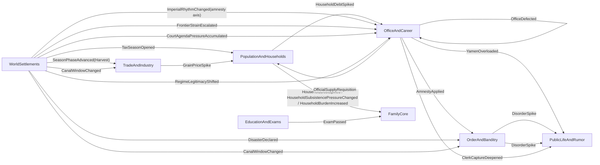

# RENZONG_THIN_CHAIN_TOPOLOGY_INDEX

This document freezes the current Renzong pressure-chain thin-slice topology.

It does not replace `RENZONG_PRESSURE_CHAIN_SPEC.md`. The spec remains the fuller design target. This index records what is actually wired as a thin live chain today, which scope each chain is allowed to touch, what keeps it from repeating, and which tests prove the current slice.

Use this file before adding rule density. If a future change deepens a chain, update this index in the same PR.

## Thin-Chain Closeout Status - v101-v108

As of the v101-v108 closeout audit, the current Renzong thin-chain skeleton is treated as closed through v100. "Closed" here means the live thin topology has source pressure, owning modules, scheduler drain or delayed-month behavior, repetition guard, off-scope boundary where applicable, downstream receipt/projection, owner-lane readback, UI/Unity copy-only display, no-summary-parsing guards, and no-save/no-schema documentation.

This is not a full-chain completion claim. The full-chain debt below remains intentionally open for later rule-density work: richer household registration and tax/corvee formulas, famine and relief economy, exam-office-public memory, mourning and non-amnesty imperial axes, frontier logistics, disaster recovery, clerk/faction depth, court process state, regime recognition, canal politics, and long-run residue/recovery tuning.

V101-V108 adds no runtime authority, no scheduler phase, no command, no event pool, no persisted state, no schema/migration, no new ledger, no manager/controller layer, no `PersonRegistry` expansion, and no UI/Unity rule path. It is an audit lock over the v3-v100 thin-chain evidence.

## Chain 8 First Rule-Density Layer - v109-v116

V109-V116 is the first rule-density layer for Chain 8. It keeps the existing path `WorldSettlements.CourtAgendaPressureAccumulated -> OfficeAndCareer.PolicyWindowOpened -> OfficeAndCareer.PolicyImplemented -> PublicLifeAndRumor`, but makes the player-facing process read as policy tone, document direction, county-gate posture, and public interpretation rather than a flat court-pressure receipt.

The new readback language is `政策语气读回`, `文移指向读回`, `县门承接姿态`, `公议承压读法`, `朝廷后手仍不直写地方`, and `不是本户硬扛朝廷后账`. It remains a rule-driven command / aftermath / social-memory / readback loop. `DomainEvent` is only one fact propagation tool; it is not the design body.

Ownership remains unchanged: `WorldSettlements` owns court agenda / mandate pressure source, `OfficeAndCareer` owns policy window and county/yamen implementation posture, `PublicLifeAndRumor` owns public interpretation and notice visibility, `SocialMemoryAndRelations` owns only later durable residue from structured aftermath, Application assembles projections, and Unity copies projected fields. V109-V116 adds no Court module, court engine, event pool, dispatch/policy/court-process/owner-lane/cooldown ledger, schema, migration, `PersonRegistry` expansion, or UI/Unity authority.

## Chain 8 Local Response Affordance - v117-v124

V117-V124 adds the next bounded local-response affordance layer to Chain 8. The existing path remains `WorldSettlements.CourtAgendaPressureAccumulated -> OfficeAndCareer.PolicyWindowOpened -> OfficeAndCareer.PolicyImplemented -> PublicLifeAndRumor`, but player-facing command surfaces may now show narrow continuations such as `政策回应入口`, `文移续接选择`, `县门轻催`, `递报改道`, and `公议降温只读回`.

This is still not a full court engine. `PressCountyYamenDocument`, `RedirectRoadReport`, `PostCountyNotice`, and `DispatchRoadReport` are reused as existing Office/PublicLife owner-lane commands and guidance surfaces. `OfficeAndCareer` resolves county document/report pressure from existing office scalar state; `PublicLifeAndRumor` reads public interpretation; Application routes/assembles/projects; Unity copies projected fields. The readback must keep saying `不是本户硬扛朝廷后账` and must not calculate policy success.

V117-V124 adds no Court module, event pool, dispatch ledger, policy ledger, court-process ledger, owner-lane ledger, cooldown ledger, schema, migration, `PersonRegistry` expansion, manager/god-controller path, Application rule layer, or UI/Unity authority. Readers must not parse `DomainEvent.Summary`, receipt prose, public-life notice/dispatch prose, `LastAdministrativeTrace`, `LastPetitionOutcome`, `LastLocalResponseSummary`, or `LastRefusalResponseSummary`.

## Chain 8 Social-Memory Echo - v125-v132

V125-V132 adds the first delayed social-memory echo after the v117-v124 local response affordance. The same court-policy path remains `WorldSettlements.CourtAgendaPressureAccumulated -> OfficeAndCareer.PolicyWindowOpened -> OfficeAndCareer.PolicyImplemented -> PublicLifeAndRumor`, but a later `SocialMemoryAndRelations` month pass may now read structured Office local-response aftermath and write `office.policy_local_response...` residue.

This is still not a Court module, court engine, event pool, faction AI, full policy economy, or new ledger. The echo uses existing `JurisdictionAuthoritySnapshot` fields such as `LastRefusalResponseCommandCode`, `LastRefusalResponseOutcomeCode`, `LastRefusalResponseTraceCode`, and `ResponseCarryoverMonths`; it must not parse command receipts, public-life prose, `DomainEvent.Summary`, `LastAdministrativeTrace`, `LastPetitionOutcome`, `LastLocalResponseSummary`, or `LastRefusalResponseSummary`.

The social-memory readback should say the residue came from `OfficeAndCareer/PublicLifeAndRumor` court-policy local response, not from `OrderAndBanditry`, not from a home-household repair path, and not from this household hard-carrying court after-accounts. Application projects structured memory cause/type/weight; Unity copies projected fields only. V125-V132 adds no persisted fields, schema bump, migration, `PersonRegistry` expansion, manager/god-controller path, or UI/Unity authority.

## Reading Rule

Each thin chain must answer:
- source pressure and owning module
- event path across modules
- pressure locus: global, court, regime, settlement, route, household, clan, person, office, or campaign
- same-month drain or explicit delayed-month behavior
- watermark, edge rule, or cadence that prevents accidental repetition
- off-scope boundary, when the pressure has a concrete locus
- downstream receipt or projection surface
- full-chain debt that remains intentionally unimplemented

The index protects the rule that Zongzu is rules-driven, not event-pool driven. `DomainEvent` records and transfers resolved facts; it is not the source of gameplay by itself.

## Topology Map

## Thin-Chain Ledger

| Chain | Current thin path | Locus | Same-month? | Repetition guard | Receipt / projection | Current proof |
|---|---|---|---|---|---|---|
| 1. Tax/corvee household-yamen-public + sponsor-family pressure | `WorldSettlements.TaxSeasonOpened -> HouseholdDebtSpiked -> OfficeAndCareer.YamenOverloaded -> PublicLife heat`; v36 also drains `HouseholdDebtSpiked -> FamilyCore` sponsor-clan pressure | symbolic tax-season source today; household handler accepts settlement scope; office emits settlement-scoped yamen receipt; public-life mutates only the matching settlement; FamilyCore touches only the household sponsor clan | yes, bounded scheduler drain | scheduler fresh-event watermark; full precise tax locus still deferred; FamilyCore uses household id + `SponsorClanId` and does not fan out | `HouseholdDebtSpiked` with tax-profile metadata, settlement-scoped `YamenOverloaded`, public-life street-talk heat, and sponsor-clan `CharityObligation` / `SupportReserve` / `BranchTension` pressure readback | `RenzongPressureChainTests.Chain1_RealMonthlyScheduler_DrainsTaxSeasonIntoYamenAndPublicLife`; `HouseholdBurdenHandlerTests`; `TaxSeasonBurdenHandlerTests`; `OfficeAndCareerModuleTests.HandleEvents_HouseholdDebtSpiked_UsesSettlementMetadataForYamenScope`; `YamenOverloadHandlerTests` |
| 2. Harvest/grain household pressure | `SeasonPhaseAdvanced(Harvest) -> TradeAndIndustry.GrainPriceSpike -> HouseholdSubsistencePressureChanged`; v36 allows `HouseholdSubsistencePressureChanged -> FamilyCore` sponsor-clan pressure | settlement market / household / sponsor clan | yes, bounded scheduler drain | harvest phase edge plus local market event; off-scope household and off-scope clan assertions | `GrainPriceSpike` carries grain-market metadata; `HouseholdSubsistencePressureChanged` carries household subsistence-profile metadata; FamilyCore reads structured household snapshot and sponsor clan only | `RenzongPressureChainTests.Chain2_RealMonthlyScheduler_DrainsHarvestPriceIntoLocalHouseholdPressure`; `GrainPriceSubsistenceHandlerTests`; `HouseholdBurdenHandlerTests` |
| 3. Exam prestige | `EducationAndExams.ExamPassed -> FamilyCore.ClanPrestigeAdjusted` | person to clan | yes, bounded scheduler drain | exam cadence and one exam result | `ExamPassed` carries credential metadata; `ClanPrestigeAdjusted` carries exam-prestige profile metadata | `ExamPrestigeChainTests.ExamPass_ThinChain_RealScheduler_DrainsIntoClanPrestige`; `ExamResultHandlerTests` |
| 4. Imperial amnesty disorder | `ImperialRhythmChanged(amnesty axis) -> OfficeAndCareer.AmnestyApplied -> OrderAndBanditry.DisorderSpike` | imperial signal allocated to settlement jurisdiction | yes, bounded scheduler drain | office-owned `LastAppliedAmnestyWave`; handler must respect amnesty axis rather than any imperial change | `AmnestyApplied` carries office execution metadata; `DisorderSpike` carries amnesty-disorder profile metadata | `ImperialAmnestyDisorderChainTests.ImperialAmnesty_ThinChain_RealScheduler_DrainsIntoDisorderSpike`; `AmnestyDispatchHandlerTests`; `AmnestyDisorderHandlerTests` |
| 5. Frontier supply household burden | `WorldSettlements.FrontierStrainEscalated -> OfficeAndCareer.OfficialSupplyRequisition -> PopulationAndHouseholds.HouseholdBurdenIncreased`; v36 allows `HouseholdBurdenIncreased -> FamilyCore` sponsor-clan pressure | settlement / household / sponsor clan | yes, bounded scheduler drain | world-owned `LastDeclaredFrontierStrainBand`; current scalar is thin-slice only; FamilyCore uses household id + `SponsorClanId` and does not fan out | `OfficialSupplyRequisition` carries office execution profile metadata; `HouseholdBurdenIncreased` carries household burden-profile metadata; sponsor clan can gain charity obligation, support drawdown, branch tension, and relief-sanction pressure | `FrontierSupplyHouseholdChainTests` plus office/population handler tests; `HouseholdBurdenHandlerTests` |
| 6. Disaster disorder public life | `WorldSettlements.DisasterDeclared -> OrderAndBanditry.DisorderSpike -> PublicLife heat` | settlement disaster | yes, bounded scheduler drain | world-owned `LastDeclaredFloodDisasterBand`; metadata-only rule handling | `DisorderSpike` carries disaster-disorder profile metadata; PublicLife projects cause-aware heat | `DisasterDisorderPublicLifeChainTests` plus disaster handler tests |
| 7. Clerk capture public life | `OfficeAndCareer.ClerkCaptureDeepened -> PublicLife heat` | settlement jurisdiction | yes, bounded scheduler drain | office-owned `ActiveClerkCaptureSettlementIds`; clears only when condition falls | `ClerkCaptureDeepened` carries office profile metadata; PublicLife heat scales from that profile | `OfficeCourtRegimePressureChainTests.Chain7_RealScheduler_ClerkCaptureDrainsIntoScopedPublicLifeAndDoesNotRepeat` plus office/public-life handler tests |
| 8. Court agenda policy window and yamen implementation | `WorldSettlements.CourtAgendaPressureAccumulated -> OfficeAndCareer.PolicyWindowOpened -> OfficeAndCareer.PolicyImplemented` | court/global source allocated to one jurisdiction, then resolved inside the same office/yamen lane | yes, bounded scheduler handling | allocation rule opens exactly one selected court-facing jurisdiction in the thin slice; local drag can absorb the signal; v37 implementation mutates only existing Office state and emits one matching-settlement outcome | `PolicyWindowOpened` carries office-owned policy-window profile metadata; `PolicyImplemented` carries implementation outcome, score, docket drag, clerk capture, local buffer, and paper-compliance metadata | `OfficeCourtRegimePressureChainTests.Chain8_RealScheduler_CourtAgendaDrainsIntoOnePolicyImplementation`; `Chain789OfficePressureHandlerTests`; `PolicyImplementationHandlerTests` |
| 9. Regime legitimacy office defection | `WorldSettlements.RegimeLegitimacyShifted -> OfficeAndCareer.OfficeDefected` | regime/global source allocated to one highest-risk official | yes, bounded scheduler handling | risk allocation chooses one official; default `MandateConfidence = 70` prevents unseeded crisis; authority/reputation can buffer low mandate pressure | `OfficeDefected` carries office-owned defection profile metadata after appointment mutation | `OfficeCourtRegimePressureChainTests.Chain9_RealScheduler_RegimePressureDefectsOnlyOneHighRiskOfficial`; `Chain789OfficePressureHandlerTests` |
| 10. Canal window trade/order pressure | `WorldSettlements.CanalWindowChanged -> TradeAndIndustry route/market pressure` and `WorldSettlements.CanalWindowChanged -> OrderAndBanditry route pressure` | water/canal-exposed settlement | yes, bounded scheduler handling | transition edge on `CanalWindow`; handlers select exposed settlements from structured `IWorldSettlementsQueries` and keep off-scope settlements untouched | Trade emits route-blocked receipt if existing route risk crosses threshold; Order emits black-route pressure receipt if existing black-route pressure crosses threshold | `CanalWindowTradeHandlerTests`; `CanalWindowOrderHandlerTests`; `EventContractHealth_CanalWindowChangedHasTradeAndOrderAuthorityConsumers` |

## Freeze Rules

1. Thin slice does not mean full chain. Every row above is a proof of topology and boundary, not the full social formula.
2. A broad pressure must choose a first local locus before mutating local state. Frontier, court, regime, disaster, and imperial rhythm may start wide, but they may not touch every household or jurisdiction by accident.
3. Persistent pressure requires an edge, watermark, processed band, or explicit recurring-demand cadence. A high current value alone is not a new escalation event.
4. Same-month follow-on effects must pass through the bounded scheduler drain and process only fresh events. If a future link cannot finish inside the cap, carry traceable state into the next month.
5. Every emitted event must be listed in `PublishedEvents`; every handled event must be listed in `ConsumedEvents`; every cross-module event name must come from `Zongzu.Contracts`.
6. Concrete-locus handlers must filter before mutation and tests must include a comparable off-scope negative case.
7. Rule density must consume existing owner-state dimensions before inventing a second rule layer. For household pressure, prefer `Livelihood`, land, grain, labor, dependents, debt, distress, and migration fields owned by `PopulationAndHouseholds`.
8. Generic downstream events must either carry cause metadata or keep projection wording cause-neutral.
9. Projection may explain why-now and what-next, but it may not become a second authority layer.
10. Application services may route commands and compose read models, but they may not absorb chain rules while the owning modules are still being shaped.
11. Ten-year diagnostic event-contract debt must be classified before it is used as design evidence. V32 classifications are diagnostic-only: `ProjectionOnlyReceipt`, `FutureContract`, `DormantSeededPath`, `AcceptanceTestGap`, `AlignmentBug`, or `Unclassified`. V33 hardens this into a no-unclassified gate for the current ten-year health run. V34 adds diagnostic `owner=<module>` and `evidence=<doc/test backlink>` readback over the classified debt. The classification table, gate, and evidence backlinks do not create an event pool, do not make `DomainEvent` the design body, and do not change persisted module state.

## Full-Chain Debt

The thin topology leaves these fuller branches intentionally unimplemented:

- Chain 1: precise zhuhu / kehu household grade, tax kind, tenant/client rent cascade, cash squeeze into markets, long memory, precise settlement tax events, and richer jurisdiction capacity formulas. The current handler already uses a multi-dimensional proxy profile from existing household state (`Livelihood`, `LandHolding`, `GrainStore`, `LaborCapacity`, `DependentCount`, `DebtPressure`, `Distress`) and carries settlement scope into the yamen/public-life receipt; v36 also lets sponsor clans absorb household debt pressure through existing `FamilyCore` support/charity/tension fields, but it is not yet a full tax/corvee society or relief economy formula.
- Chain 2: formal yield ratio, granary security, route risk, disaster relief, migration, death pressure, famine narrative residue. The current handler already uses a first household-owned subsistence profile from grain price/current supply-demand metadata plus existing household dimensions (`Livelihood`, `GrainStore`, `LaborCapacity`, `DependentCount`, `DebtPressure`, `Distress`, `MigrationRisk`); v36 can press sponsor-clan charity/support/tension from that structured household snapshot, but it is not yet a full grain/famine society formula.
- Chain 3: office waiting list, recommendation, favor/shame memory, public-life exam projection, failure and study-abandon branches. The current handler already uses a first credential-prestige profile from exam metadata (`ExamTier`, score, academy prestige, stress) plus existing clan/person state (`Prestige`, `MarriageAlliancePressure`, heir/branch role, adult unmarried status), but it is not yet the full education-office-public-life chain.
- Chain 4: mourning, succession, appointment rhythm, dispatch wording, public legitimacy, and non-amnesty imperial axes. The current handler already uses a first amnesty-disorder profile from office execution metadata (`AmnestyWave`, authority tier, jurisdiction leverage, clerk dependence, petition backlog, administrative task load) plus order-owned local state (`DisorderPressure`, `BanditThreat`, `BlackRoutePressure`, `CoercionRisk`, `RoutePressure`, suppression buffers), but it is not yet the full imperial-local political chain.
- Chain 5: frontier sectors, WarfareCampaign mobilization, ConflictAndForce readiness, market diversion, formal quota formulas, public-life military burden, and long memory residue. The current handler already uses a first office-to-household profile from frontier metadata plus jurisdiction pressure (`AuthorityTier`, leverage, clerk dependence, backlog, administrative task load) and household-owned dimensions (`Livelihood`, `LandHolding`, `GrainStore`, `ToolCondition`, `ShelterQuality`, `LaborCapacity`, `DependentCount`, `LaborerCount`, `DebtPressure`, `Distress`, `MigrationRisk`); v36 can press sponsor-clan charity/support/tension from `HouseholdBurdenIncreased`, but it is not yet the full frontier/war economy chain.
- Chain 6: relief decisions, household subsistence/migration, market panic, route insecurity, SocialMemory disaster residue, public legitimacy. The current handler already uses a first order-owned disaster-disorder profile from disaster metadata (`severity`, `floodRisk`, `embankmentStrain`) plus local order soil (`DisorderPressure`, `BanditThreat`, `RoutePressure`, `BlackRoutePressure`, `CoercionRisk`, `RetaliationRisk`, `ImplementationDrag`) and suppression buffers, but it is not yet the full disaster-relief society chain.
- Chain 7: official evaluation, memorial attacks, petition delay, trade dispute delay, clerk factions, recommended clerk / shiye intervention. The current handler already uses a first office-to-public profile from `ClerkDependence`, `PetitionBacklog`, `AdministrativeTaskLoad`, `PetitionPressure`, authority tier, and jurisdiction leverage, but it is not yet the full official-clerk-execution chain.
- Chain 8: court process state, appointment slate, dispatch arrival, downstream household/market/public consequences. The current handler already uses a first office-owned policy-window profile plus v37 implementation outcome from mandate deficit, authority tier, jurisdiction leverage, petition signal, administrative task load, clerk dependence, petition backlog, docket drag, clerk capture, local buffer, and paper compliance; v109-v116 adds first-layer process readback for policy tone, document direction, county-gate posture, and public interpretation; v117-v124 adds bounded local response affordances through existing Office/PublicLife commands; v125-v132 lets `SocialMemoryAndRelations` write later `office.policy_local_response...` residue from structured Office aftermath only. It is not yet the full court-agenda/policy-dispatch chain.
- Chain 9: regime recognition, grain-route control, household compliance, public legitimacy, ritual claim, force backing, rebellion-to-polity and dynasty-cycle consequences. The current handler already uses a first office-owned defection profile from mandate deficit, demotion pressure, clerk pressure, petition pressure, reputation strain, and authority/reputation buffer, but it is not yet the full regime-recognition/compliance chain.
- Chain 10: canal dredging politics, formal shipment allocation, canal-office paperwork, boatmen, route factions, market substitution, and durable public/social residue. The current handler only returns canal-window facts to existing `TradeAndIndustry` and `OrderAndBanditry` owner lanes through existing fields; it is not a full canal economy, patrol AI, or yamen implementation formula.

## Next Thickening Priority

After v38-v60 made office/yamen and Family owner-lane readback visible, and v61-v68 added the first bounded FamilyCore relief choice, deepen rule density in this order unless an explicit ExecPlan says otherwise:

1. force/campaign and regime depth, now that local burden, legitimacy, office execution, and first Family relief choice surfaces are readable;
2. fuller court-policy process, only after policy wording, dispatch arrival, and public-life interpretation keep owner lanes rather than becoming an office-only thin receipt;
3. household/family relief choice variants, only as bounded FamilyCore commands that reuse existing fields or carry explicit schema/migration plans;
4. social-memory residue deepening for Family relief, only from structured aftermath and never from `Family救济选择读回`, receipt prose, or `DomainEvent.Summary`.
