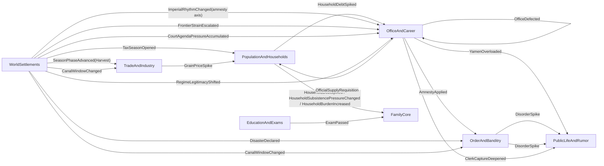

# RENZONG_THIN_CHAIN_TOPOLOGY_INDEX

This document freezes the current Renzong pressure-chain thin-slice topology.

It does not replace `RENZONG_PRESSURE_CHAIN_SPEC.md`. The spec remains the fuller design target. This index records what is actually wired as a thin live chain today, which scope each chain is allowed to touch, what keeps it from repeating, and which tests prove the current slice.

Use this file before adding rule density. If a future change deepens a chain, update this index in the same PR.

## V453-V460 Household Mobility Dynamics Explanation

V453-V460 adds a runtime explanation layer over the existing multi-dimensional household mobility dynamics. It reads already-projected household social-pressure signals, household livelihood carriers, and settlement pool snapshots so the player can see which dimensions are shaping a household's mobility posture.

This is not a new mobility algorithm, class engine, commoner status rule, selector, or fidelity-ring mutation. `PopulationAndHouseholds` still owns household livelihood, labor, debt, grain, land, migration, and pool dynamics; `PersonRegistry` still owns identity / `FidelityRing` only; Application assembles the read model; Unity copies the projected field. The pass adds no schema, migration, ledger, manager, prose parser, or UI/Unity authority.

## V461-V468 Household Mobility Dynamics Closeout

V461-V468 closes v453-v460 as a first household mobility explanation layer only. The closed layer includes runtime household-pressure explanation fields, deterministic top-dimension selection, Desk Sandbox copy-only presentation, docs evidence, and architecture guard coverage.

The closeout is not a new migration economy, class/status engine, route-history model, selector, durable residue path, direct movement command, or per-person world simulation. `PopulationAndHouseholds` remains the owner of household livelihood, labor, debt, grain, land, migration, and pool dynamics; `PersonRegistry` remains identity / `FidelityRing` only; Application assembles projections; Unity copies projected fields. V461-V468 adds no production rule, schema, migration, ledger, module, manager/controller path, parser, `PersonRegistry` expansion, or UI/Unity authority.

## V469-V476 Household Mobility Owner-Lane Preflight

V469-V476 is a preflight for the next possible household mobility rule-density layer. It does not implement movement, migration economy, route history, selector state, durable residue, status/class drift, or per-person world simulation.

`PopulationAndHouseholds` remains the default first owner lane because it already owns household livelihood, activity, distress, debt, labor, grain, land, migration pressure, and pool carriers. Future household mobility depth must declare owner state, cadence, target scope, hot path, touched counts, deterministic cap/order, no-touch boundary, schema impact, projection fields, and validation before code lands.

The scale rule remains "near detail, far summary": player-near and pressure-hit households may become more readable through a future owner-laned rule; distant society stays settlement/pool pressure summary until a separate plan promotes bounded detail. V469-V476 adds no schema, migration, ledger, module, manager/controller path, `PersonRegistry` expansion, Application/UI/Unity authority, or prose parser.

## V485-V492 Household Mobility Preflight Closeout Audit

V485-V492 closes v469-v476 as owner-lane preflight evidence only. Closed here means the future gate is documented, tested, and aligned with the skill matrix; it does not mean household movement rules are implemented.

The closeout keeps the same split: `PopulationAndHouseholds` remains the default first future owner lane, `PersonRegistry` remains identity / `FidelityRing` only, Application remains projection/assembly only, and UI/Unity copy projected fields only.

Future household mobility depth still needs a separate owner-lane ExecPlan with owned state, cadence, target scope, hot path, touched counts, deterministic cap/order, no-touch boundary, schema impact, projection fields, and validation before runtime code lands.

V485-V492 adds no schema, migration, ledger, module, movement command, route-history model, migration economy, selector, durable residue, manager/controller path, `PersonRegistry` expansion, Application authority, UI authority, Unity authority, or prose parser.

## V501-V508 Household Mobility First Runtime Rule And Rules-Data Readiness

V501-V508 opens the first runtime rule readiness map and hardcoded extraction map for household mobility. It does not implement household movement. It records that the first real rule should start inside `PopulationAndHouseholds`, use monthly authority before any xun-band thickening, and read existing livelihood/activity/distress/debt/labor/grain/land/migration-pressure/pool carriers.

The target scope is player-near households, pressure-hit local households, active-region pools, and distant summaries. Quiet households, off-scope settlements, distant pooled society, `PersonRegistry`, Application, UI, and Unity stay no-touch. Future fanout must declare deterministic household/pool/settlement caps and stable ordering before touching runtime targets.

The extraction map registers current hardcoded thresholds, weights, caps, recovery/decay rules, ordering rules, regional assumptions, era/scenario assumptions, and pool limits in `PopulationAndHouseholds` as candidates for owner-consumed authored rules-data. V501-V508 adds no schema, migration, loader, authored runtime plugin marketplace, movement command, route-history model, migration economy, selector, target-cardinality state, durable residue, manager/controller path, `PersonRegistry` expansion, Application authority, UI authority, Unity authority, or prose parser.

## V509-V516 Household Mobility Rules-Data Contract And Validator Preflight

V509-V516 defines the future household mobility rules-data contract and validator preflight without changing runtime behavior. The contract requires stable ids, schema/version, deterministic ordering, default fallback, readable validation errors, owner-consumed use only, no UI/Application authority, and no arbitrary script/plugin execution.

The repo currently has `content/authoring` and `content/generated`, but no reusable owner-consumed runtime rules-data/content/config pattern for household mobility. Therefore this pass remains docs/tests-only and adds no rules-data loader or default rules-data file.

Future rules-data may carry threshold bands, pressure weights, regional modifiers, era/scenario modifiers, recovery/decay rates, fanout caps, and deterministic tie-break priorities. It remains `PopulationAndHouseholds`-owned input for later owner rules, not a runtime plugin marketplace, Application resolver, UI/Unity rule path, prose parser, movement command, route-history model, migration economy, selector, target-cardinality state, durable residue, `PersonRegistry` expansion, or save/schema change.

## V517-V524 Household Mobility Default Rules-Data Skeleton

V517-V524 records the default rules-data skeleton contract for future household mobility extraction. Because the repo still has no reusable owner-consumed runtime rules-data/content/config pattern, this pass remains docs/tests-only and adds no default file, loader, validator implementation, runtime rule, or save/schema change.

The future skeleton shape is data-only: `ruleSetId`, `schemaVersion`, `ownerModule`, `defaultFallbackPolicy`, ordered `parameterGroups`, `validationResult`, and deterministic declaration order. Parameter groups remain threshold bands, pressure weights, regional modifiers, era/scenario modifiers, recovery/decay rates, fanout caps, and tie-break priorities.

The skeleton is not authority state and does not enter save. It is not a runtime plugin marketplace, arbitrary script surface, Application resolver, UI/Unity rule path, movement command, route-history model, migration economy, selector, target-cardinality state, durable residue, `PersonRegistry` expansion, or prose parser.

## V525-V532 PopulationAndHouseholds First Hardcoded Rule Extraction

V525-V532 extracts one low-risk hardcoded cap from `PopulationAndHouseholds`: the focused member promotion fanout cap used when a pressure-hit household makes regional members locally readable. The default remains two members, and the existing deterministic household-id then person-id ordering remains the tie-break path.

This is an owner-consumed rules-data shape inside `PopulationAndHouseholds`, not a loader, `content/rules-data`, movement command, route-history model, migration economy, selector, class/status engine, or `PersonRegistry` expansion. Application, UI, and Unity do not read the rule data or calculate household mobility outcomes.

Schema/migration impact remains none. The extraction does not add persisted state, change cadence, create a movement ledger, or promote distant pooled society into hidden household targets.

## V533-V540 PopulationAndHouseholds First Household Mobility Runtime Rule

V533-V540 lands the first small household mobility runtime rule inside `PopulationAndHouseholds`. The monthly owner pass reads existing `MigrationPools` plus household livelihood, distress, debt, labor, grain, land, and migration pressure; it does not read prose or UI state.

The default rule selects at most one active settlement pool by outflow pressure, then at most two pressure-hit household candidates by deterministic score and household id. It only nudges existing `MigrationRisk` / `IsMigrating` and may emit the existing `MigrationStarted` event if the existing threshold is crossed.

This remains near detail far summary: player-near and pressure-hit local households may receive bounded detail pressure, while quiet households, lower-priority active pools, off-scope settlements, and distant pooled society remain untouched. There is no movement command, route history, migration economy, class/status engine, `PersonRegistry` expansion, Application/UI/Unity authority, or save/schema change.

## V541-V548 Household Mobility First Runtime Rule Closeout

V541-V548 closes the first household mobility runtime-rule track as docs/tests evidence only. It treats V533-V540 as the single first monthly owner-lane pressure nudge, not as a migration system or a second rule family.

The closeout freezes the boundary: existing `MigrationRisk`, `IsMigrating`, `MigrationPools`, and the existing `MigrationStarted` threshold receipt are the only outputs of the first rule. Future movement, route history, recovery/deeper decay, projection expansion, or additional runtime rules need a separate ExecPlan and validation lane.

Schema/migration impact remains none. This pass adds no production behavior, movement command, route-history state, migration economy, class/status engine, `PersonRegistry` expansion, Application/UI/Unity authority, loader, plugin surface, or prose parser.

## V549-V556 Household Mobility Runtime Rule Health Evidence

V549-V556 records diagnostics/readiness evidence for the first household mobility runtime rule. It is not a second rule, movement system, route-history model, long-run saturation tuning pass, or performance optimization claim.

The current topology remains the V533-V540 monthly `PopulationAndHouseholds` pressure nudge: one active pool and two household candidates by default, deterministic cap/order, existing `MigrationRisk` / `IsMigrating` output, and the existing `MigrationStarted` threshold receipt only.

The next gate before widening household mobility is explicit health proof: touched household/pool/settlement counts, no-touch proof for quiet/off-scope/distant summaries, same-seed replay evidence, pressure-band interpretation, and hot-path/cardinality notes. V549-V556 adds no schema, migration, movement command, route-history state, migration economy, class/status engine, `PersonRegistry` expansion, Application/UI/Unity authority, runtime plugin surface, or prose parser.

## V557-V564 Household Mobility Runtime Widening Gate

V557-V564 freezes the widening gate for future household mobility runtime work. It is a docs/tests preflight, not a fanout expansion, second runtime rule, recovery/decay change, long-run saturation tuning pass, counter/caching implementation, or performance optimization claim.

The live topology is unchanged: the V533-V540 monthly `PopulationAndHouseholds` pressure nudge still defaults to one active pool and two household candidates, writes existing `MigrationRisk` / `IsMigrating`, updates existing `MigrationPools`, and may emit only the existing `MigrationStarted` threshold receipt.

Before any later PR widens this lane, it must declare owner state, target scope, proposed touched counts, deterministic order/caps, no-touch boundary, pressure-band interpretation, schema decision, validation lane, and whether performance evidence is actually being claimed. V557-V564 adds no schema, migration, touch-count state, diagnostic state, performance cache, movement command, route-history state, migration economy, class/status engine, `PersonRegistry` expansion, Application/UI/Unity authority, runtime plugin surface, or prose parser.

## V565-V572 Household Mobility Runtime Touch-Count Proof

V565-V572 adds focused test evidence for the current V533-V540 household mobility runtime rule touch budget. It is not fanout widening: the default rule still touches at most one selected active pool and two eligible households in the focused fixture, using existing deterministic pool order and household score/order.

The proof compares a default run with a zero-risk-delta baseline so the touched households can be counted without adding counters, diagnostic state, projection fields, or persisted state. The test also proves the lower-priority pressure-hit household, quiet household, lower-priority active pool, off-scope settlement, distant summaries, `PersonRegistry`, Application, UI, and Unity remain no-touch for authority. V565-V572 adds no schema, migration, movement command, route-history state, migration economy, class/status engine, `PersonRegistry` expansion, Application/UI/Unity authority, runtime plugin surface, performance cache, long-run saturation tuning, or prose parser.

## V573-V580 Household Mobility Rules-Data Fallback Matrix

V573-V580 adds focused fallback evidence for the household mobility runtime rules-data shape. It proves malformed runtime parameters report validation errors and fall back deterministically to defaults, including active-pool threshold, settlement cap, household cap, and risk delta.

The owner-result proof compares a malformed rules-data run with the default run and requires the same `PopulationAndHouseholds` monthly signature. This pass adds no runtime behavior, rules-data loader, rules-data file, runtime plugin marketplace, arbitrary script rule, reflection-heavy loading, schema, migration, fanout widening, movement command, route-history state, migration economy, class/status engine, `PersonRegistry` expansion, Application/UI/Unity authority, performance cache, or prose parser.

## Thin-Chain Closeout Status - v101-v108

As of the v101-v108 closeout audit, the current Renzong thin-chain skeleton is treated as closed through v100. "Closed" here means the live thin topology has source pressure, owning modules, scheduler drain or delayed-month behavior, repetition guard, off-scope boundary where applicable, downstream receipt/projection, owner-lane readback, UI/Unity copy-only display, no-summary-parsing guards, and no-save/no-schema documentation.

This is not a full-chain completion claim. The full-chain debt below remains intentionally open for later rule-density work: richer household registration and tax/corvee formulas, famine and relief economy, exam-office-public memory, mourning and non-amnesty imperial axes, frontier logistics, disaster recovery, clerk/faction depth, court process state, regime recognition, canal politics, and long-run residue/recovery tuning.

V101-V108 adds no runtime authority, no scheduler phase, no command, no event pool, no persisted state, no schema/migration, no new ledger, no manager/controller layer, no `PersonRegistry` expansion, and no UI/Unity rule path. It is an audit lock over the v3-v100 thin-chain evidence.

## Chain 8 First Rule-Density Layer - v109-v116

V109-V116 is the first rule-density layer for Chain 8. It keeps the existing path `WorldSettlements.CourtAgendaPressureAccumulated -> OfficeAndCareer.PolicyWindowOpened -> OfficeAndCareer.PolicyImplemented -> PublicLifeAndRumor`, but makes the player-facing process read as policy tone, document direction, county-gate posture, and public interpretation rather than a flat court-pressure receipt.

The new readback language is `政策语气读回`, `文移指向读回`, `县门承接姿态`, `公议承压读法`, `朝廷后手仍不直写地方`, and `不是本户硬扛朝廷后账`. It remains a rule-driven command / aftermath / social-memory / readback loop. `DomainEvent` is only one fact propagation tool; it is not the design body.

Ownership remains unchanged: `WorldSettlements` owns court agenda / mandate pressure source, `OfficeAndCareer` owns policy window and county/yamen implementation posture, `PublicLifeAndRumor` owns public interpretation and notice visibility, `SocialMemoryAndRelations` owns only later durable residue from structured aftermath, Application assembles projections, and Unity copies projected fields. V109-V116 adds no Court module, court engine, event pool, dispatch/policy/court-process/owner-lane/cooldown ledger, schema, migration, `PersonRegistry` expansion, or UI/Unity authority.

## Chain 8 Local Response Affordance - v117-v124

V117-V124 adds the next bounded local-response affordance layer to Chain 8. The existing path remains `WorldSettlements.CourtAgendaPressureAccumulated -> OfficeAndCareer.PolicyWindowOpened -> OfficeAndCareer.PolicyImplemented -> PublicLifeAndRumor`, but player-facing command surfaces may now show narrow continuations such as `政策回应入口`, `文移续接选择`, `县门轻催`, `递报改道`, and `公议降温只读回`.

This is still not a full court engine. `PressCountyYamenDocument`, `RedirectRoadReport`, `PostCountyNotice`, and `DispatchRoadReport` are reused as existing Office/PublicLife owner-lane commands and guidance surfaces. `OfficeAndCareer` resolves county document/report pressure from existing office scalar state; `PublicLifeAndRumor` reads public interpretation; Application routes/assembles/projects; Unity copies projected fields. The readback must keep saying `不是本户硬扛朝廷后账` and must not calculate policy success.

V117-V124 adds no Court module, event pool, dispatch ledger, policy ledger, court-process ledger, owner-lane ledger, cooldown ledger, schema, migration, `PersonRegistry` expansion, manager/god-controller path, Application rule layer, or UI/Unity authority. Readers must not parse `DomainEvent.Summary`, receipt prose, public-life notice/dispatch prose, `LastAdministrativeTrace`, `LastPetitionOutcome`, `LastLocalResponseSummary`, or `LastRefusalResponseSummary`.

## Chain 8 Memory-Pressure Readback - v133-v140

V133-V140 adds a projection-only memory-pressure readback after the v125-v132 delayed echo. When a later policy window is visible, Application may project existing `office.policy_local_response...` SocialMemory cause/type/weight together with current `JurisdictionAuthoritySnapshot` and `SettlementPublicLifeSnapshot` values as `政策旧账回压读回`, `旧文移余味`, `下一次政策窗口读法`, and `公议旧读法续压`.

This readback must remain downstream of `OfficeAndCareer`, `PublicLifeAndRumor`, and `SocialMemoryAndRelations`. It does not create a Court module, court engine, event pool, policy ledger, memory-pressure ledger, cooldown ledger, new schema field, migration, Application success calculation, UI rule path, Unity rule path, `PersonRegistry` expansion, or manager/god-controller path. It must not parse memory summaries, receipt prose, public-life prose, `DomainEvent.Summary`, `OfficialNoticeLine`, `PrefectureDispatchLine`, `LastAdministrativeTrace`, `LastPetitionOutcome`, `LastLocalResponseSummary`, or `LastRefusalResponseSummary`.

## Chain 8 Public Follow-Up Cue - v149-v156

V149-V156 adds a projection-only public follow-up cue on top of v141-v148. When old `office.policy_local_response...` residue is already visible in public-life command/readback surfaces, Application may read the structured outcome code and current public-life scalars to show `政策公议后手提示`, `公议冷却提示`, `公议轻续提示`, `公议换招提示`, and `下一步仍看榜示/递报承口`.

This cue is not a cooldown ledger and not a new policy result. `OfficeAndCareer` still owns county document/report execution, `PublicLifeAndRumor` still owns street interpretation, and `SocialMemoryAndRelations` still owns durable residue. It adds no Court module, court engine, event pool, public-follow-up ledger, cooldown ledger, schema field, migration, Application success calculation, UI/Unity authority, `PersonRegistry` expansion, or manager/god-controller path. It must not parse memory summaries, receipt prose, public-life prose, `DomainEvent.Summary`, `OfficialNoticeLine`, `PrefectureDispatchLine`, `LastAdministrativeTrace`, `LastPetitionOutcome`, `LastLocalResponseSummary`, or `LastRefusalResponseSummary`.

## Chain 8 Follow-Up Docket Guard - v157-v164

V157-V164 adds a projection-only docket/no-loop guard on top of v149-v156. When old `office.policy_local_response...` residue is already visible as a public follow-up cue, Application may read the same structured outcome code and public-life scalars to show `政策后手案牍防误读`, `公议后手只作案牍提示`, `不是Order后账`, `不是Office成败`, and `仍等Office/PublicLife/SocialMemory分读` in governance/docket guard text.

This guard belongs to existing `CourtPolicyNoLoopGuardSummary` and docket guidance only. It is not a new ledger, not a cooldown account, not a policy outcome, not Order debt, and not a home-household bill. It adds no Court module, court engine, event pool, docket ledger, public-follow-up ledger, cooldown ledger, schema field, migration, Application success calculation, UI/Unity authority, `PersonRegistry` expansion, or manager/god-controller path. It must not parse memory summaries, receipt prose, public-life prose, `DomainEvent.Summary`, `OfficialNoticeLine`, `PrefectureDispatchLine`, `LastAdministrativeTrace`, `LastPetitionOutcome`, `LastLocalResponseSummary`, or `LastRefusalResponseSummary`.

## Chain 8 Suggested Action Guard - v165-v172

V165-V172 adds a projection-only suggested-action guard on top of v157-v164. When the governance docket already selects an existing affordance for a settlement that has the court-policy public follow-up guard, Application may append `建议动作防误读` and `只承接已投影的政策公议后手` to the existing `SuggestedCommandPrompt` / docket `GuidanceSummary`.

This does not change `SelectPrimaryGovernanceAffordance` priority, command availability, or policy outcome calculation. The suggested action remains an already-projected Office/PublicLife affordance, not a Court command, not a new ranking rule, not a cooldown account, not Order debt, not Office success/failure, and not a home-household bill. V165-V172 adds no Court module, court engine, event pool, suggested-action ledger, docket ledger, public-follow-up ledger, cooldown ledger, schema field, migration, Application success calculation, UI/Unity authority, `PersonRegistry` expansion, or manager/god-controller path. It must not parse memory summaries, receipt prose, public-life prose, `DomainEvent.Summary`, `OfficialNoticeLine`, `PrefectureDispatchLine`, `LastAdministrativeTrace`, `LastPetitionOutcome`, `LastLocalResponseSummary`, or `LastRefusalResponseSummary`.

## Chain 8 Suggested Receipt Guard - v173-v180

V173-V180 adds a projection-only suggested receipt guard on top of v165-v172. When a later command receipt is already carrying existing court-policy local-response/public-follow-up context, Application may append `建议回执防误读`, `只回收已投影的政策公议后手`, and `回执不是新政策结果` to the projected receipt readback.

This does not create a receipt ledger or suggested receipt ledger. The receipt remains a readback over existing Office/PublicLife/SocialMemory facts: `OfficeAndCareer` still owns county document/report aftermath, `PublicLifeAndRumor` still owns public interpretation, and `SocialMemoryAndRelations` still owns durable residue. V173-V180 adds no Court module, court engine, event pool, dispatch/policy/court-process/owner-lane/cooldown/docket/suggested-action/suggested-receipt ledger, schema field, migration, Application success calculation, UI/Unity authority, `PersonRegistry` expansion, or manager/god-controller path. It must not parse memory summaries, receipt prose, public-life prose, `DomainEvent.Summary`, `OfficialNoticeLine`, `PrefectureDispatchLine`, `LastAdministrativeTrace`, `LastPetitionOutcome`, `LastLocalResponseSummary`, or `LastRefusalResponseSummary`.

## Chain 8 Receipt-Docket Consistency Guard - v181-v188

V181-V188 adds a projection-only receipt-to-docket consistency guard on top of v173-v180. When the governance docket already sees the same structured court-policy local-response/public-follow-up residue used by the suggested receipt guard, Application may append `回执案牍一致防误读`, `回执只回收已投影的政策公议后手`, and `案牍不把回执读成新政策结果` to the existing governance no-loop / docket guidance surfaces.

This guard belongs to `CourtPolicyNoLoopGuardSummary` and docket `GuidanceSummary` only. It does not create a receipt-docket ledger, policy result, cooldown account, Order after-account, Office success/failure, or home-household bill. `OfficeAndCareer` still owns county document/report aftermath, `PublicLifeAndRumor` owns public interpretation, and `SocialMemoryAndRelations` owns durable residue. V181-V188 adds no Court module, court engine, event pool, dispatch/policy/court-process/owner-lane/cooldown/docket/receipt/receipt-docket ledger, schema field, migration, Application success calculation, UI/Unity authority, `PersonRegistry` expansion, or manager/god-controller path. It must not parse memory summaries, receipt prose, public-life prose, `DomainEvent.Summary`, `OfficialNoticeLine`, `PrefectureDispatchLine`, `LastAdministrativeTrace`, `LastPetitionOutcome`, `LastLocalResponseSummary`, or `LastRefusalResponseSummary`.

## Chain 8 Public-Life Receipt Echo - v189-v196

V189-V196 adds a projection-only public-life receipt echo guard on top of v181-v188. When a public-life notice/report command already reads the same structured `office.policy_local_response...` residue as policy public-reading echo, Application may append `公议回执回声防误读`, `街面只读已投影的政策公议后手`, and `公议不把回执读成新政令` to the existing public-life command `LeverageSummary` / `ReadbackSummary`.

This belongs only to player-facing public-life command readback. It does not create a public-life receipt echo ledger, new policy result, Order after-account, Office success/failure, cooldown account, or home-household bill. `OfficeAndCareer` still owns county document/report aftermath, `PublicLifeAndRumor` owns street/public interpretation, and `SocialMemoryAndRelations` owns durable residue. V189-V196 adds no Court module, court engine, event pool, dispatch/policy/court-process/owner-lane/cooldown/docket/receipt/public-life-receipt-echo ledger, schema field, migration, Application success calculation, UI/Unity authority, `PersonRegistry` expansion, or manager/god-controller path. It must not parse memory summaries, receipt prose, public-life prose, command affordance prose, `DomainEvent.Summary`, `OfficialNoticeLine`, `PrefectureDispatchLine`, `LastAdministrativeTrace`, `LastPetitionOutcome`, `LastLocalResponseSummary`, or `LastRefusalResponseSummary`.

## Chain 8 First Rule-Density Closeout Audit - v197-v204

V197-V204 closes v109-v196 as a Chain 8 first rule-density audit. It treats the branch as complete only at the first-layer readback level: policy process texture, bounded Office/PublicLife local response, delayed SocialMemory residue, memory-pressure next-window readback, public-reading echo, public follow-up cue, docket guard, suggested-action guard, suggested-receipt guard, receipt-docket consistency, and public-life receipt echo.

The v109-v196 first rule-density closeout audit v197-v204 is not the full court engine and not a court-agenda / policy-dispatch completion claim. Court process state, appointment slate, dispatch arrival, and downstream household/market/public consequences remain explicit full-chain debt. V197-V204 adds no production rule, Court module, event pool, dispatch/policy/court-process/owner-lane/cooldown/docket/receipt/public-life-receipt-echo ledger, schema field, migration, Application success calculation, UI/Unity authority, `PersonRegistry` expansion, or manager/god-controller path.

## Chain 8 Public-Reading Echo - v141-v148

V141-V148 adds a projection-only public-reading echo on top of v133-v140. When a later public-life notice/report choice is visible, Application may project existing `office.policy_local_response...` SocialMemory cause/type/weight together with current `JurisdictionAuthoritySnapshot` and `SettlementPublicLifeSnapshot` values as `政策公议旧读回`, `公议旧账回声`, and `下一次榜示/递报旧读法`.

The echo belongs on governance and public-life command readbacks only. `PublicLifeAndRumor` reads street interpretation, `OfficeAndCareer` still owns county-gate execution, and `SocialMemoryAndRelations` still owns durable residue. It adds no Court module, court engine, event pool, public-reading ledger, policy ledger, schema field, migration, Application success calculation, UI/Unity authority, `PersonRegistry` expansion, or manager/god-controller path. It must not parse memory summaries, receipt prose, public-life prose, `DomainEvent.Summary`, `OfficialNoticeLine`, `PrefectureDispatchLine`, `LastAdministrativeTrace`, `LastPetitionOutcome`, `LastLocalResponseSummary`, or `LastRefusalResponseSummary`.

## Chain 8 Social-Memory Echo - v125-v132

V125-V132 adds the first delayed social-memory echo after the v117-v124 local response affordance. The same court-policy path remains `WorldSettlements.CourtAgendaPressureAccumulated -> OfficeAndCareer.PolicyWindowOpened -> OfficeAndCareer.PolicyImplemented -> PublicLifeAndRumor`, but a later `SocialMemoryAndRelations` month pass may now read structured Office local-response aftermath and write `office.policy_local_response...` residue.

This is still not a Court module, court engine, event pool, faction AI, full policy economy, or new ledger. The echo uses existing `JurisdictionAuthoritySnapshot` fields such as `LastRefusalResponseCommandCode`, `LastRefusalResponseOutcomeCode`, `LastRefusalResponseTraceCode`, and `ResponseCarryoverMonths`; it must not parse command receipts, public-life prose, `DomainEvent.Summary`, `LastAdministrativeTrace`, `LastPetitionOutcome`, `LastLocalResponseSummary`, or `LastRefusalResponseSummary`.

The social-memory readback should say the residue came from `OfficeAndCareer/PublicLifeAndRumor` court-policy local response, not from `OrderAndBanditry`, not from a home-household repair path, and not from this household hard-carrying court after-accounts. Application projects structured memory cause/type/weight; Unity copies projected fields only. V125-V132 adds no persisted fields, schema bump, migration, `PersonRegistry` expansion, manager/god-controller path, or UI/Unity authority.

## Reading Rule

Each thin chain must answer:
- source pressure and owning module
- event path across modules
- pressure locus: global, court, regime, settlement, route, household, clan, person, office, or campaign
- same-month drain or explicit delayed-month behavior
- watermark, edge rule, or cadence that prevents accidental repetition
- off-scope boundary, when the pressure has a concrete locus
- downstream receipt or projection surface
- full-chain debt that remains intentionally unimplemented

The index protects the rule that Zongzu is rules-driven, not event-pool driven. `DomainEvent` records and transfers resolved facts; it is not the source of gameplay by itself.

## Topology Map

## Thin-Chain Ledger

| Chain | Current thin path | Locus | Same-month? | Repetition guard | Receipt / projection | Current proof |
|---|---|---|---|---|---|---|
| 1. Tax/corvee household-yamen-public + sponsor-family pressure | `WorldSettlements.TaxSeasonOpened -> HouseholdDebtSpiked -> OfficeAndCareer.YamenOverloaded -> PublicLife heat`; v36 also drains `HouseholdDebtSpiked -> FamilyCore` sponsor-clan pressure | symbolic tax-season source today; household handler accepts settlement scope; office emits settlement-scoped yamen receipt; public-life mutates only the matching settlement; FamilyCore touches only the household sponsor clan | yes, bounded scheduler drain | scheduler fresh-event watermark; full precise tax locus still deferred; FamilyCore uses household id + `SponsorClanId` and does not fan out | `HouseholdDebtSpiked` with tax-profile metadata, settlement-scoped `YamenOverloaded`, public-life street-talk heat, and sponsor-clan `CharityObligation` / `SupportReserve` / `BranchTension` pressure readback | `RenzongPressureChainTests.Chain1_RealMonthlyScheduler_DrainsTaxSeasonIntoYamenAndPublicLife`; `HouseholdBurdenHandlerTests`; `TaxSeasonBurdenHandlerTests`; `OfficeAndCareerModuleTests.HandleEvents_HouseholdDebtSpiked_UsesSettlementMetadataForYamenScope`; `YamenOverloadHandlerTests` |
| 2. Harvest/grain household pressure | `SeasonPhaseAdvanced(Harvest) -> TradeAndIndustry.GrainPriceSpike -> HouseholdSubsistencePressureChanged`; v36 allows `HouseholdSubsistencePressureChanged -> FamilyCore` sponsor-clan pressure | settlement market / household / sponsor clan | yes, bounded scheduler drain | harvest phase edge plus local market event; off-scope household and off-scope clan assertions | `GrainPriceSpike` carries grain-market metadata; `HouseholdSubsistencePressureChanged` carries household subsistence-profile metadata; FamilyCore reads structured household snapshot and sponsor clan only | `RenzongPressureChainTests.Chain2_RealMonthlyScheduler_DrainsHarvestPriceIntoLocalHouseholdPressure`; `GrainPriceSubsistenceHandlerTests`; `HouseholdBurdenHandlerTests` |
| 3. Exam prestige | `EducationAndExams.ExamPassed -> FamilyCore.ClanPrestigeAdjusted` | person to clan | yes, bounded scheduler drain | exam cadence and one exam result | `ExamPassed` carries credential metadata; `ClanPrestigeAdjusted` carries exam-prestige profile metadata | `ExamPrestigeChainTests.ExamPass_ThinChain_RealScheduler_DrainsIntoClanPrestige`; `ExamResultHandlerTests` |
| 4. Imperial amnesty disorder | `ImperialRhythmChanged(amnesty axis) -> OfficeAndCareer.AmnestyApplied -> OrderAndBanditry.DisorderSpike` | imperial signal allocated to settlement jurisdiction | yes, bounded scheduler drain | office-owned `LastAppliedAmnestyWave`; handler must respect amnesty axis rather than any imperial change | `AmnestyApplied` carries office execution metadata; `DisorderSpike` carries amnesty-disorder profile metadata | `ImperialAmnestyDisorderChainTests.ImperialAmnesty_ThinChain_RealScheduler_DrainsIntoDisorderSpike`; `AmnestyDispatchHandlerTests`; `AmnestyDisorderHandlerTests` |
| 5. Frontier supply household burden | `WorldSettlements.FrontierStrainEscalated -> OfficeAndCareer.OfficialSupplyRequisition -> PopulationAndHouseholds.HouseholdBurdenIncreased`; v36 allows `HouseholdBurdenIncreased -> FamilyCore` sponsor-clan pressure | settlement / household / sponsor clan | yes, bounded scheduler drain | world-owned `LastDeclaredFrontierStrainBand`; current scalar is thin-slice only; FamilyCore uses household id + `SponsorClanId` and does not fan out | `OfficialSupplyRequisition` carries office execution profile metadata; `HouseholdBurdenIncreased` carries household burden-profile metadata; sponsor clan can gain charity obligation, support drawdown, branch tension, and relief-sanction pressure | `FrontierSupplyHouseholdChainTests` plus office/population handler tests; `HouseholdBurdenHandlerTests` |
| 6. Disaster disorder public life | `WorldSettlements.DisasterDeclared -> OrderAndBanditry.DisorderSpike -> PublicLife heat` | settlement disaster | yes, bounded scheduler drain | world-owned `LastDeclaredFloodDisasterBand`; metadata-only rule handling | `DisorderSpike` carries disaster-disorder profile metadata; PublicLife projects cause-aware heat | `DisasterDisorderPublicLifeChainTests` plus disaster handler tests |
| 7. Clerk capture public life | `OfficeAndCareer.ClerkCaptureDeepened -> PublicLife heat` | settlement jurisdiction | yes, bounded scheduler drain | office-owned `ActiveClerkCaptureSettlementIds`; clears only when condition falls | `ClerkCaptureDeepened` carries office profile metadata; PublicLife heat scales from that profile | `OfficeCourtRegimePressureChainTests.Chain7_RealScheduler_ClerkCaptureDrainsIntoScopedPublicLifeAndDoesNotRepeat` plus office/public-life handler tests |
| 8. Court agenda policy window and yamen implementation | `WorldSettlements.CourtAgendaPressureAccumulated -> OfficeAndCareer.PolicyWindowOpened -> OfficeAndCareer.PolicyImplemented` | court/global source allocated to one jurisdiction, then resolved inside the same office/yamen lane | yes, bounded scheduler handling | allocation rule opens exactly one selected court-facing jurisdiction in the thin slice; local drag can absorb the signal; v37 implementation mutates only existing Office state and emits one matching-settlement outcome | `PolicyWindowOpened` carries office-owned policy-window profile metadata; `PolicyImplemented` carries implementation outcome, score, docket drag, clerk capture, local buffer, and paper-compliance metadata | `OfficeCourtRegimePressureChainTests.Chain8_RealScheduler_CourtAgendaDrainsIntoOnePolicyImplementation`; `Chain789OfficePressureHandlerTests`; `PolicyImplementationHandlerTests` |
| 9. Regime legitimacy office defection | `WorldSettlements.RegimeLegitimacyShifted -> OfficeAndCareer.OfficeDefected -> PublicLifeAndRumor` | regime/global source allocated to one highest-risk official, then read by the matching public-life settlement | yes, bounded scheduler handling | risk allocation chooses one official; default `MandateConfidence = 70` prevents unseeded crisis; authority/reputation can buffer low mandate pressure | `OfficeDefected` carries office-owned defection profile metadata after appointment mutation; v253-v260 projects `天命摇动读回`, `去就风险读回`, `官身承压姿态`, and `公议向背读法` through Office/PublicLife readback only | `OfficeCourtRegimePressureChainTests.Chain9_RealScheduler_RegimePressureDefectsOnlyOneHighRiskOfficial`; `OfficeCourtRegimePressureChainTests.Chain9_RegimeLegitimacyDefectionProjectsPublicAndGovernanceReadback`; `Chain789OfficePressureHandlerTests` |
| 10. Canal window trade/order pressure | `WorldSettlements.CanalWindowChanged -> TradeAndIndustry route/market pressure` and `WorldSettlements.CanalWindowChanged -> OrderAndBanditry route pressure` | water/canal-exposed settlement | yes, bounded scheduler handling | transition edge on `CanalWindow`; handlers select exposed settlements from structured `IWorldSettlementsQueries` and keep off-scope settlements untouched | Trade emits route-blocked receipt if existing route risk crosses threshold; Order emits black-route pressure receipt if existing black-route pressure crosses threshold | `CanalWindowTradeHandlerTests`; `CanalWindowOrderHandlerTests`; `EventContractHealth_CanalWindowChangedHasTradeAndOrderAuthorityConsumers` |

## Freeze Rules

1. Thin slice does not mean full chain. Every row above is a proof of topology and boundary, not the full social formula.
2. A broad pressure must choose a first local locus before mutating local state. Frontier, court, regime, disaster, and imperial rhythm may start wide, but they may not touch every household or jurisdiction by accident.
3. Persistent pressure requires an edge, watermark, processed band, or explicit recurring-demand cadence. A high current value alone is not a new escalation event.
4. Same-month follow-on effects must pass through the bounded scheduler drain and process only fresh events. If a future link cannot finish inside the cap, carry traceable state into the next month.
5. Every emitted event must be listed in `PublishedEvents`; every handled event must be listed in `ConsumedEvents`; every cross-module event name must come from `Zongzu.Contracts`.
6. Concrete-locus handlers must filter before mutation and tests must include a comparable off-scope negative case.
7. Rule density must consume existing owner-state dimensions before inventing a second rule layer. For household pressure, prefer `Livelihood`, land, grain, labor, dependents, debt, distress, and migration fields owned by `PopulationAndHouseholds`.
8. Generic downstream events must either carry cause metadata or keep projection wording cause-neutral.
9. Projection may explain why-now and what-next, but it may not become a second authority layer.
10. Application services may route commands and compose read models, but they may not absorb chain rules while the owning modules are still being shaped.
11. Ten-year diagnostic event-contract debt must be classified before it is used as design evidence. V32 classifications are diagnostic-only: `ProjectionOnlyReceipt`, `FutureContract`, `DormantSeededPath`, `AcceptanceTestGap`, `AlignmentBug`, or `Unclassified`. V33 hardens this into a no-unclassified gate for the current ten-year health run. V34 adds diagnostic `owner=<module>` and `evidence=<doc/test backlink>` readback over the classified debt. The classification table, gate, and evidence backlinks do not create an event pool, do not make `DomainEvent` the design body, and do not change persisted module state.

## Full-Chain Debt

The thin topology leaves these fuller branches intentionally unimplemented:

Chain 8 v165-v204 note: the suggested-action guard, suggested receipt guard, receipt-docket consistency guard, public-life receipt echo guard, and first rule-density closeout audit only copy or document existing court-policy anti-misread guidance in the docket prompt, command receipt readback, docket no-loop surface, public-life command readback, and audit surfaces. They do not close court process state, add an appointment slate, add dispatch arrival, create a receipt ledger, create a receipt-docket ledger, create a public-life receipt echo ledger, or create downstream household/market/public consequence rules.

- Chain 1: precise zhuhu / kehu household grade, tax kind, tenant/client rent cascade, cash squeeze into markets, long memory, precise settlement tax events, and richer jurisdiction capacity formulas. The current handler already uses a multi-dimensional proxy profile from existing household state (`Livelihood`, `LandHolding`, `GrainStore`, `LaborCapacity`, `DependentCount`, `DebtPressure`, `Distress`) and carries settlement scope into the yamen/public-life receipt; v36 also lets sponsor clans absorb household debt pressure through existing `FamilyCore` support/charity/tension fields, but it is not yet a full tax/corvee society or relief economy formula.
- Chain 2: formal yield ratio, granary security, route risk, disaster relief, migration, death pressure, famine narrative residue. The current handler already uses a first household-owned subsistence profile from grain price/current supply-demand metadata plus existing household dimensions (`Livelihood`, `GrainStore`, `LaborCapacity`, `DependentCount`, `DebtPressure`, `Distress`, `MigrationRisk`); v36 can press sponsor-clan charity/support/tension from that structured household snapshot, but it is not yet a full grain/famine society formula.
- Chain 3: office waiting list, recommendation, favor/shame memory, public-life exam projection, failure and study-abandon branches. The current handler already uses a first credential-prestige profile from exam metadata (`ExamTier`, score, academy prestige, stress) plus existing clan/person state (`Prestige`, `MarriageAlliancePressure`, heir/branch role, adult unmarried status), but it is not yet the full education-office-public-life chain.
- Chain 4: mourning, succession, appointment rhythm, dispatch wording, public legitimacy, and non-amnesty imperial axes. The current handler already uses a first amnesty-disorder profile from office execution metadata (`AmnestyWave`, authority tier, jurisdiction leverage, clerk dependence, petition backlog, administrative task load) plus order-owned local state (`DisorderPressure`, `BanditThreat`, `BlackRoutePressure`, `CoercionRisk`, `RoutePressure`, suppression buffers), but it is not yet the full imperial-local political chain.
- Chain 5: frontier sectors, WarfareCampaign mobilization, ConflictAndForce readiness, market diversion, formal quota formulas, public-life military burden, and long memory residue. The current handler already uses a first office-to-household profile from frontier metadata plus jurisdiction pressure (`AuthorityTier`, leverage, clerk dependence, backlog, administrative task load) and household-owned dimensions (`Livelihood`, `LandHolding`, `GrainStore`, `ToolCondition`, `ShelterQuality`, `LaborCapacity`, `DependentCount`, `LaborerCount`, `DebtPressure`, `Distress`, `MigrationRisk`); v36 can press sponsor-clan charity/support/tension from `HouseholdBurdenIncreased`, but it is not yet the full frontier/war economy chain.
- Chain 6: relief decisions, household subsistence/migration, market panic, route insecurity, SocialMemory disaster residue, public legitimacy. The current handler already uses a first order-owned disaster-disorder profile from disaster metadata (`severity`, `floodRisk`, `embankmentStrain`) plus local order soil (`DisorderPressure`, `BanditThreat`, `RoutePressure`, `BlackRoutePressure`, `CoercionRisk`, `RetaliationRisk`, `ImplementationDrag`) and suppression buffers, but it is not yet the full disaster-relief society chain.
- Chain 7: official evaluation, memorial attacks, petition delay, trade dispute delay, clerk factions, recommended clerk / shiye intervention. The current handler already uses a first office-to-public profile from `ClerkDependence`, `PetitionBacklog`, `AdministrativeTaskLoad`, `PetitionPressure`, authority tier, and jurisdiction leverage, but it is not yet the full official-clerk-execution chain.
- Chain 8: court process state, appointment slate, dispatch arrival, downstream household/market/public consequences. The current handler already uses a first office-owned policy-window profile plus v37 implementation outcome from mandate deficit, authority tier, jurisdiction leverage, petition signal, administrative task load, clerk dependence, petition backlog, docket drag, clerk capture, local buffer, and paper compliance; v109-v116 adds first-layer process readback for policy tone, document direction, county-gate posture, and public interpretation; v117-v124 adds bounded local response affordances through existing Office/PublicLife commands; v125-v132 lets `SocialMemoryAndRelations` write later `office.policy_local_response...` residue from structured Office aftermath only; v133-v140 projects that old residue into the next visible policy-window readback as memory-pressure context; v141-v148 also lets public-life notice/report choices show the old residue as public-reading echo; v149-v156 adds projection-only public follow-up cues such as `公议轻续提示` without adding a cooldown ledger; v157-v164 adds a docket/no-loop anti-misread guard over that cue; v165-v180 copies the same anti-misread guidance into suggested prompts and receipts; v181-v188 aligns the docket with the receipt so neither surface reads the receipt as a new policy result; v189-v196 makes public-life command readback say the street/public side also does not read the receipt as a new policy command; v197-v204 audits that v109-v196 is a closed first rule-density branch only. It is not yet the full court-agenda/policy-dispatch chain.
- Chain 9: regime recognition, grain-route control, household compliance, public legitimacy, ritual claim, force backing, rebellion-to-polity and dynasty-cycle consequences. The current handler already uses a first office-owned defection profile from mandate deficit, demotion pressure, clerk pressure, petition pressure, reputation strain, and authority/reputation buffer. V253-V260 adds only first-layer public/governance readback for `天命摇动读回`, `去就风险读回`, `官身承压姿态`, and `公议向背读法`; it is not yet the full regime-recognition/compliance chain.
- Chain 10: canal dredging politics, formal shipment allocation, canal-office paperwork, boatmen, route factions, market substitution, and durable public/social residue. The current handler only returns canal-window facts to existing `TradeAndIndustry` and `OrderAndBanditry` owner lanes through existing fields; it is not a full canal economy, patrol AI, or yamen implementation formula.

## V213-V244 Social Mobility Fidelity Ring Note

This pass is not a new Renzong pressure chain. It thickens the shared "near detail, far summary" substrate that existing and future chains can read.

- `PopulationAndHouseholds` now turns high household pressure into first-layer livelihood drift, member activity, and labor/marriage/migration pool readback.
- `PersonRegistry` can move a hot person into a nearer `FidelityRing` through a narrow command, but remains identity-only.
- Chains that later touch households, migration, relief, disorder, office, or warfare may read these structured population/fidelity projections; they must not treat them as a ledger or parse readback prose.
- Save/schema impact is none.

## V245-V252 Social Mobility Fidelity Ring Closeout Audit

V245-V252 closes the v213-v244 social mobility fidelity-ring branch as first-layer substrate only. It is documentation and architecture-test governance, not a new runtime rule layer.

Closed means the current code now has a bounded loop for household pressure -> livelihood/member activity/pool synchronization -> structured mobility/fidelity readback -> Unity copy-only presentation. It does not mean Zongzu has a full society engine, complete migration economy, full class mobility model, per-person world simulation, dormant-stub demotion loop, or SocialMemory durable movement residue.

The closeout preserves the owner split: `PopulationAndHouseholds` owns livelihood/activity/pools, `PersonRegistry` owns identity and existing fidelity-ring assignment only, `SocialMemoryAndRelations` remains a later structured-residue owner, Application assembles projections, and UI/Unity copy fields. V245-V252 adds no module, ledger, schema, migration, persisted cache, manager/controller, or prose-parsing authority.

## V269-V276 Social Mobility Scale Budget Guard

V269-V276 is a guard over the v213-v252 mobility/fidelity substrate, not a new pressure chain and not a new runtime feature. It records the scale rule that future personnel or social-mobility work must follow: near people can become detailed, active pressure can select a bounded local focus, active chain regions stay readable through structured pools and settlement summaries, and distant society remains alive as pressure summaries rather than all-world per-person hard simulation.

The guard preserves the owner split: `PopulationAndHouseholds` owns household livelihood, membership activity, and labor/marriage/migration pools; `PersonRegistry` owns identity and existing `FidelityRing` assignment only; `SocialMemoryAndRelations` remains the later durable-residue owner; Application assembles projections and diagnostics; Unity copies projected fields. V269-V276 adds no production rule, schema, migration, movement/social/focus/scheduler ledger, world-person simulation manager, Application/UI/Unity authority, `PersonRegistry` domain expansion, or prose parser.

## V277-V284 Social Mobility Influence Readback

V277-V284 adds a second readback layer over the existing social mobility/fidelity substrate. It exposes why a surface is showing close detail, pressure-selected local detail, active-region pools, or distant summary through runtime fields on `FidelityScaleSnapshot`, `SettlementMobilitySnapshot`, and `PersonDossierSnapshot`.

This pass does not change the underlying owner rules. `PopulationAndHouseholds` still owns livelihood/activity/pools, `PersonRegistry` still owns identity/fidelity only, and Application/Unity only project or copy the new readback. It adds no command, schema, migration, movement/social/focus/scheduler ledger, global person simulation, durable SocialMemory movement residue, or UI-owned mobility rule.

## V285-V292 Social Mobility Boundary Closeout Audit

V285-V292 closes v213-v284 as a first-layer social mobility / personnel-flow substrate only: near detail, pressure-selected local detail, active-region pools, distant pressure summary. Closed here means the current code and docs prove a bounded path for household pressure -> livelihood/activity/pool synchronization -> fidelity-ring readback -> scale-budget/influence readback -> Unity copy-only presentation.

It does not mean Zongzu has a complete society engine, full migration economy, full class-mobility formula, direct player command over people, all-world per-person monthly simulation, dormant-stub demotion loop, or durable SocialMemory movement residue. Future depth must open a new ExecPlan and name owner state, cadence, hot path, expected cardinality, deterministic cap/order, no-touch boundary, schema impact, and validation lane.

The closeout preserves the owner split: `PopulationAndHouseholds` owns livelihood/activity/pools; `PersonRegistry` owns identity and existing `FidelityRing` assignment only; `SocialMemoryAndRelations` remains a future durable-residue owner; Application assembles projections and diagnostics; UI/Unity copy projected fields only. V285-V292 adds no production rule, schema, migration, movement/social/focus/scheduler/command/personnel ledger, projection cache, manager/controller, `PersonRegistry` domain expansion, or prose parser.

## V293-V300 Personnel Command Preflight

V293-V300 is a preflight audit for future player-facing personnel-flow commands. It does not add a command. It records that any later command affecting movement, migration, assignment, return, settlement placement, office service, or campaign manpower must name its owner module, target scope, hot path, expected cardinality, deterministic cap/order, no-touch boundary, schema impact, and validation lane before implementation.

Current seams remain bounded: `PopulationAndHouseholds` owns household livelihood/activity/migration pressure and local household response commands; `PersonRegistry` owns identity and existing `FidelityRing` assignment only; `FamilyCore`, `OfficeAndCareer`, `WarfareCampaign`, or later owner lanes may request personnel effects only through their own module-owned rule contracts. Application routes commands, and UI/Unity copy affordances and receipts only.

The preflight adds no production rule, player command, schema, migration, direct move/transfer/summon/assign-person path, command/movement/personnel/assignment/focus/scheduler ledger, projection cache, manager/controller, `PersonRegistry` domain expansion, Application rule layer, UI/Unity authority, or prose parser.

## V301-V308 Personnel Flow Command Readiness

V301-V308 adds the first projected personnel-flow readiness readback on existing `PopulationAndHouseholds` home-household local response commands. It does not add a new command. It lets the public-life command surface say that `RestrictNightTravel`, `PoolRunnerCompensation`, and `SendHouseholdRoadMessage` can influence only this household's livelihood, labor capacity, distress, and migration pressure.

The owner split remains unchanged: `PopulationAndHouseholds` owns the local household response and migration-pressure state; `PersonRegistry` owns identity and existing `FidelityRing` only; Application assembles `PersonnelFlowReadinessSummary`; UI/Unity copy the projected field. V301-V308 adds no schema, migration, direct move/transfer/summon/assign-person path, command/movement/personnel/assignment/focus/scheduler ledger, global person simulation manager, `PersonRegistry` expansion, or prose parser.

## V309-V316 Personnel Flow Surface Echo

V309-V316 adds a structured command-surface echo over the v301-v308 personnel-flow readiness fields. `PlayerCommandSurfaceSnapshot.PersonnelFlowReadinessSummary` is assembled only from non-empty affordance/receipt `PersonnelFlowReadinessSummary` fields, so Great Hall mobility readback can show `人员流动命令预备汇总` without calculating movement success or parsing prose.

The echo keeps the same near/far rule: local household command readiness is visible, but distant people remain pooled and summarized. It adds no schema, migration, direct personnel command, movement/personnel/surface-echo ledger, `PersonRegistry` expansion, Application movement resolver, UI authority, Unity authority, or `DomainEvent.Summary` / readback prose parser.

## V317-V324 Personnel Flow Readiness Closeout Audit

V317-V324 closes v293-v316 as the first personnel-flow command-readiness layer: preflight gates, structured local-response readiness, command-surface echo, and Great Hall display path. The closeout is docs/tests only.

This is not a complete migration system, not a complete social-mobility engine, and not a direct move/transfer/summon/assign-person command lane. `PopulationAndHouseholds` owns household response, `PersonRegistry` owns identity/FidelityRing only, and Application/Unity display projected fields only. Schema/migration impact remains none.

## V325-V332 Personnel Flow Owner-Lane Gate

V325-V332 adds a runtime owner-lane gate readback on the player-command surface. It makes the current personnel-flow boundary explicit: `PopulationAndHouseholds` is the only readable lane for current home-household response, while `FamilyCore` kin mediation, `OfficeAndCareer` document/service pressure, and `WarfareCampaign` manpower posture remain future owner-lane plans.

`PlayerCommandSurfaceSnapshot.PersonnelFlowOwnerLaneGateSummary` is assembled from structured command affordance/receipt fields and displayed through Great Hall mobility readback. It adds no schema, migration, direct personnel command, owner-lane-gate ledger, movement resolver, UI authority, Unity authority, prose parser, or `PersonRegistry` expansion.

## V333-V340 Personnel Flow Desk Gate Echo

V333-V340 copies the projected owner-lane gate into Desk Sandbox settlement mobility readback only when that settlement already has public-life command affordances or receipts carrying `PersonnelFlowReadinessSummary`.

This keeps the desk local: `人员流动归口门槛` appears near the settlement with a real projected readiness surface, not on every node by inference. It adds no schema, migration, command route, movement resolver, desk-gate ledger, UI authority, Unity authority, prose parser, or `PersonRegistry` expansion.

## V341-V348 Personnel Flow Desk Gate Containment

V341-V348 closes a leak path around the desk echo: a global `PersonnelFlowOwnerLaneGateSummary` is not enough to make every settlement display the gate. Desk Sandbox must find structured local public-life affordances or receipts with `PersonnelFlowReadinessSummary` for that settlement before appending the owner-lane gate.

This keeps personnel-flow readback in the "near detail, far summary" rule. Active local surfaces may show the owner-lane gate; quiet or distant nodes keep their mobility pool summaries. It adds no schema, migration, direct personnel command, movement/personnel/desk-gate ledger, UI authority, Unity authority, prose parser, or `PersonRegistry` expansion.

## V349-V356 Personnel Flow Gate Closeout Audit

V349-V356 closes v325-v348 as the first personnel-flow owner-lane gate layer: command-surface gate, Great Hall readback, Desk Sandbox local echo, and containment against quiet/distant node leakage.

Closed here still means first-layer readback only. It is not a migration economy, direct person movement system, office-service lane, campaign-manpower lane, assignment system, or full social mobility engine. Future depth must open a new owner-lane ExecPlan with state, cadence, cardinality, schema impact, and validation before adding rules.

## V357-V364 Personnel Flow Future Owner-Lane Preflight

V357-V364 is a preflight guard for future personnel-flow lanes. It records that `FamilyCore`, `OfficeAndCareer`, and `WarfareCampaign` personnel-flow paths remain planned owner lanes, not authority unlocked by the current gate.

Any later lane must name its owner command, target scope, no-touch boundary, hot path, expected cardinality, deterministic order/cap, schema impact, cadence, projection fields, and validation before implementation. V357-V364 adds no schema, migration, command, movement resolver, future-owner-lane ledger, UI authority, Unity authority, prose parser, or `PersonRegistry` expansion.

## V365-V372 Personnel Flow Future Lane Surface

V365-V372 surfaces that future-lane preflight on the existing player-command / Great Hall mobility readback. `PlayerCommandSurfaceSnapshot.PersonnelFlowFutureOwnerLanePreflightSummary` is assembled from structured personnel-flow readiness affordance/receipt presence, not from prose.

The readback says `FamilyCore`, `OfficeAndCareer`, and `WarfareCampaign` still require separate owner-lane plans with owner module, accepted command, target scope, hot path, cardinality, deterministic cap/order, schema impact, and validation before rule work. It adds no schema, migration, command, movement resolver, future-lane-surface ledger, UI authority, Unity authority, prose parser, or `PersonRegistry` expansion.

## V373-V380 Personnel Flow Future Lane Closeout Audit

V373-V380 closes v357-v372 as a future-lane preflight visibility layer only. Closed here means the docs, read model, Great Hall display, and architecture tests prove that future Family/Office/Warfare personnel-flow lanes remain planned owner lanes rather than hidden unlocked authority.

It is not a direct movement system, migration economy, office-service lane, kin-transfer lane, campaign-manpower lane, assignment path, durable movement residue, or full social mobility engine. Future depth must open a new owner-lane ExecPlan with state, cadence, cardinality, deterministic cap/order, schema impact, no-touch boundary, and validation before adding rules.

## V381-V388 Commoner Social Position Preflight

V381-V388 records commoner / class-position mobility as a future owner-lane problem over the existing social-mobility substrate. It acknowledges current carriers in `PopulationAndHouseholds`, `EducationAndExams`, `TradeAndIndustry`, `OfficeAndCareer`, `FamilyCore`, `PublicLifeAndRumor`, and `SocialMemoryAndRelations`, but it does not implement a class engine.

Future commoner status drift must name owner module, accepted command or monthly rule, pressure carrier, target scope, hot path, expected cardinality, deterministic order/cap, schema impact, cadence, projection fields, and validation. V381-V388 adds no schema, migration, direct promote/demote command, social-class resolver, class ledger, UI authority, Unity authority, prose parser, or `PersonRegistry` expansion.

## V389-V396 Commoner Social Position Readback

V389-V396 adds `PersonDossierSnapshot.SocialPositionReadbackSummary` as the first runtime readback surface for commoner / social-position interpretation. It is built from structured owner snapshots already used by person dossiers: family, household, education, trade, office, and social memory context.

The readback makes the existing label legible without becoming authority. It does not implement a class engine, promote/demote people, resolve zhuhu/kehu conversion, add an office-service or trade-attachment route, write durable residue, create a ledger, parse prose, change schema, or expand `PersonRegistry`.

## V397-V404 Social Position Owner-Lane Keys

V397-V404 adds `PersonDossierSnapshot.SocialPositionSourceModuleKeys` as the structured source list for the v389-v396 social-position readback. It is narrower than the whole-dossier `SourceModuleKeys`: it records only the owner snapshots that made the social-position readback legible, plus `PersonRegistry` as identity / `FidelityRing` anchor.

The list exists so future UI, tests, and projection readers do not parse `SocialPositionLabel`, `SocialPositionReadbackSummary`, notification prose, receipt prose, or docs text. It adds no class engine, new module, promote/demote path, zhuhu/kehu conversion, ledger, persisted state, schema bump, migration, UI authority, Unity authority, or `PersonRegistry` expansion.

## V405-V412 Social Position Readback Closeout Audit

V405-V412 closes v381-v404 as the first commoner / social-position readback layer only: future-lane contract, runtime readback summary, structured source-module keys, Unity copy-only presentation, and architecture evidence are now aligned.

Closed here does not mean full social mobility is done. It is not a class engine, route economy, office-service ladder, tenant/landholding conversion system, durable social-position residue, or all-world person simulation. Future commoner status depth must still open a new owner-lane ExecPlan with state, cadence, target scope, hot path, expected cardinality, deterministic cap/order, schema impact, projection fields, and validation before adding rules.

## V413-V420 Social Position Scale Budget

V413-V420 adds `PersonDossierSnapshot.SocialPositionScaleBudgetReadbackSummary` so the person dossier explicitly reads `near detail, far summary`: close/local people may show owner-lane social-position detail, while distant society remains pooled summary.

The field is built from existing `FidelityRing` and structured social-position source keys. It does not change fidelity rings, select new people, promote/demote status, resolve zhuhu/kehu conversion, add a ledger, parse prose, change schema, or expand `PersonRegistry`.

## V421-V428 Social Position Regional Scale Guard

V421-V428 guards the far-summary half of the same scale budget. A registry-only `FidelityRing.Regional` person dossier must read as `regional summary` with registry-only source, while still saying distant society remains pooled summary and not all-world per-person class simulation.

This is tests/docs evidence only: no new production rule, fidelity-ring mutation, target selection, class route, ledger, schema, migration, Application authority, UI authority, Unity authority, or `PersonRegistry` expansion.

## V429-V436 Social Position Scale Closeout

V429-V436 closes v381-v428 as a first commoner / social-position visibility substrate only: future-lane contract, runtime social-position readback, structured owner-lane source keys, scale-budget readback, regional summary guard, and Unity copy-only evidence are aligned.

Closed here does not mean full class mobility is implemented. It is not a class engine, zhuhu/kehu conversion system, office-service route, trade-attachment route, clerk/artisan/merchant ladder, durable social-position residue, regional person selector, global person browser, or all-world per-person career simulation.

Future commoner status depth must still open a new owner-lane ExecPlan with state, cadence, target scope, hot path, expected cardinality, deterministic cap/order, schema impact, projection fields, and validation before adding rules.

## V437-V444 Commoner Status Owner-Lane Preflight

V437-V444 prepares the next possible depth step after the social-position visibility closeout. It records `PopulationAndHouseholds` as the recommended first owner lane for future commoner status drift because existing code already owns household livelihood, activity, migration pressure, labor pools, distress, debt, land, grain, and settlement pressure carriers.

This is not an implementation. It adds no command, monthly rule, resolver, event path, class engine, zhuhu/kehu conversion, schema field, migration, new module, ledger, Application authority, UI authority, Unity authority, or `PersonRegistry` expansion.

Future implementation still needs a separate ExecPlan with owner state, cadence, target scope, no-touch boundary, hot path, expected cardinality, deterministic cap/order, schema impact, projection fields, and validation.

## V445-V452 Fidelity Scale Budget Preflight

V445-V452 records the performance and authority rule behind the social-position branch: "near detail, far summary." Player-near or pressure-hit people may become readable through owner-laned projections, while distant society remains represented through settlement/household pools and pressure carriers.

This is not a new selector or runtime precision pass. It adds no fidelity-ring mutation, global person scan, regional person browser, scheduler sweep, class/commoner-status engine, schema field, migration, new module, ledger, Application authority, UI authority, Unity authority, or `PersonRegistry` expansion.

Future implementation that raises detail must declare target scope, hot path, touched counts, deterministic cap/order, cadence, schema impact, projection fields, and validation before code lands.

## Chain 9 Regime Legitimacy Readback - v253-v260

V253-V260 adds the first readback-thickening layer for Chain 9. It keeps the same-month path `WorldSettlements.RegimeLegitimacyShifted -> OfficeAndCareer.OfficeDefected -> PublicLifeAndRumor`, but makes the player-facing surfaces read the pressure as `天命摇动读回`, `去就风险读回`, `官身承压姿态`, and `公议向背读法`.

Ownership remains unchanged: `WorldSettlements` owns the mandate/regime pressure source, `OfficeAndCareer` owns official defection risk and appointment mutation, `PublicLifeAndRumor` owns street/public interpretation, `SocialMemoryAndRelations` writes no same-month durable residue in this pass, Application assembles structured projections, and Unity copies projected fields only. The readback must keep saying the household is not repairing legitimacy: `不是本户替朝廷修合法性`, and the office/public split remains `仍由Office/PublicLife分读`.

V253-V260 adds no full regime engine, Court module, faction AI, event pool, regime-recognition / legitimacy / defection / owner-lane / cooldown ledger, schema field, migration, Application rule layer, UI/Unity authority, `PersonRegistry` expansion, or manager/god-controller path. It must not parse `DomainEvent.Summary`, receipt prose, public-life prose, `OfficialNoticeLine`, `PrefectureDispatchLine`, `LastAdministrativeTrace`, `LastPetitionOutcome`, `LastLocalResponseSummary`, or `LastRefusalResponseSummary`.

## Regime Legitimacy Readback Closeout Audit - v261-v268

V261-V268 closes v253-v260 as a Chain 9 first readback branch only. Closed here means the current code and docs prove a bounded loop from mandate/regime pressure to one office-owned defection mutation, then to matching public-life and governance readback. It does not mean Zongzu has a full regime engine, regime-recognition economy, public allegiance simulation, rebellion-to-polity track, ritual legitimacy formula, or dynasty-cycle model.

The closeout preserves the owner split from v253-v260: `WorldSettlements` owns the mandate/regime pressure source; `OfficeAndCareer` owns official risk, appointment mutation, and county/yamen posture; `PublicLifeAndRumor` owns public interpretation; `SocialMemoryAndRelations` writes no same-month durable residue for this branch; Application projects structured read models; Unity copies projected fields.

V261-V268 adds no production rule, persisted state, schema field, migration, Court module, faction AI, event pool, regime-recognition / legitimacy / defection / owner-lane / cooldown / scheduler / public-allegiance ledger, Application rule layer, UI/Unity authority, `PersonRegistry` expansion, or manager/god-controller path. Future regime depth must open a new ExecPlan and name owner state, cadence, fanout, schema impact, and validation separately.

## Next Thickening Priority

After v38-v60 made office/yamen and Family owner-lane readback visible, and v61-v68 added the first bounded FamilyCore relief choice, deepen rule density in this order unless an explicit ExecPlan says otherwise:

1. force/campaign and regime depth, now that local burden, legitimacy, office execution, and first Family relief choice surfaces are readable;
2. fuller court-policy process, only after policy wording, dispatch arrival, and public-life interpretation keep owner lanes rather than becoming an office-only thin receipt;
3. household/family relief choice variants, only as bounded FamilyCore commands that reuse existing fields or carry explicit schema/migration plans;
4. social-memory residue deepening for Family relief, only from structured aftermath and never from `Family救济选择读回`, receipt prose, or `DomainEvent.Summary`.
## V581-V588 Household Mobility Runtime Threshold No-Touch Proof

V581-V588 adds focused proof that the first `PopulationAndHouseholds` household mobility runtime rule respects the active-pool threshold as a deterministic no-touch gate. The proof keeps the branch within the existing owner lane: threshold-blocked pools produce the same household/pool signature as the zero-risk-delta baseline and emit no `Household mobility pressure` diff.

This is not a migration engine, route-history model, movement command, or second household mobility rule. Schema/migration impact: none.
## V589-V596 Household Mobility Runtime Zero-Cap No-Touch Proof

V589-V596 adds focused proof that the first `PopulationAndHouseholds` household mobility runtime rule respects zero fanout caps as deterministic no-touch gates. Settlement cap zero selects no active pools, household cap zero selects no households, and both paths match the zero-risk-delta baseline with no `Household mobility pressure` diff.

This is not a migration engine, route-history model, movement command, fanout widening, or second household mobility rule. Schema/migration impact: none.
## V597-V604 Household Mobility Runtime Zero-Risk-Delta No-Touch Proof

V597-V604 adds focused proof that the first `PopulationAndHouseholds` household mobility runtime rule respects zero risk delta as a deterministic no-touch gate. Risk delta zero matches a cap-blocked no-touch baseline and emits no `Household mobility pressure` diff.

This is not a migration engine, route-history model, movement command, fanout widening, risk tuning pass, or second household mobility rule. Schema/migration impact: none.
## V605-V612 Household Mobility Runtime Candidate Filter No-Touch Proof

V605-V612 adds focused proof that the first `PopulationAndHouseholds` household mobility runtime rule respects candidate filtering as a deterministic no-touch gate. Already-migrating/high-risk households and below-floor households are not touched, while the remaining eligible candidate is selected in deterministic order.

This is not a migration engine, route-history model, movement command, fanout widening, candidate retuning pass, or second household mobility rule. Schema/migration impact: none.
## V613-V620 Household Mobility Runtime Tie-Break No-Touch Proof

V613-V620 adds focused proof that the first `PopulationAndHouseholds` household mobility runtime rule resolves equal-score household candidates by deterministic household-id ordering. With household cap one, the tied lower household id receives the existing pressure nudge and the tied higher household id remains no-touch.

This is not a migration engine, route-history model, movement command, fanout widening, ordering retune, score retune, or second household mobility rule. Schema/migration impact: none.
## V621-V628 Household Mobility Runtime Pool Tie-Break No-Touch Proof

V621-V628 adds focused proof that the first `PopulationAndHouseholds` household mobility runtime rule resolves equal-outflow active pools by deterministic settlement-id ordering. With settlement cap one, the lower settlement id receives the existing pressure pass and the tied higher settlement id plus its households remain no-touch.

This is not a migration engine, route-history model, movement command, fanout widening, pool ordering retune, threshold retune, or second household mobility rule. Schema/migration impact: none.
## V629-V636 Household Mobility Runtime Score-Ordering No-Touch Proof

V629-V636 adds focused proof that the first `PopulationAndHouseholds` household mobility runtime rule resolves candidate households by deterministic score before household-id tie-break. With household cap one, the higher-score candidate receives the existing pressure nudge and the lower household id remains no-touch.

This is not a migration engine, route-history model, movement command, fanout widening, score formula retune, candidate ordering retune, or second household mobility rule. Schema/migration impact: none.

## V637-V644 Household Mobility Runtime Pool-Priority No-Touch Proof

V637-V644 adds focused proof that the first `PopulationAndHouseholds` household mobility runtime rule applies active-pool priority before cross-pool household score comparison. With settlement cap one, the higher-outflow pool receives the existing pressure pass while a higher-scoring household in a lower-priority pool remains no-touch.

This is not a migration engine, route-history model, movement command, fanout widening, pool ordering retune, score formula retune, candidate ordering retune, threshold retune, or second household mobility rule. Schema/migration impact: none.

## V645-V652 Household Mobility Runtime Per-Pool Cap No-Touch Proof

V645-V652 adds focused proof that the first `PopulationAndHouseholds` household mobility runtime rule applies the household cap inside each selected active pool, not as a global cross-pool cap. With settlement cap two and household cap one, each selected pool receives one deterministic household touch while lower-score households inside those pools remain no-touch.

This is not a migration engine, route-history model, movement command, fanout widening, cap semantics retune, global household cap, pool ordering retune, score formula retune, candidate ordering retune, threshold retune, or second household mobility rule. Schema/migration impact: none.

## V653-V660 Household Mobility Runtime Threshold Event No-Touch Proof

V653-V660 adds focused proof that the first `PopulationAndHouseholds` household mobility runtime rule emits the existing `MigrationStarted` structured event only when a selected household crosses the existing threshold. The proof keeps the branch inside the owner lane: a capped selected household may cross from 79 to 80, while unselected/off-cap households emit no threshold event and receive no household mobility pressure diff.

This is not a migration engine, route-history model, movement command, new event type, event routing change, fanout widening, threshold retune, cap semantics retune, or second household mobility rule. Schema/migration impact: none.

## V661-V668 Household Mobility Runtime Event Metadata No-Prose Proof

V661-V668 adds focused proof that the first `PopulationAndHouseholds` household mobility runtime rule's existing threshold event is readable through structured metadata, not `Summary` prose. The selected crossing household's event carries cause, settlement id, and household id in `Metadata`, while prose remains downstream explanation and not a rule input.

This is not a migration engine, route-history model, movement command, new event type, event routing change, prose parser, fanout widening, threshold retune, cap semantics retune, or second household mobility rule. Schema/migration impact: none.

## V669-V676 Household Mobility Runtime Event Metadata Replay Proof

V669-V676 adds focused proof that the first `PopulationAndHouseholds` household mobility runtime rule's selected threshold-event metadata signature is stable across repeated same-seed runs. Event type, entity key, cause, settlement id, household id, and downstream summary match without adding runtime replay state.

This is not a migration engine, route-history model, movement command, new event type, event routing change, replay ledger, fanout widening, threshold retune, cap semantics retune, or second household mobility rule. Schema/migration impact: none.

## V677-V684 Household Mobility Runtime Threshold Extraction

V677-V684 extracts the first `PopulationAndHouseholds` household mobility runtime rule's `MigrationStarted` event-crossing threshold into owner-consumed rules-data. The default event threshold remains 80, so the selected crossing household's existing event behavior stays equivalent under default rules-data while malformed threshold input falls back deterministically.

This is not a migration engine, route-history model, movement command, runtime loader, rules-data file, runtime plugin marketplace, fanout widening, candidate filter retune, general migration-state retune, or second household mobility rule. Schema/migration impact: none.

## V685-V692 Household Mobility Runtime Candidate Floor Extraction

V685-V692 extracts the first `PopulationAndHouseholds` household mobility runtime rule's candidate migration-risk floor into owner-consumed rules-data. The default candidate floor remains 55, so below-floor households remain no-touch under default rules-data while malformed floor input falls back deterministically.

This is not a migration engine, route-history model, movement command, runtime loader, rules-data file, runtime plugin marketplace, fanout widening, high-risk filter retune, general migration-state retune, or second household mobility rule. Schema/migration impact: none.

## V693-V700 Household Mobility Runtime Score Weight Extraction

V693-V700 extracts the first `PopulationAndHouseholds` household mobility runtime rule's migration-risk score weight into owner-consumed rules-data. The default score weight remains 4, so the score-ordering fixture and selected household remain equivalent under default rules-data while malformed weight input falls back deterministically.

This is not a migration engine, route-history model, movement command, runtime loader, rules-data file, runtime plugin marketplace, score formula retune, fanout widening, filter retune, threshold retune, or second household mobility rule. Schema/migration impact: none.

## V701-V708 Household Mobility Runtime Labor Floor Extraction

V701-V708 extracts the first `PopulationAndHouseholds` household mobility runtime rule's labor-capacity pressure floor into owner-consumed rules-data. The default labor floor remains 60, so the score-ordering fixture and selected household remain equivalent under default rules-data while malformed floor input falls back deterministically.

This is not a migration engine, route-history model, movement command, runtime loader, rules-data file, runtime plugin marketplace, labor model retune, score formula retune beyond literal extraction, fanout widening, filter retune, threshold retune, or second household mobility rule. Schema/migration impact: none.

## V709-V716 Household Mobility Runtime Grain Floor Extraction

V709-V716 extracts the first `PopulationAndHouseholds` household mobility runtime rule's grain-store pressure floor into owner-consumed rules-data. The default grain floor remains 25, so the score-ordering fixture and selected household remain equivalent under default rules-data while malformed floor input falls back deterministically.

This is not a migration engine, route-history model, movement command, runtime loader, rules-data file, runtime plugin marketplace, grain economy retune, grain pressure divisor extraction, score formula retune beyond literal extraction, fanout widening, filter retune, threshold retune, or second household mobility rule. Schema/migration impact: none.

## V717-V724 Household Mobility Runtime Land Floor Extraction

V717-V724 extracts the first `PopulationAndHouseholds` household mobility runtime rule's land-holding pressure floor into owner-consumed rules-data. The default land floor remains 20, so the score-ordering fixture and selected household remain equivalent under default rules-data while malformed floor input falls back deterministically.

This is not a migration engine, route-history model, movement command, runtime loader, rules-data file, runtime plugin marketplace, land economy retune, land pressure divisor extraction, class/status engine, score formula retune beyond literal extraction, fanout widening, filter retune, threshold retune, or second household mobility rule. Schema/migration impact: none.

## V725-V732 Household Mobility Runtime Grain Divisor Extraction

V725-V732 extracts the first `PopulationAndHouseholds` household mobility runtime rule's grain-store pressure divisor into owner-consumed rules-data. The default grain divisor remains 2, and validation rejects 0, so the score-ordering fixture and selected household remain equivalent under default rules-data while malformed divisor input falls back deterministically.

This is not a migration engine, route-history model, movement command, runtime loader, rules-data file, runtime plugin marketplace, grain economy retune, grain floor retune, land pressure divisor extraction, score formula retune beyond literal extraction, fanout widening, filter retune, threshold retune, or second household mobility rule. Schema/migration impact: none.

## V733-V740 Household Mobility Runtime Land Divisor Extraction

V733-V740 extracts the first `PopulationAndHouseholds` household mobility runtime rule's land-holding pressure divisor into owner-consumed rules-data. The default land divisor remains 2, and validation rejects 0, so the score-ordering fixture and selected household remain equivalent under default rules-data while malformed divisor input falls back deterministically.

This is not a migration engine, route-history model, movement command, runtime loader, rules-data file, runtime plugin marketplace, land economy retune, land floor retune, grain pressure divisor extraction, score formula retune beyond literal extraction, fanout widening, filter retune, threshold retune, or second household mobility rule. Schema/migration impact: none.

## V741-V748 Household Mobility Runtime Candidate Ceiling Extraction

V741-V748 extracts the first `PopulationAndHouseholds` household mobility runtime rule's candidate high-risk ceiling into owner-consumed rules-data. The default candidate migration-risk ceiling remains 80, so households at or above that value remain no-touch candidates under default rules-data while malformed ceiling input falls back deterministically.

This is not a migration engine, route-history model, movement command, runtime loader, rules-data file, runtime plugin marketplace, migration-started event threshold retune, candidate floor retune, trigger threshold extraction, score formula retune beyond literal extraction, fanout widening, filter expansion, or second household mobility rule. Schema/migration impact: none.

## V749-V756 Household Mobility Runtime Distress Trigger Extraction

V749-V756 extracts the first `PopulationAndHouseholds` household mobility runtime rule's distress trigger threshold into owner-consumed rules-data. The default distress trigger threshold remains 60, so candidate eligibility and no-touch behavior remain equivalent under default rules-data while malformed threshold input falls back deterministically.

This is not a migration engine, route-history model, movement command, runtime loader, rules-data file, runtime plugin marketplace, distress economy retune, debt/labor/grain/land/livelihood trigger extraction, score formula retune beyond literal extraction, fanout widening, filter expansion, or second household mobility rule. Schema/migration impact: none.

## V757-V764 Household Mobility Runtime Debt Trigger Extraction

V757-V764 extracts the first `PopulationAndHouseholds` household mobility runtime rule's debt-pressure trigger threshold into owner-consumed rules-data. The default debt-pressure trigger threshold remains 60, so candidate eligibility and no-touch behavior remain equivalent under default rules-data while malformed threshold input falls back deterministically.

This is not a migration engine, route-history model, movement command, runtime loader, rules-data file, runtime plugin marketplace, debt economy retune, distress/labor/grain/land/livelihood trigger extraction, score formula retune beyond literal extraction, fanout widening, filter expansion, or second household mobility rule. Schema/migration impact: none.

## V765-V772 Household Mobility Runtime Labor Trigger Extraction

V765-V772 extracts the first `PopulationAndHouseholds` household mobility runtime rule's labor-capacity trigger ceiling into owner-consumed rules-data. The default labor-capacity trigger ceiling remains 45, so candidate eligibility and no-touch behavior remain equivalent under default rules-data while malformed threshold input falls back deterministically.

This is not a migration engine, route-history model, movement command, runtime loader, rules-data file, runtime plugin marketplace, labor model retune, debt/distress/grain/land/livelihood trigger extraction, score formula retune beyond literal extraction, fanout widening, filter expansion, or second household mobility rule. Schema/migration impact: none.

## V773-V780 Household Mobility Runtime Grain Trigger Extraction

V773-V780 extracts the first `PopulationAndHouseholds` household mobility runtime rule's grain-store trigger floor into owner-consumed rules-data. The default grain-store trigger floor remains 25, so candidate eligibility and no-touch behavior remain equivalent under default rules-data while malformed threshold input falls back deterministically.

This is not a migration engine, route-history model, movement command, runtime loader, rules-data file, runtime plugin marketplace, grain economy retune, labor/debt/distress/land/livelihood trigger extraction, score formula retune beyond literal extraction, fanout widening, filter expansion, or second household mobility rule. Schema/migration impact: none.

## V781-V788 Household Mobility Runtime Land Trigger Extraction

V781-V788 extracts the first `PopulationAndHouseholds` household mobility runtime rule's land-holding trigger floor into owner-consumed rules-data. The default land-holding trigger floor remains 15, so candidate eligibility and no-touch behavior remain equivalent under default rules-data while malformed threshold input falls back deterministically.

This is not a migration engine, route-history model, movement command, runtime loader, rules-data file, runtime plugin marketplace, land economy retune, grain/labor/debt/distress/livelihood trigger extraction, score formula retune beyond literal extraction, fanout widening, filter expansion, or second household mobility rule. Schema/migration impact: none.

## V789-V796 Household Mobility Runtime Livelihood Trigger Extraction

V789-V796 extracts the first `PopulationAndHouseholds` household mobility runtime rule's trigger livelihood list into owner-consumed rules-data. The default list remains `[SeasonalMigrant, HiredLabor]`, so candidate eligibility remains equivalent under default rules-data while malformed list input falls back deterministically.

This is not a migration engine, route-history model, movement command, runtime loader, rules-data file, runtime plugin marketplace, livelihood engine retune, livelihood score weight extraction, score formula retune beyond literal extraction, fanout widening, filter expansion, or second household mobility rule. Schema/migration impact: none.

## V797-V804 Household Mobility Runtime Livelihood Score Weight Extraction

V797-V804 extracts the first `PopulationAndHouseholds` household mobility runtime rule's livelihood score weights into owner-consumed rules-data. The default ordered weights remain `SeasonalMigrant=18`, `HiredLabor=10`, and `Tenant=6`, while unmatched livelihoods still score `0`.

This is not a migration engine, route-history model, movement command, runtime loader, rules-data file, runtime plugin marketplace, livelihood engine retune, trigger extraction, migration-risk score retune, pressure floor/divisor extraction, fanout widening, filter expansion, or second household mobility rule. Schema/migration impact: none.

## V805-V812 Household Mobility Runtime Pressure Score Weight Extraction

V805-V812 extracts the first `PopulationAndHouseholds` household mobility runtime rule's implicit distress/debt unit score weights into owner-consumed rules-data. The default weights remain `Distress=1` and `DebtPressure=1`, preserving ordering under default rules-data.

This is not a migration engine, route-history model, movement command, runtime loader, rules-data file, runtime plugin marketplace, pressure formula retune, livelihood engine retune, trigger extraction, migration-risk score retune, livelihood score retune, pressure floor/divisor extraction, fanout widening, filter expansion, or second household mobility rule. Schema/migration impact: none.

## V813-V820 Household Mobility Runtime Migration Status Threshold Extraction

V813-V820 extracts the first `PopulationAndHouseholds` household mobility runtime rule's migration status threshold into owner-consumed rules-data. The default threshold remains `80`, so a household nudged from 79 to 80 still becomes migrating under default rules-data.

This is not a migration engine, route-history model, movement command, runtime loader, rules-data file, runtime plugin marketplace, migration status retune, migration-started event threshold retune, candidate ceiling retune, fanout widening, filter expansion, or second household mobility rule. Schema/migration impact: none.

## V821-V828 Household Mobility Runtime Migration Risk Clamp Extraction

V821-V828 extracts the first `PopulationAndHouseholds` household mobility runtime rule's post-nudge migration-risk clamp bounds into owner-consumed rules-data. The default clamp remains `0..100`, so a selected household nudged above the top band still caps at `100` under default rules-data.

This is not a migration engine, route-history model, movement command, runtime loader, rules-data file, runtime plugin marketplace, migration-risk retune, risk-delta retune, migration status retune, candidate filter retune, fanout widening, filter expansion, or second household mobility rule. Schema/migration impact: none.

## V829-V836 Household Mobility Runtime Tie-Break Priority Extraction

V829-V836 extracts the first `PopulationAndHouseholds` household mobility runtime rule's deterministic tie-break priorities into owner-consumed rules-data. The default active-pool tie-break remains settlement id ascending, and the default household tie-break remains household id ascending.

This is not a migration engine, route-history model, movement command, runtime loader, rules-data file, runtime plugin marketplace, ordering retune, score formula retune, fanout widening, filter expansion, or second household mobility rule. Schema/migration impact: none.

## V837-V844 Household Mobility Runtime Unmatched Livelihood Score Extraction

V837-V844 extracts the first `PopulationAndHouseholds` household mobility runtime rule's unmatched-livelihood score fallback into owner-consumed rules-data. The default fallback remains `0`, so unmatched livelihoods still add no extra candidate score under default rules-data.

This is not a migration engine, route-history model, movement command, runtime loader, rules-data file, runtime plugin marketplace, livelihood weight retune, score formula retune, fanout widening, filter expansion, or second household mobility rule. Schema/migration impact: none.

## V845-V852 Household Mobility Runtime Pressure Contribution Floor Extraction

V845-V852 extracts the first `PopulationAndHouseholds` household mobility runtime rule's non-negative pressure contribution floor into owner-consumed rules-data. The default contribution floor remains `0`, so labor, grain, and land pressure contributions still cannot go negative under default rules-data.

This is not a migration engine, route-history model, movement command, runtime loader, rules-data file, runtime plugin marketplace, pressure floor retune, divisor retune, score formula retune, fanout widening, filter expansion, or second household mobility rule. Schema/migration impact: none.

## V853-V860 Household Mobility Runtime Extraction Closeout

V853-V860 closes the first household mobility runtime rule hardcoded extraction track. The extracted owner-consumed rules-data families now cover active-pool threshold, candidate floor/ceiling, trigger thresholds, trigger livelihoods, livelihood weights, unmatched fallback, pressure score weights, pressure contribution floor, pressure floors/divisors, fanout caps, tie-break priorities, risk delta, risk clamp, migration status threshold, and migration-started event threshold.

Remaining inline controls are zero-cap/no-delta and empty-collection no-op guards, changed/no-changed flow, threshold crossing comparison, and candidate boolean composition. These are not authored rules-data knobs and stay inline to avoid creating control-flow config authority. This is not a migration engine, route-history model, movement command, runtime loader, rules-data file, runtime plugin marketplace, fanout widening, filter expansion, or second household mobility rule. Schema/migration impact: none.

## V861-V868 PopulationAndHouseholds Runtime Rule File Split

V861-V868 begins the large-file split after closeout by moving the first household mobility runtime rule and its local helpers into `PopulationAndHouseholdsModule.MobilityRuntime.cs`. The rule remains private `PopulationAndHouseholds` owner code in the same partial class and still uses the same owner-consumed rules-data and deterministic cap/order path.

This is not a runtime behavior change, migration engine, route-history model, movement command, runtime loader, rules-data file, runtime plugin marketplace, formula retune, fanout widening, filter expansion, or second household mobility rule. Schema/migration impact: none.

## V869-V876 PopulationAndHouseholds Membership Focus File Split

V869-V876 continues the large-file split by moving membership livelihood/activity synchronization and hot-household member fidelity promotion helpers into `PopulationAndHouseholdsModule.MembershipFocus.cs`. The helpers remain private `PopulationAndHouseholds` owner code in the same partial class and still use existing ordered membership traversal and focused-member promotion cap rules-data.

This is not a runtime behavior change, migration engine, route-history model, movement command, runtime loader, rules-data file, runtime plugin marketplace, formula retune, fanout widening, focus-ring retune, filter expansion, or second household mobility rule. Schema/migration impact: none.

## V877-V884 PopulationAndHouseholds Pool Rebuild File Split

V877-V884 continues the large-file split by moving settlement summary rebuild, labor pool rebuild, marriage pool rebuild, migration pool rebuild, and their private helper methods into `PopulationAndHouseholdsModule.PoolRebuild.cs`. The helpers remain private `PopulationAndHouseholds` owner code in the same partial class and still use the existing stable settlement, household, and membership ordering.

This is not a runtime behavior change, migration engine, route-history model, movement command, runtime loader, rules-data file, runtime plugin marketplace, pool formula retune, pool limit extraction, fanout widening, target filter expansion, or second household mobility rule. Schema/migration impact: none.

## V885-V892 PopulationAndHouseholds Query Surface File Split

V885-V892 continues the large-file split by moving the private `PopulationQueries` implementation and clone helpers into `PopulationAndHouseholdsModule.Queries.cs`. The query surface remains owner-owned, read-only, deterministically ordered, and downstream of `PopulationAndHouseholds` state.

This is not a runtime behavior change, projection authority shift, migration engine, route-history model, movement command, runtime loader, rules-data file, runtime plugin marketplace, snapshot field expansion, fanout widening, target filter expansion, or second household mobility rule. Schema/migration impact: none.

## V893-V900 PopulationAndHouseholds Pressure Profile File Split

V893-V900 continues the large-file split by moving grain subsistence, tax-season, and official-supply pressure profile helpers into `PopulationAndHouseholdsModule.PressureProfiles.cs`. Event dispatch, receipts, and projection-facing text remain in the owner module call sites; only pure private formula helpers and record structs move.

This is not a runtime behavior change, rules-data extraction, formula retune, metadata fallback change, migration engine, route-history model, movement command, runtime loader, rules-data file, runtime plugin marketplace, fanout widening, target filter expansion, or second household mobility rule. Schema/migration impact: none.

## V901-V908 PopulationAndHouseholds Event Dispatch File Split

V901-V908 continues the large-file split by moving private trade-shock, world-pulse, family-branch, grain-price, tax-season, and official-supply event-dispatch/application methods into `PopulationAndHouseholdsModule.EventDispatch.cs`. `HandleEvents` keeps the same call order, event metadata, receipt text, deterministic household ordering, and owner authority.

This is not a runtime behavior change, event-router rewrite, rules-data extraction, formula retune, metadata fallback change, migration engine, route-history model, movement command, runtime loader, rules-data file, runtime plugin marketplace, fanout widening, target filter expansion, or second household mobility rule. Schema/migration impact: none.

## V909-V916 PopulationAndHouseholds Livelihood Drift File Split

V909-V916 continues the large-file split by moving private monthly livelihood drift helpers into `PopulationAndHouseholdsModule.LivelihoodDrift.cs`. `RunMonth` keeps the same ordered household pass, drift helper calls, threshold checks, baseline mapping, and event call sites.

This is not a runtime behavior change, livelihood retune, rules-data extraction, migration engine, route-history model, movement command, runtime loader, rules-data file, runtime plugin marketplace, fanout widening, target filter expansion, class/status engine, or second household mobility rule. Schema/migration impact: none.

## V917-V924 PopulationAndHouseholds Monthly Pulse File Split

V917-V924 continues the large-file split by moving private xun/month pulse helpers into `PopulationAndHouseholdsModule.MonthlyPulse.cs`. `RunXun`, `RunMonth`, event handlers, and the mobility runtime rule keep the same helper calls, delta thresholds, clan support lookup, and migration status fallback.

This is not a runtime behavior change, monthly formula retune, rules-data extraction, migration engine, route-history model, movement command, runtime loader, rules-data file, runtime plugin marketplace, fanout widening, target filter expansion, class/status engine, or second household mobility rule. Schema/migration impact: none.

## V925-V932 PopulationAndHouseholds Warfare Aftermath File Split

V925-V932 continues the large-file split by moving private warfare-campaign aftermath handling into `PopulationAndHouseholdsModule.WarfareAftermath.cs`. `HandleEvents` keeps the same trade/world/family/office dispatch order before applying warfare aftermath, and campaign household selection, delta formulas, receipt text, and ordering remain unchanged.

This is not a runtime behavior change, campaign formula retune, rules-data extraction, migration engine, route-history model, movement command, runtime loader, rules-data file, runtime plugin marketplace, fanout widening, target filter expansion, class/status engine, or second household mobility rule. Schema/migration impact: none.

## V933-V940 PopulationAndHouseholds Health Lifecycle File Split

V933-V940 continues the large-file split by moving private monthly health, illness, and illness-death adjudication into `PopulationAndHouseholdsModule.HealthLifecycle.cs`. `RunMonth` keeps the same call point after membership synchronization and hot-household member promotion, and membership ordering, health thresholds, illness-month caps, `PersonRegistry` command seam, receipt text, and dependent-count adjustment remain unchanged.

This is not a runtime behavior change, mortality formula retune, rules-data extraction, migration engine, route-history model, movement command, runtime loader, rules-data file, runtime plugin marketplace, fanout widening, target filter expansion, class/status engine, `PersonRegistry` expansion, or second household mobility rule. Schema/migration impact: none.

## V941-V948 PopulationAndHouseholds Monthly Pressure Rules-Data Extraction

V941-V948 extracts the `RunMonth` monthly prosperity/security/clan-relief/drift thresholds from C# literals into owner-consumed `PopulationHouseholdMobilityRulesData`. Default values preserve the previous behavior: prosperity `< 50`, prosperity `>= 60`, security `< 45`, security `>= 55`, clan support `>= 60`, and drift `NextInt(-1, 2)`.

This is not a runtime behavior retune, migration engine, route-history model, movement command, runtime loader, rules-data file, runtime plugin marketplace, fanout widening, target filter expansion, class/status engine, `PersonRegistry` expansion, or second household mobility rule. Schema/migration impact: none.

## V949-V956 PopulationAndHouseholds Grain Price Signal Rules-Data Extraction

V949-V956 extracts grain-price shock metadata fallback and clamp constants from `PopulationAndHouseholdsModule.PressureProfiles.cs` into owner-consumed `PopulationHouseholdMobilityRulesData`. Default values preserve the previous behavior: current price fallback `130`, old price fallback `100`, supply fallback `50`, demand fallback `70`, current price clamp `50..200`, price delta clamp `0..150`, supply clamp `0..100`, and demand clamp `0..100`.

This is not a grain price formula retune, subsistence pressure retune, migration engine, route-history model, movement command, runtime loader, rules-data file, runtime plugin marketplace, fanout widening, target filter expansion, class/status engine, `PersonRegistry` expansion, or second household mobility rule. Schema/migration impact: none.

## V957-V964 PopulationAndHouseholds Grain Price Pressure Clamp Extraction

V957-V964 extracts the `ComputePricePressure` final clamp bounds into owner-consumed `PopulationHouseholdMobilityRulesData`. Default values preserve the previous behavior: price pressure is clamped to `4..14`.

This is not a grain price band retune, subsistence pressure retune, migration engine, route-history model, movement command, runtime loader, rules-data file, runtime plugin marketplace, fanout widening, target filter expansion, class/status engine, `PersonRegistry` expansion, or second household mobility rule. Schema/migration impact: none.

## V965-V972 PopulationAndHouseholds Grain Price Level Band Extraction

V965-V972 extracts the `ComputePricePressure` price-level threshold/score bands into owner-consumed `PopulationHouseholdMobilityRulesData`. Default bands preserve the previous behavior: `>= 170 => 7`, `>= 150 => 5`, `>= 130 => 3`, `>= 120 => 2`, fallback `1`.

This is not a grain price band retune, price jump extraction, market tightness extraction, subsistence pressure retune, migration engine, route-history model, movement command, runtime loader, rules-data file, runtime plugin marketplace, fanout widening, target filter expansion, class/status engine, `PersonRegistry` expansion, or second household mobility rule. Schema/migration impact: none.

## V973-V980 PopulationAndHouseholds Grain Price Jump Band Extraction

V973-V980 extracts the `ComputePricePressure` price-jump threshold/score bands into owner-consumed `PopulationHouseholdMobilityRulesData`. Default bands preserve the previous behavior: `>= 45 => 5`, `>= 30 => 4`, `>= 18 => 2`, `>= 8 => 1`, fallback `0`.

This is not a market tightness extraction, subsistence pressure retune, migration engine, route-history model, movement command, runtime loader, rules-data file, runtime plugin marketplace, fanout widening, target filter expansion, class/status engine, `PersonRegistry` expansion, or second household mobility rule. Schema/migration impact: none.

## V981-V988 PopulationAndHouseholds Grain Price Market Tightness Band Extraction

V981-V988 extracts the `ComputePricePressure` market-tightness threshold/score bands into owner-consumed `PopulationHouseholdMobilityRulesData`. Default bands preserve the previous behavior: `>= 60 => 4`, `>= 40 => 3`, `>= 20 => 2`, `>= 8 => 1`, fallback `0`.

This is not a subsistence pressure retune, migration engine, route-history model, movement command, runtime loader, rules-data file, runtime plugin marketplace, fanout widening, target filter expansion, class/status engine, `PersonRegistry` expansion, or second household mobility rule. Schema/migration impact: none.

## V989-V996 PopulationAndHouseholds Subsistence Market Dependency Extraction

V989-V996 extracts the `ComputeMarketDependencyPressure` livelihood-to-score mapping into owner-consumed `PopulationHouseholdMobilityRulesData`. Default weights preserve prior behavior for petty trader/boatman, artisan/hired labor/seasonal migrant, service/tenant/unknown, smallholder, and fallback scores.

This is not a labor, fragility, interaction, tax-season, official-supply, movement, route-history, migration-economy, class/status, loader/plugin, `PersonRegistry`, or schema expansion. Schema/migration impact: none.

## V997-V1004 PopulationAndHouseholds Subsistence Labor Capacity Extraction

V997-V1004 extracts the labor-capacity threshold-to-score portion of `ComputeSubsistenceLaborPressure` into owner-consumed `PopulationHouseholdMobilityRulesData`. Default bands preserve prior behavior for `>=80`, `>=60`, `>=40`, `>=25`, and fallback labor-capacity scores.

This is not a dependent-count, labor-clamp, fragility, interaction, tax-season, official-supply, movement, route-history, migration-economy, class/status, loader/plugin, `PersonRegistry`, or schema expansion. Schema/migration impact: none.

The path remains a private `PopulationAndHouseholds` subsistence pressure component read by owner code only; Application/UI/Unity do not calculate subsistence labor or household mobility outcomes.

## V1005-V1012 PopulationAndHouseholds Subsistence Dependent Count Extraction

V1005-V1012 extracts the dependent-count threshold-to-score portion of `ComputeSubsistenceLaborPressure` into owner-consumed `PopulationHouseholdMobilityRulesData`. Default bands preserve prior behavior for `>=5`, `>=3`, and fallback dependent-count scores.

This is not a labor-clamp, fragility, interaction, tax-season, official-supply, movement, route-history, migration-economy, class/status, loader/plugin, `PersonRegistry`, or schema expansion. Schema/migration impact: none.

## V1013-V1020 PopulationAndHouseholds Subsistence Labor Clamp Extraction

V1013-V1020 extracts the final subsistence labor pressure clamp from `ComputeSubsistenceLaborPressure` into owner-consumed `PopulationHouseholdMobilityRulesData`. Default clamp values preserve prior behavior: floor `-2`, ceiling `4`.

This is not a grain-buffer, fragility, interaction, tax-season, official-supply, movement, route-history, migration-economy, class/status, loader/plugin, `PersonRegistry`, or schema expansion. Schema/migration impact: none.

## V1021-V1028 PopulationAndHouseholds Subsistence Grain Buffer Extraction

V1021-V1028 extracts the subsistence grain-buffer threshold-to-score map from `ComputeGrainBufferPressure` into owner-consumed `PopulationHouseholdMobilityRulesData`. Default bands preserve prior behavior for high stores, low stores, and empty/fallback stores.

This is not a price-pressure, market-dependency, labor, fragility, interaction, tax-season, official-supply, movement, route-history, migration-economy, class/status, loader/plugin, `PersonRegistry`, or schema expansion. Schema/migration impact: none.

## V1029-V1036 PopulationAndHouseholds Subsistence Fragility Distress Extraction

V1029-V1036 extracts the distress threshold-to-score map from `ComputeSubsistenceFragilityPressure` into owner-consumed `PopulationHouseholdMobilityRulesData`. Default bands preserve prior behavior for `>=80`, `>=65`, `>=50`, and fallback distress scores.

This is not a debt, migration-risk, fragility-clamp, interaction, tax-season, official-supply, movement, route-history, migration-economy, class/status, loader/plugin, `PersonRegistry`, or schema expansion. Schema/migration impact: none.

## V1037-V1044 PopulationAndHouseholds Subsistence Fragility Debt Extraction

V1037-V1044 extracts the debt threshold-to-score map from `ComputeSubsistenceFragilityPressure` into owner-consumed `PopulationHouseholdMobilityRulesData`. Default bands preserve prior behavior for `>=80`, `>=65`, `>=50`, and fallback debt scores.

This is not a distress, migration-risk, fragility-clamp, interaction, tax-season, official-supply, movement, route-history, migration-economy, class/status, loader/plugin, `PersonRegistry`, or schema expansion. Schema/migration impact: none.

The path remains a private `PopulationAndHouseholds` subsistence pressure component read by owner code only; Application/UI/Unity do not calculate dependent-count pressure or household mobility outcomes.

## V1045-V1052 PopulationAndHouseholds Subsistence Fragility Migration Extraction

V1045-V1052 extracts the migration flag/risk contribution from `ComputeSubsistenceFragilityPressure` into owner-consumed `PopulationHouseholdMobilityRulesData`. Default threshold/score/fallback preserve prior behavior: existing `IsMigrating` or `MigrationRisk >= 70` contributes `1`; otherwise the contribution is `0`.

This is not a migration engine, target selector, movement command, route-history, interaction, tax-season, official-supply, loader/plugin, `PersonRegistry`, or schema expansion. Schema/migration impact: none.

The path remains a private `PopulationAndHouseholds` subsistence pressure component read by owner code only; Application/UI/Unity do not calculate fragility migration pressure or household mobility outcomes.

## V1053-V1060 PopulationAndHouseholds Subsistence Fragility Clamp Extraction

V1053-V1060 extracts the final subsistence fragility clamp from `ComputeSubsistenceFragilityPressure` into owner-consumed `PopulationHouseholdMobilityRulesData`. Default floor/ceiling preserve prior behavior: fragility pressure is clamped to `0..7`.

This is not a migration engine, target selector, movement command, route-history, interaction, tax-season, official-supply, loader/plugin, `PersonRegistry`, or schema expansion. Schema/migration impact: none.

The path remains a private `PopulationAndHouseholds` subsistence pressure component read by owner code only; Application/UI/Unity do not calculate fragility clamp pressure or household mobility outcomes.

## V1061-V1068 PopulationAndHouseholds Subsistence Interaction Grain Shortage Extraction

V1061-V1068 extracts the grain-shortage window from `ComputeSubsistenceInteractionPressure` into owner-consumed `PopulationHouseholdMobilityRulesData`. Default floor/ceiling preserve prior behavior: `GrainStore > 0 && GrainStore < 25`.

This is not a cash-need boost extraction, debt-threshold extraction, resilience relief extraction, interaction clamp extraction, migration engine, movement command, route-history, loader/plugin, `PersonRegistry`, or schema expansion. Schema/migration impact: none.

## V1069-V1076 PopulationAndHouseholds Subsistence Interaction Cash-Need Extraction

V1069-V1076 extracts the cash-need livelihood boost from `ComputeSubsistenceInteractionPressure` into owner-consumed `PopulationHouseholdMobilityRulesData`. Default score preserves prior behavior: grain shortage plus cash-need livelihood contributes `+2`.

This is not a debt-threshold extraction, resilience relief extraction, interaction clamp extraction, migration engine, movement command, route-history, loader/plugin, `PersonRegistry`, or schema expansion. Schema/migration impact: none.

## V1077-V1084 PopulationAndHouseholds Subsistence Interaction Debt-Boost Extraction

V1077-V1084 extracts the grain-shortage debt pressure gate and boost from `ComputeSubsistenceInteractionPressure` into owner-consumed `PopulationHouseholdMobilityRulesData`. Default threshold and score preserve prior behavior: grain shortage plus `DebtPressure >= 60` contributes `+1`.

This is not a resilience relief extraction, interaction clamp extraction, tax-season extraction, official-supply extraction, migration engine, movement command, route-history, loader/plugin, `PersonRegistry`, or schema expansion. Schema/migration impact: none.

## V1085-V1092 PopulationAndHouseholds Subsistence Interaction Resilience Relief Extraction

V1085-V1092 extracts the resilient household relief gate and score from `ComputeSubsistenceInteractionPressure` into owner-consumed `PopulationHouseholdMobilityRulesData`. Default thresholds and score preserve prior behavior: `GrainStore >= 75`, `LandHolding >= 35`, and `LaborCapacity >= 60` contribute `-2`.

This is not an interaction clamp extraction, tax-season extraction, official-supply extraction, migration engine, movement command, route-history, loader/plugin, `PersonRegistry`, or schema expansion. Schema/migration impact: none.

## V1093-V1100 PopulationAndHouseholds Subsistence Interaction Clamp Extraction

V1093-V1100 extracts the final subsistence interaction pressure clamp from `ComputeSubsistenceInteractionPressure` into owner-consumed `PopulationHouseholdMobilityRulesData`. Default floor/ceiling preserve prior behavior: interaction pressure is clamped to `-2..4`.

This is not a tax-season extraction, official-supply extraction, migration engine, movement command, route-history, loader/plugin, `PersonRegistry`, or schema expansion. Schema/migration impact: none.

## V1101-V1108 PopulationAndHouseholds Subsistence Event Threshold Extraction

V1101-V1108 extracts the grain-price subsistence event distress crossing threshold from `ApplyGrainPriceSubsistencePressure` into owner-consumed `PopulationHouseholdMobilityRulesData`. Default threshold preserves prior behavior: the structured `HouseholdSubsistencePressureChanged` receipt emits when distress crosses `60`.

This is not a distress-delta clamp extraction, tax-season extraction, official-supply extraction, migration engine, movement command, route-history, loader/plugin, `PersonRegistry`, or schema expansion. Schema/migration impact: none.

## V1109-V1116 PopulationAndHouseholds Subsistence Distress Delta Clamp Extraction

V1109-V1116 extracts the grain-price subsistence distress delta clamp from `SubsistencePressureProfile.DistressDelta` into owner-consumed `PopulationHouseholdMobilityRulesData`. Default bounds preserve prior behavior: subsistence distress delta is clamped to `4..30`.

This is not a tax-season extraction, official-supply extraction, migration engine, movement command, route-history, loader/plugin, `PersonRegistry`, or schema expansion. Schema/migration impact: none.

## V1117-V1124 PopulationAndHouseholds Tax Season Debt Delta Clamp Extraction

V1117-V1124 extracts the tax-season debt delta clamp from `TaxSeasonBurdenProfile.DebtDelta` into owner-consumed `PopulationHouseholdMobilityRulesData`. Default bounds preserve prior behavior: tax debt delta is clamped to `8..28`.

This is not a tax-season event threshold extraction, tax registration/liquidity/labor/fragility/interaction formula extraction, official-supply extraction, migration engine, movement command, route-history, loader/plugin, `PersonRegistry`, or schema expansion. Schema/migration impact: none.

## V1125-V1132 PopulationAndHouseholds Tax Season Debt Spike Threshold Extraction

V1125-V1132 extracts the tax-season debt spike event threshold from `ApplyTaxSeasonPressure` into owner-consumed `PopulationHouseholdMobilityRulesData`. Default threshold preserves prior behavior: the structured `HouseholdDebtSpiked` receipt emits when debt crosses `70`.

This is not a tax debt delta clamp extraction, tax registration/liquidity/labor/fragility/interaction formula extraction, official-supply extraction, migration engine, movement command, route-history, loader/plugin, `PersonRegistry`, or schema expansion. Schema/migration impact: none.

## V1133-V1140 PopulationAndHouseholds Official Supply Distress Delta Clamp Extraction

V1133-V1140 extracts the official-supply distress delta clamp from `OfficialSupplyBurdenProfile.DistressDelta` into owner-consumed `PopulationHouseholdMobilityRulesData`. Default bounds preserve prior behavior: official-supply distress delta is clamped to `0..24`.

This is not an official-supply debt/labor/migration clamp extraction, official-supply event threshold extraction, official-supply signal extraction, tax-season extraction, migration engine, movement command, route-history, loader/plugin, `PersonRegistry`, or schema expansion. Schema/migration impact: none.

## V1141-V1148 PopulationAndHouseholds Official Supply Debt Delta Clamp Extraction

V1141-V1148 extracts the official-supply debt delta clamp from `OfficialSupplyBurdenProfile.DebtDelta` into owner-consumed `PopulationHouseholdMobilityRulesData`. Default bounds preserve prior behavior: official-supply debt delta is clamped to `0..18`.

This is not an official-supply labor/migration clamp extraction, official-supply event threshold extraction, official-supply signal extraction, tax-season extraction, migration engine, movement command, route-history, loader/plugin, `PersonRegistry`, or schema expansion. Schema/migration impact: none.

## V1149-V1156 PopulationAndHouseholds Official Supply Labor Drop Clamp Extraction

V1149-V1156 extracts the official-supply labor drop clamp from `OfficialSupplyBurdenProfile.LaborDrop` into owner-consumed `PopulationHouseholdMobilityRulesData`. Default bounds preserve prior behavior: official-supply labor drop is clamped to `0..8`.

This is not an official-supply migration clamp extraction, official-supply event threshold extraction, official-supply signal extraction, tax-season extraction, migration engine, movement command, route-history, loader/plugin, `PersonRegistry`, or schema expansion. Schema/migration impact: none.

## V1157-V1164 PopulationAndHouseholds Official Supply Migration Delta Clamp Extraction

V1157-V1164 extracts the official-supply migration delta clamp from `OfficialSupplyBurdenProfile.MigrationDelta` into owner-consumed `PopulationHouseholdMobilityRulesData`. Default bounds preserve prior behavior: official-supply migration delta is clamped to `0..8`.

This is not an official-supply event threshold extraction, official-supply signal extraction, tax-season extraction, migration engine, movement command, route-history, loader/plugin, `PersonRegistry`, or schema expansion. Schema/migration impact: none.

## V1165-V1172 PopulationAndHouseholds Official Supply Burden Event Threshold Extraction

V1165-V1172 extracts the official-supply burden event distress threshold from `DispatchOfficeSupplyEvents` into owner-consumed `PopulationHouseholdMobilityRulesData`. Default threshold preserves prior behavior: the structured `HouseholdBurdenIncreased` receipt emits when distress crosses `80`.

This is not an official-supply signal extraction, official-supply delta retune, tax-season extraction, migration engine, movement command, route-history, loader/plugin, `PersonRegistry`, or schema expansion. Schema/migration impact: none.

## V1173-V1180 PopulationAndHouseholds Official Supply Signal Fallback Clamp Extraction

V1173-V1180 extracts the official-supply signal metadata fallback values and derived supply-pressure fallback clamp from `ResolveOfficialSupplySignal` into owner-consumed `PopulationHouseholdMobilityRulesData`. Default values preserve prior behavior: frontier `60`, quota `7`, docket `1`, clerk distortion `0`, authority buffer `4`, and derived supply fallback clamp `4..26`.

This is not an official-supply normalization clamp extraction, official-supply formula extraction, tax-season extraction, migration engine, movement command, route-history, loader/plugin, `PersonRegistry`, or schema expansion. Schema/migration impact: none.
