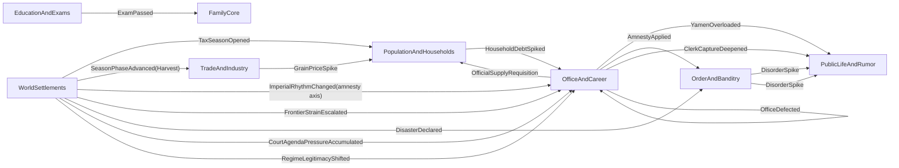

# RENZONG_THIN_CHAIN_TOPOLOGY_INDEX

This document freezes the current Renzong pressure-chain thin-slice topology.

It does not replace `RENZONG_PRESSURE_CHAIN_SPEC.md`. The spec remains the fuller design target. This index records what is actually wired as a thin live chain today, which scope each chain is allowed to touch, what keeps it from repeating, and which tests prove the current slice.

Use this file before adding rule density. If a future change deepens a chain, update this index in the same PR.

## Reading Rule

Each thin chain must answer:
- source pressure and owning module
- event path across modules
- pressure locus: global, court, regime, settlement, route, household, clan, person, office, or campaign
- same-month drain or explicit delayed-month behavior
- watermark, edge rule, or cadence that prevents accidental repetition
- off-scope boundary, when the pressure has a concrete locus
- downstream receipt or projection surface
- full-chain debt that remains intentionally unimplemented

The index protects the rule that Zongzu is rules-driven, not event-pool driven. `DomainEvent` records and transfers resolved facts; it is not the source of gameplay by itself.

## Topology Map

## Thin-Chain Ledger

| Chain | Current thin path | Locus | Same-month? | Repetition guard | Receipt / projection | Current proof |
|---|---|---|---|---|---|---|
| 1. Tax/corvee household-yamen-public | `WorldSettlements.TaxSeasonOpened -> HouseholdDebtSpiked -> OfficeAndCareer.YamenOverloaded -> PublicLife heat` | symbolic tax-season source today; handler accepts settlement scope and mutates household debt by household-owned exposure profile | yes, bounded scheduler drain | scheduler fresh-event watermark; full precise tax locus still deferred | `HouseholdDebtSpiked` with tax-profile metadata, then `YamenOverloaded` plus public-life street-talk heat | `RenzongPressureChainTests.Chain1_RealMonthlyScheduler_DrainsTaxSeasonIntoYamenAndPublicLife`; `TaxSeasonBurdenHandlerTests` |
| 2. Harvest/grain household pressure | `SeasonPhaseAdvanced(Harvest) -> TradeAndIndustry.GrainPriceSpike -> HouseholdSubsistencePressureChanged` | settlement market / household | yes, bounded scheduler drain | harvest phase edge plus local market event; off-scope household assertion | household subsistence-pressure event | `RenzongPressureChainTests.Chain2_RealMonthlyScheduler_DrainsHarvestPriceIntoLocalHouseholdPressure` |
| 3. Exam prestige | `EducationAndExams.ExamPassed -> FamilyCore.ClanPrestigeAdjusted` | person to clan | yes, bounded scheduler drain | exam cadence and one exam result | clan prestige receipt | `ExamPrestigeChainTests.ExamPass_ThinChain_RealScheduler_DrainsIntoClanPrestige` |
| 4. Imperial amnesty disorder | `ImperialRhythmChanged(amnesty axis) -> OfficeAndCareer.AmnestyApplied -> OrderAndBanditry.DisorderSpike` | imperial signal allocated to settlement jurisdiction | yes, bounded scheduler drain | office-owned `LastAppliedAmnestyWave`; handler must respect amnesty axis rather than any imperial change | cause-tagged `DisorderSpike` | `ImperialAmnestyDisorderChainTests.ImperialAmnesty_ThinChain_RealScheduler_DrainsIntoDisorderSpike` |
| 5. Frontier supply household burden | `WorldSettlements.FrontierStrainEscalated -> OfficeAndCareer.OfficialSupplyRequisition -> PopulationAndHouseholds.HouseholdBurdenIncreased` | settlement | yes, bounded scheduler drain | world-owned `LastDeclaredFrontierStrainBand`; current scalar is thin-slice only | household burden receipt with cause/source/settlement metadata | `FrontierSupplyHouseholdChainTests` plus office/population handler tests |
| 6. Disaster disorder public life | `WorldSettlements.DisasterDeclared -> OrderAndBanditry.DisorderSpike -> PublicLife heat` | settlement disaster | yes, bounded scheduler drain | world-owned `LastDeclaredFloodDisasterBand`; metadata-only rule handling | cause-tagged disorder and public-life heat | `DisasterDisorderPublicLifeChainTests` plus disaster handler tests |
| 7. Clerk capture public life | `OfficeAndCareer.ClerkCaptureDeepened -> PublicLife heat` | settlement jurisdiction | yes, bounded scheduler drain | office-owned `ActiveClerkCaptureSettlementIds`; clears only when condition falls | public-life trace about clerk capture | `OfficeCourtRegimePressureChainTests.Chain7_RealScheduler_ClerkCaptureDrainsIntoScopedPublicLifeAndDoesNotRepeat` |
| 8. Court agenda policy window | `WorldSettlements.CourtAgendaPressureAccumulated -> OfficeAndCareer.PolicyWindowOpened` | court/global source allocated to one jurisdiction | yes, bounded scheduler handling | allocation rule opens exactly one selected court-facing jurisdiction in the thin slice | office-owned policy-window event | `OfficeCourtRegimePressureChainTests.Chain8_RealScheduler_CourtAgendaOpensOnlyOneCourtFacingWindow` |
| 9. Regime legitimacy office defection | `WorldSettlements.RegimeLegitimacyShifted -> OfficeAndCareer.OfficeDefected` | regime/global source allocated to one highest-risk official | yes, bounded scheduler handling | risk allocation chooses one official; default `MandateConfidence = 70` prevents unseeded crisis | office-owned defection receipt after appointment mutation | `OfficeCourtRegimePressureChainTests.Chain9_RealScheduler_RegimePressureDefectsOnlyOneHighRiskOfficial` |

## Freeze Rules

1. Thin slice does not mean full chain. Every row above is a proof of topology and boundary, not the full social formula.
2. A broad pressure must choose a first local locus before mutating local state. Frontier, court, regime, disaster, and imperial rhythm may start wide, but they may not touch every household or jurisdiction by accident.
3. Persistent pressure requires an edge, watermark, processed band, or explicit recurring-demand cadence. A high current value alone is not a new escalation event.
4. Same-month follow-on effects must pass through the bounded scheduler drain and process only fresh events. If a future link cannot finish inside the cap, carry traceable state into the next month.
5. Every emitted event must be listed in `PublishedEvents`; every handled event must be listed in `ConsumedEvents`; every cross-module event name must come from `Zongzu.Contracts`.
6. Concrete-locus handlers must filter before mutation and tests must include a comparable off-scope negative case.
7. Rule density must consume existing owner-state dimensions before inventing a second rule layer. For household pressure, prefer `Livelihood`, land, grain, labor, dependents, debt, distress, and migration fields owned by `PopulationAndHouseholds`.
8. Generic downstream events must either carry cause metadata or keep projection wording cause-neutral.
9. Projection may explain why-now and what-next, but it may not become a second authority layer.
10. Application services may route commands and compose read models, but they may not absorb chain rules while the owning modules are still being shaped.

## Full-Chain Debt

The thin topology leaves these fuller branches intentionally unimplemented:

- Chain 1: precise zhuhu / kehu household grade, tax kind, tenant/client rent cascade, cash squeeze into markets, long memory, precise jurisdiction payloads. The current handler already uses a multi-dimensional proxy profile from existing household state (`Livelihood`, `LandHolding`, `GrainStore`, `LaborCapacity`, `DependentCount`, `DebtPressure`, `Distress`) but it is not yet a full tax/corvee society formula.
- Chain 2: yield ratio, granary security, route risk, household grain stores by livelihood, migration, death pressure, famine narrative residue.
- Chain 3: office waiting list, recommendation, favor/shame memory, public-life exam projection, failure and study-abandon branches.
- Chain 4: mourning, succession, appointment rhythm, dispatch wording, public legitimacy, and non-amnesty imperial axes.
- Chain 5: frontier sectors, WarfareCampaign mobilization, ConflictAndForce readiness, market diversion, quota formulas, clerk distortion, public-life military burden.
- Chain 6: relief decisions, household subsistence/migration, market panic, route insecurity, SocialMemory disaster residue, public legitimacy.
- Chain 7: official evaluation, memorial attacks, petition delay, trade dispute delay, clerk factions, recommended clerk / shiye intervention.
- Chain 8: court process state, policy wording, appointment slate, dispatch arrival, local implementation drag, policy capture, downstream household/market/public consequences.
- Chain 9: regime recognition, grain-route control, household compliance, public legitimacy, ritual claim, force backing, rebellion-to-polity and dynasty-cycle consequences.

## Next Thickening Priority

After this freeze, deepen rule density in this order unless an explicit ExecPlan says otherwise:

1. household tax/grain burden and family lifecycle pressure, because these make ordinary households and lineages breathe before higher politics becomes playable;
2. office/yamen implementation drag, because court and frontier pressure must arrive through documents, clerks, and local bargaining rather than direct imperial commands;
3. public-life and map projection, because the player must see where pressure landed before issuing bounded commands;
4. force/campaign and regime depth, only after local burden, legitimacy, and office execution are readable.
